```mermaid
graph LR
    A[👨‍💻 Developer] --> B[🤝 DevOps Engineer]
    B --> C[🚀 Cloud Native Expert]
    style B fill:#4CAF50,color:#fff
```

```mermaid
graph TB
    subgraph "Traditional Development Workflow"
        DEV[🖥️ Development<br/>Laptop Setup] --> TEST[🧪 Testing<br/>Different Environment]
        TEST --> STAGE[🎭 Staging<br/>Yet Another Setup]
        STAGE --> PROD[🔥 Production<br/>Completely Different!]
    end
    
    subgraph "Problems"
        P1[❌ Environment Drift]
        P2[❌ Dependency Hell]
        P3[❌ Manual Configuration]
        P4[❌ Slow Deployments]
    end
    
    PROD --> P1
    PROD --> P2
    PROD --> P3
    PROD --> P4
```

```mermaid
graph TB
    subgraph "Without Orchestration"
        DEV1[Developer] --> |manual deploy| CONT1[Container 1]
        DEV1 --> |manual deploy| CONT2[Container 2]
        DEV1 --> |manual scale| CONT3[Container 3]
        CONT1 -.crashes.-> X1[💀]
        LB1[Manual Load Balancer]
        LB1 --> CONT1
        LB1 --> CONT2
    end
    
    subgraph "Questions"
        Q1[❓ What if container crashes?]
        Q2[❓ How to scale automatically?]
        Q3[❓ How to update without downtime?]
        Q4[❓ How to discover services?]
        Q5[❓ How to manage resources?]
    end
```

```mermaid
graph TB
    subgraph "Kubernetes Cluster"
        direction TB
        CP[🎯 Control Plane<br/>The Brain]
        
        subgraph "Worker Nodes"
            NODE1[Node 1<br/>💻]
            NODE2[Node 2<br/>💻]
            NODE3[Node 3<br/>💻]
        end
        
        subgraph "Automatic Features"
            AUTO1[🔄 Auto-Scaling]
            AUTO2[🏥 Self-Healing]
            AUTO3[⚖️ Load Balancing]
            AUTO4[🔍 Service Discovery]
            AUTO5[📦 Rolling Updates]
        end
        
        CP --> NODE1
        CP --> NODE2
        CP --> NODE3
        
        CP --> AUTO1
        CP --> AUTO2
        CP --> AUTO3
        CP --> AUTO4
        CP --> AUTO5
    end
    
    style CP fill:#4CAF50,color:#fff
    style AUTO1 fill:#2196F3,color:#fff
    style AUTO2 fill:#2196F3,color:#fff
    style AUTO3 fill:#2196F3,color:#fff
    style AUTO4 fill:#2196F3,color:#fff
    style AUTO5 fill:#2196F3,color:#fff
```

```mermaid
graph LR
    subgraph "Spotify Challenge"
        DEVS[3,000+ Engineers]
        SERVICES[Hundreds of<br/>Microservices]
        DEPLOYS[50,000+<br/>Deployments/Day]
    end
    
    subgraph "Solution"
        K8S[Kubernetes]
        HELM[Helm Charts]
        CICD[CI/CD Pipeline]
    end
    
    subgraph "Results"
        SPEED[⚡ Faster TTM]
        QUALITY[✅ Higher Quality]
        SCALE[📈 Easy Scaling]
    end
    
    DEVS --> SERVICES
    SERVICES --> K8S
    K8S --> HELM
    HELM --> CICD
    CICD --> DEPLOYS
    DEPLOYS --> SPEED
    DEPLOYS --> QUALITY
    DEPLOYS --> SCALE
    
    style SPEED fill:#1DB954,color:#fff
    style QUALITY fill:#1DB954,color:#fff
    style SCALE fill:#1DB954,color:#fff
```

```mermaid
graph TB
    subgraph "Airbnb Journey"
        MONO[Monolithic<br/>Application]
        MICRO[1000+<br/>Microservices]
        K8S[Kubernetes<br/>Platform]
    end
    
    subgraph "Challenges Solved"
        COST[💰 30% Cost<br/>Reduction]
        PERF[⚡ Better<br/>Performance]
        SCALE[📈 Auto-Scaling<br/>During Peaks]
        GLOBAL[🌍 Global<br/>Deployment]
    end
    
    MONO --> MICRO
    MICRO --> K8S
    K8S --> COST
    K8S --> PERF
    K8S --> SCALE
    K8S --> GLOBAL
    
    style COST fill:#FF5A5F,color:#fff
    style PERF fill:#FF5A5F,color:#fff
    style SCALE fill:#FF5A5F,color:#fff
    style GLOBAL fill:#FF5A5F,color:#fff
```

```mermaid
graph LR
    subgraph "Modern DevOps Pipeline"
        CODE[💻 Code<br/>ASP.NET/Node.js]
        GIT[📝 Git Push]
        CI[🔧 CI Pipeline<br/>Build & Test]
        IMAGE[📦 Container Image<br/>Docker Registry]
        GITOPS[📂 GitOps<br/>Update K8s Manifests]
        ARGOCD[🔄 ArgoCD<br/>Auto Sync]
        K8S[☸️ Kubernetes<br/>Deploys to Prod]
        MONITOR[📊 Monitor<br/>Prometheus/Grafana]
    end
    
    CODE --> GIT
    GIT --> CI
    CI --> IMAGE
    CI --> GITOPS
    GITOPS --> ARGOCD
    ARGOCD --> K8S
    K8S --> MONITOR
    MONITOR -.Feedback.-> CODE
    
    style ARGOCD fill:#F4811F,color:#fff
    style K8S fill:#4CAF50,color:#fff
    style MONITOR fill:#2196F3,color:#fff
```

```mermaid
graph LR
    subgraph "Week 1-2: Foundation"
        W1[📚 Learn Containers<br/>Docker basics]
        W2[☸️ K8s Concepts<br/>Pods, Services, Deployments]
    end
    
    subgraph "Week 3-4: Practice"
        W3[🔨 Local Setup<br/>KIND/k3d clusters]
        W4[🚀 Deploy Apps<br/>ASP.NET/Node.js]
    end
    
    subgraph "Week 5-6: Advanced"
        W5[🏗️ Production Setup<br/>HA clusters, monitoring]
        W6[🔄 GitOps<br/>ArgoCD automation]
    end
    
    W1 --> W2
    W2 --> W3
    W3 --> W4
    W4 --> W5
    W5 --> W6
    
    style W1 fill:#4CAF50,color:#fff
    style W2 fill:#4CAF50,color:#fff
    style W3 fill:#2196F3,color:#fff
    style W4 fill:#2196F3,color:#fff
    style W5 fill:#FF9800,color:#fff
    style W6 fill:#FF9800,color:#fff
```

# From Developer to DevOps: Your Journey with Kubernetes
## Introduction Presentation for Newcomers

**Duration:** 70 minutes  
**Target Audience:** Developers (ASP.NET Core, Node.js) transitioning to DevOps  
**Prerequisites:** Basic programming knowledge, familiarity with command-line interfaces

---

## Slide 1: Welcome & Icebreaker (5 minutes)

### Visual


### Content
**Title:** "It Works on My Machine!" 🤷‍♂️

**Interactive Poll Questions:**
1. Who has experienced "it works on my machine" issues?
2. How many deployments does your team do per week?
3. Have you manually SSH'd into servers to fix production issues?

### Speaker Notes
- Start with humor and relatability
- Share a personal story about deployment failures
- Make attendees feel comfortable - everyone has these problems
- Set expectations: This session will show WHY Kubernetes matters before HOW

**Key Message:** "By the end of today, you'll understand why companies like Netflix, Spotify, and Airbnb rely on Kubernetes for their applications."

---

## Slide 2: The Developer's Pain Points (10 minutes)

### Visual


### Content
**Real Developer Scenarios:**

**Scenario 1: ASP.NET Core Deployment Nightmare**
```csharp
// App.cs - Works perfectly locally
var builder = WebApplication.CreateBuilder(args);
builder.Services.AddDbContext<AppDbContext>(options =>
    options.UseSqlServer(builder.Configuration.GetConnectionString("DefaultConnection")));

// Production: "Connection string not found!"
// Issue: Different configuration management in each environment
```

**Scenario 2: Node.js Dependency Chaos**
```javascript
// package.json
{
  "dependencies": {
    "express": "^4.18.0",  // Works on Dev with 4.18.2
    "mongodb": "^5.0.0"    // Prod has 5.1.0 with breaking changes
  }
}
// Result: Production breaks with "Cannot find module..."
```

**Common Pain Points:**
1. **Environment Inconsistency**: Dev uses Windows, Prod uses Linux
2. **Manual Server Management**: SSH into servers, install dependencies manually
3. **Scaling Issues**: Traffic spike? Time to panic and manually add servers!
4. **Deployment Anxiety**: Friday deployments = weekend work
5. **Resource Waste**: Servers running 24/7 with 5% utilization

### Speaker Notes
- Share specific examples from real projects
- Ask audience to share their pain points
- Emphasize emotional impact: stress, overtime, on-call burnout
- Build desire for a better way

**Interactive Question:** "What's the worst deployment experience you've had?"

---

## Slide 3: Enter Containers - The Game Changer (10 minutes)

### Visual


### Content
**What Containers Solve:**

✅ **Portability**: Package app + dependencies together  
✅ **Consistency**: Same container runs everywhere  
✅ **Efficiency**: Share OS kernel, lightweight  
✅ **Isolation**: Apps don't interfere with each other  
✅ **Speed**: Start in seconds, not minutes

**Real Example: ASP.NET Core in Docker**

```dockerfile
# Dockerfile
FROM mcr.microsoft.com/dotnet/aspnet:8.0 AS base
WORKDIR /app
EXPOSE 80

FROM mcr.microsoft.com/dotnet/sdk:8.0 AS build
WORKDIR /src
COPY ["MyApp.csproj", "./"]
RUN dotnet restore
COPY . .
RUN dotnet publish -c Release -o /app/publish

FROM base AS final
WORKDIR /app
COPY --from=build /app/publish .
ENTRYPOINT ["dotnet", "MyApp.dll"]
```

**Build and Run:**
```bash
# Build once
docker build -t myapp:v1.0 .

# Run anywhere - Dev laptop, teammate's machine, production
docker run -p 8080:80 myapp:v1.0

# Result: IDENTICAL behavior everywhere! 🎉
```

### Speaker Notes
- Emphasize the "package once, run anywhere" concept
- Use analogy: "Containers are like shipping containers - standardized, portable"
- Demo if possible: Build and run a simple container live
- Show how it solves the "works on my machine" problem

**Live Demo (if possible):** Build and run a simple ASP.NET Core or Node.js container

---

## Slide 4: The Container Orchestration Challenge (10 minutes)

### Visual


### Content
**The New Problems:**

While containers solved environment consistency, managing them at scale creates new challenges:

**Real Scenario: E-commerce Black Friday**
```
8:00 AM - Normal traffic: 100 requests/second ✅
11:00 AM - Sales start: 10,000 requests/second ⚠️
11:05 AM - Containers overwhelmed, site crashes! 💥
11:10 AM - Frantically starting more containers manually...
11:30 AM - Finally stabilized, but lost thousands in sales 💸
```

**Manual Container Management Problems:**

1. **No Auto-Healing**: Container crashes? Manual restart needed
2. **No Auto-Scaling**: Traffic spike? Manually add containers
3. **No Load Balancing**: Need to configure nginx/haproxy manually
4. **No Service Discovery**: How do containers find each other?
5. **No Resource Management**: Containers fight for CPU/memory
6. **No Rolling Updates**: Deploy new version? Downtime required
7. **Multi-Host Complexity**: How to deploy across multiple servers?

**Example: Microservices Chaos**
```
50 microservices × 3 environments (dev/stage/prod) × 5 containers each
= 750 containers to manage manually! 😱
```

### Speaker Notes
- Build tension: "We solved one problem, but created another"
- Use dramatic examples: Black Friday crashes, midnight incident calls
- Emphasize scale: managing 10 containers is hard, 100+ is impossible
- Lead into: "This is where Kubernetes comes in..."

**Interactive Question:** "Imagine managing 100 containers manually. What could go wrong?"

---

## Slide 5: Kubernetes - The Industry Standard Solution (15 minutes)

### Visual


### Content
**What is Kubernetes?**

Kubernetes (K8s) is an open-source container orchestration platform that automates:
- 📦 **Deployment**: Declarative configuration
- 📈 **Scaling**: Automatic based on load
- 🔧 **Management**: Self-healing capabilities
- 🌐 **Networking**: Built-in service discovery and load balancing

**The Kubernetes Promise:**

```yaml
# Simply declare what you want:
apiVersion: apps/v1
kind: Deployment
metadata:
  name: my-app
spec:
  replicas: 3  # I want 3 instances
  template:
    spec:
      containers:
      - name: app
        image: myapp:v1.0
        resources:
          requests:
            cpu: 100m
            memory: 128Mi
---
# Kubernetes automatically:
# ✅ Creates 3 container instances
# ✅ Distributes them across nodes
# ✅ Restarts if they crash
# ✅ Load balances traffic
# ✅ Scales up/down based on load
```

**Auto-Scaling in Action:**
```yaml
apiVersion: autoscaling/v2
kind: HorizontalPodAutoscaler
metadata:
  name: my-app-hpa
spec:
  scaleTargetRef:
    kind: Deployment
    name: my-app
  minReplicas: 3
  maxReplicas: 50
  metrics:
  - type: Resource
    resource:
      name: cpu
      target:
        type: Utilization
        averageUtilization: 70

# Result: Automatically scales from 3 to 50 containers
# based on CPU usage. BLACK FRIDAY SOLVED! 🎉
```

### Speaker Notes
- Emphasize "declarative" approach: describe desired state, K8s makes it happen
- Use analogy: "Like cruise control for your applications"
- Highlight the automation: no more manual intervention
- Share statistics: CNCF adoption, job market demand

**Key Statistics to Share:**
- 96% of organizations are using or evaluating Kubernetes
- #1 most requested DevOps skill in job postings
- Used by 88% of Fortune 100 companies

---

## Slide 6: Real-World Success Story - Netflix (5 minutes)

### Visual


### Content
**Company:** Netflix  
**Challenge:** Stream content to 200M+ subscribers globally with zero downtime  
**Scale:** 700+ microservices, 4,000+ deployments per day

**Before Kubernetes:**
- Manual deployment processes
- Long deployment cycles (hours)
- Difficult to scale globally
- Regional outages impacted users

**Kubernetes Implementation:**
- **Titus**: Netflix's container management platform built on Kubernetes
- **Automated Deployments**: 4,000+ deployments daily
- **Global Distribution**: Deployed across multiple regions automatically
- **Chaos Engineering**: Chaos Monkey tests resilience constantly

**Results:**
✅ **99.99% Uptime**: Even with thousands of daily deployments  
✅ **50% Faster Deployments**: From hours to minutes  
✅ **Auto-Scaling**: Handles peak viewing hours seamlessly  
✅ **Global Reach**: Serves 190+ countries consistently

**Technical Approach:**
```yaml
# Simplified example of Netflix's deployment strategy
apiVersion: apps/v1
kind: Deployment
metadata:
  name: streaming-service
spec:
  replicas: 100  # Scales up to thousands during peak hours
  strategy:
    type: RollingUpdate
    rollingUpdate:
      maxUnavailable: 1%  # 99% availability during updates
      maxSurge: 20%
  template:
    spec:
      containers:
      - name: stream
        image: netflix/streaming:v2.1.3
        resources:
          requests:
            cpu: 2000m
            memory: 4Gi
```

### Speaker Notes
- Emphasize the scale: millions of users, zero downtime expectations
- Share the transformation journey: from monolith to microservices
- Highlight developer productivity: engineers deploy independently
- Connect to audience: "Your applications can have the same capabilities"

**Quote:** *"Kubernetes allows us to iterate quickly and deploy with confidence, even at massive scale."* - Netflix Engineering

---

## Slide 7: Real-World Success Story - Spotify (5 minutes)

### Visual


### Content
**Company:** Spotify  
**Challenge:** Enable 3,000+ developers to deploy services independently  
**Goal:** Improve developer experience and deployment velocity

**The Problem:**
- Hundreds of microservices to manage
- 3,000+ developers waiting on ops team for deployments
- Manual deployment bottlenecks
- Inconsistent environments across squads

**Kubernetes Solution:**
```yaml
# Spotify's self-service platform approach
# Each squad gets their own namespace
apiVersion: v1
kind: Namespace
metadata:
  name: squad-discovery
  labels:
    team: discovery
    
---
# Teams deploy independently using Helm charts
apiVersion: apps/v1
kind: Deployment
metadata:
  name: playlist-service
  namespace: squad-discovery
spec:
  replicas: 5
  template:
    spec:
      containers:
      - name: service
        image: spotify/playlist-service:latest
        env:
        - name: ENVIRONMENT
          value: production
```

**Implementation:**
1. **Backstage**: Internal developer portal (now open source!)
2. **Helm Charts**: Standardized deployment templates
3. **Autonomous Squads**: Teams own their services end-to-end
4. **Automated CI/CD**: GitHub → Jenkins → Kubernetes

**Results:**
✅ **50,000+ Deployments/Day**: Developers deploy without waiting  
✅ **Reduced Time-to-Market**: Features ship 3x faster  
✅ **Improved Reliability**: Automatic rollbacks on failures  
✅ **Better Developer Experience**: "You build it, you run it"  
✅ **Cost Optimization**: Dynamic resource allocation

### Speaker Notes
- Emphasize developer empowerment: no more ops bottlenecks
- Highlight the cultural shift: developers own deployment
- Spotify open-sourced Backstage - they believe in sharing solutions
- Connect to audience: smaller teams can benefit from same patterns

**Key Insight:** "Kubernetes enabled us to scale our organization, not just our infrastructure."

---

## Slide 8: Real-World Success Story - Airbnb (5 minutes)

### Visual


### Content
**Company:** Airbnb  
**Challenge:** Migrate from monolith to microservices while optimizing costs  
**Scale:** 1000+ microservices, millions of users globally

**The Transformation:**

**Before Kubernetes:**
- Monolithic Rails application
- Manual server provisioning
- Over-provisioned infrastructure (paying for unused capacity)
- Slow deployment cycles
- Difficult to scale regionally

**Kubernetes Implementation:**
```yaml
# Example: Dynamic resource allocation
apiVersion: apps/v1
kind: Deployment
metadata:
  name: booking-service
spec:
  replicas: 5
  template:
    spec:
      containers:
      - name: booking
        image: airbnb/booking:v3.2.1
        resources:
          # Right-sized based on actual usage
          requests:
            cpu: 250m      # Only request what's needed
            memory: 512Mi
          limits:
            cpu: 1000m     # Cap maximum usage
            memory: 2Gi
---
# Auto-scaling for peak booking periods
apiVersion: autoscaling/v2
kind: HorizontalPodAutoscaler
metadata:
  name: booking-hpa
spec:
  scaleTargetRef:
    kind: Deployment
    name: booking-service
  minReplicas: 5
  maxReplicas: 100  # Scale during high-travel seasons
  metrics:
  - type: Resource
    resource:
      name: cpu
      target:
        averageUtilization: 70
```

**Key Innovations:**
1. **Custom Schedulers**: Optimized workload placement
2. **Resource Quotas**: Prevented resource waste
3. **Cluster Autoscaling**: Added/removed nodes automatically
4. **Multi-Region Deployment**: Served users from nearest region

**Results:**
✅ **30% Cost Reduction**: Better resource utilization  
✅ **Improved Performance**: Faster response times globally  
✅ **Elastic Scaling**: Handle seasonal booking spikes  
✅ **Developer Productivity**: 1000+ services deployed seamlessly  
✅ **Global Expansion**: Easy deployment to new regions

### Speaker Notes
- Focus on cost savings: real money saved
- Explain resource requests vs limits concept
- Highlight business impact: cost + performance = competitive advantage
- Relevance: Even small companies can benefit from resource optimization

**Business Impact:** "Kubernetes helped us scale cost-effectively while improving user experience globally."

---

## Slide 9: Kubernetes Architecture - How It Works (10 minutes)

### Visual


### Content
**Kubernetes Components Explained:**

**Control Plane (Master) - The Decision Maker:**
1. **API Server**: The front door - all requests go here
2. **etcd**: The database - stores everything (cluster state, configuration)
3. **Scheduler**: The matchmaker - decides which node runs which pod
4. **Controller Manager**: The maintainer - keeps everything in desired state

**Worker Nodes - The Workers:**
1. **kubelet**: The supervisor - manages pods on each node
2. **kube-proxy**: The traffic cop - routes network requests
3. **Container Runtime**: Docker/containerd - actually runs containers

**Real-World Analogy:**
Think of Kubernetes like a restaurant:
- **Control Plane** = Restaurant Manager + Kitchen Manager
- **API Server** = Head Waiter (takes all orders)
- **Scheduler** = Seating Host (assigns tables/stations)
- **Worker Nodes** = Kitchen Stations
- **Pods** = Individual dishes being prepared
- **kubelet** = Station Chef (cooks the dish)

**How It Works - Step by Step:**

```yaml
# 1. Developer creates deployment
apiVersion: apps/v1
kind: Deployment
metadata:
  name: my-web-app
spec:
  replicas: 3
  selector:
    matchLabels:
      app: web
  template:
    metadata:
      labels:
        app: web
    spec:
      containers:
      - name: web
        image: mycompany/webapp:v1.0
        ports:
        - containerPort: 80
```

**Behind the Scenes:**
```
1. Developer: kubectl apply -f deployment.yaml
   └─> API Server receives request

2. API Server: Validates and saves to etcd
   └─> "Okay, user wants 3 replicas of webapp"

3. Controller Manager: Notices 0 pods exist, need 3
   └─> Creates 3 Pod specs

4. Scheduler: Looks at all nodes, finds best placement
   └─> Node1: 2 pods, Node2: 1 pod (balancing load)

5. kubelet on each Node: Gets assigned pods
   └─> Pulls container image
   └─> Starts containers
   └─> Reports status back to API Server

6. kube-proxy: Configures networking
   └─> Sets up load balancing to 3 pods

Result: Your app is now running! And if a pod crashes,
Controller Manager notices and creates a replacement automatically! 🎉
```

### Speaker Notes
- Use the restaurant analogy heavily - it's relatable
- Draw parallels to audience's existing knowledge
- Emphasize automation: "All this happens without you doing anything"
- Don't get too technical - focus on concepts

**Interactive Question:** "What happens if a worker node (kitchen station) crashes?"
**Answer:** "Kubernetes automatically reschedules pods to healthy nodes!"

---

## Slide 10: DevOps Workflow with Kubernetes (10 minutes)

### Visual


### Content
**The Complete DevOps Workflow:**

**Step 1: Developer Writes Code**
```csharp
// ASP.NET Core API
[ApiController]
[Route("api/[controller]")]
public class ProductsController : ControllerBase
{
    [HttpGet]
    public IActionResult GetProducts()
    {
        return Ok(new { products = _productService.GetAll() });
    }
}
```

**Step 2: Push to Git**
```bash
git add .
git commit -m "Add product API endpoint"
git push origin main
```

**Step 3: CI Pipeline Runs (GitHub Actions)**
```yaml
name: CI/CD Pipeline
on:
  push:
    branches: [main]

jobs:
  build-and-deploy:
    runs-on: ubuntu-latest
    steps:
      # Build and test
      - name: Checkout code
        uses: actions/checkout@v3
      
      - name: Run tests
        run: dotnet test
      
      # Build container image
      - name: Build Docker image
        run: docker build -t myapp:${{ github.sha }} .
      
      # Push to registry
      - name: Push to Docker Hub
        run: docker push myapp:${{ github.sha }}
      
      # Update Kubernetes manifests
      - name: Update deployment
        run: |
          sed -i 's|image: myapp:.*|image: myapp:${{ github.sha }}|' \
            k8s/production/deployment.yaml
          git commit -am "Deploy ${{ github.sha }}"
          git push
```

**Step 4: GitOps with ArgoCD**
```yaml
# ArgoCD Application
apiVersion: argoproj.io/v1alpha1
kind: Application
metadata:
  name: my-web-app
  namespace: argocd
spec:
  project: default
  source:
    repoURL: https://github.com/mycompany/myapp
    targetRevision: HEAD
    path: k8s/production
  destination:
    server: https://kubernetes.default.svc
    namespace: production
  syncPolicy:
    automated:
      prune: true       # Remove old resources
      selfHeal: true    # Auto-fix if someone modifies manually
      
# ArgoCD detects Git changes and automatically deploys! 🚀
```

**Step 5: Kubernetes Deployment**
```yaml
apiVersion: apps/v1
kind: Deployment
metadata:
  name: web-app
spec:
  replicas: 3
  strategy:
    type: RollingUpdate
    rollingUpdate:
      maxUnavailable: 1    # Only 1 pod down at a time
      maxSurge: 1          # Only 1 extra pod during update
  template:
    spec:
      containers:
      - name: app
        image: myapp:abc123  # Updated by CI pipeline
        readinessProbe:      # Don't send traffic until ready
          httpGet:
            path: /health
            port: 80
        livenessProbe:       # Restart if unhealthy
          httpGet:
            path: /health
            port: 80

# Result: Zero-downtime deployment! ✨
```

**Step 6: Monitoring & Feedback**
```yaml
# Prometheus monitoring
apiVersion: monitoring.coreos.com/v1
kind: ServiceMonitor
metadata:
  name: app-metrics
spec:
  selector:
    matchLabels:
      app: web-app
  endpoints:
  - port: metrics
    interval: 30s
```

**The Magic:**
- ✅ Code to production in minutes, not days
- ✅ Automated testing catches bugs early
- ✅ Zero-downtime deployments
- ✅ Automatic rollback on failures
- ✅ Continuous monitoring and alerting
- ✅ Full audit trail in Git

### Speaker Notes
- Walk through each step slowly
- Emphasize automation: "You push code, Kubernetes deploys it"
- Highlight safety: rollbacks, health checks, gradual rollouts
- Show how it eliminates manual steps

**Key Message:** "From code commit to production in 5 minutes, with zero downtime and automatic quality gates!"

---

## Slide 11: Your Learning Journey Starts Now (5 minutes)

### Visual


### Content
**Your 6-Week Roadmap:**

**Foundation (Weeks 1-2):**
- ✅ Master Docker fundamentals
- ✅ Understand Kubernetes architecture
- ✅ Learn core K8s objects (Pods, Deployments, Services)
- 📖 Resources: [Why Containerize?](01-why-containerize.md), [K8s Architecture](02-kubernetes-architecture.md)

**Hands-On Practice (Weeks 3-4):**
- ✅ Set up local Kubernetes cluster with KIND/k3d
- ✅ Deploy ASP.NET Core applications
- ✅ Deploy Node.js applications
- ✅ Configure CI/CD pipelines
- 🔨 Workshop: Today's hands-on exercises!

**Advanced Topics (Weeks 5-6):**
- ✅ Production HA cluster setup with RKE2
- ✅ Load balancing with MetalLB
- ✅ Security hardening and WAF
- ✅ GitOps with ArgoCD
- ✅ Monitoring with Prometheus/Grafana

**Skills You'll Gain:**

**Technical Skills:**
- 🎯 Container orchestration
- 🎯 Infrastructure as Code
- 🎯 CI/CD pipeline design
- 🎯 Kubernetes administration
- 🎯 Cloud-native architecture
- 🎯 DevOps best practices

**Career Impact:**
- 💼 Most in-demand DevOps skill
- 💼 Higher salary potential (30-50% increase)
- 💼 Work on cutting-edge technologies
- 💼 Join companies like Netflix, Spotify, Airbnb

**Today's Next Steps:**
1. ✅ Complete hands-on workshop exercises
2. ✅ Set up local Kubernetes environment
3. ✅ Deploy your first application
4. ✅ Join community: Kubernetes Slack, forums
5. ✅ Follow learning path in course materials

### Speaker Notes
- Make it achievable: 6 weeks to competency
- Emphasize practical over theoretical learning
- Share success stories of others who learned K8s
- Encourage questions and community involvement

**Motivational Quote:** *"The journey of a thousand deployments begins with a single pod!"* 🚀

---

## Slide 12: Hands-On Workshop Preview (5 minutes)

### Content
**What We'll Build Today:**

```mermaid
graph TB
    subgraph "Today's Workshop Project"
        DEV[👨‍💻 Your Code<br/>ASP.NET or Node.js]
        DOCKER[🐳 Containerize<br/>Build Docker image]
        K8S[☸️ Deploy to K8s<br/>Local cluster]
        ACCESS[🌐 Access App<br/>http://localhost]
    end
    
    DEV --> DOCKER
    DOCKER --> K8S
    K8S --> ACCESS
    
    style ACCESS fill:#4CAF50,color:#fff
```



**Workshop Exercises:**

**Exercise 1: Deploy ASP.NET Core API**
- Build a simple REST API
- Containerize with Docker
- Deploy to local Kubernetes
- Test with curl/browser

**Exercise 2: Deploy Node.js Web App**
- Create Express.js application
- Build multi-stage Dockerfile
- Deploy with Kubernetes manifests
- Configure service exposure

**Exercise 3: Scaling and Updates**
- Scale application replicas
- Perform rolling updates
- Experience zero-downtime deployment
- Rollback on failure

**Time Allocation:**
- Exercise 1: 30 minutes
- Exercise 2: 30 minutes
- Exercise 3: 20 minutes
- Q&A: 10 minutes

**Prerequisites Check:**
```bash
# Verify you have these installed:
docker --version        # Docker 20.10+
kubectl version        # kubectl 1.27+
kind version          # kind 0.20+

# If not installed, see: docs/00-prerequisites.md
```

### Speaker Notes
- Confirm everyone has prerequisites installed
- Share workshop repository URL
- Explain support resources available
- Set expectations: hands-on, everyone will deploy something!

**Key Message:** "In the next 90 minutes, you'll deploy your first Kubernetes application!"

---

## Q&A Session (Remaining Time)

### Common Questions & Answers:

**Q: Is Kubernetes too complex for small teams?**
A: Modern tools like k3s, k3d, and managed services (EKS, GKE, AKS) make it accessible. Start simple, grow gradually. Even startups benefit from deployment automation.

**Q: Do I need to know everything about Kubernetes?**
A: No! Focus on core concepts first (Pods, Deployments, Services). Advanced features come with experience. Most developers use 20% of features 80% of the time.

**Q: Can I use Kubernetes with existing applications?**
A: Yes! Start by containerizing one service at a time. You don't need to refactor everything. Kubernetes works with legacy and modern apps.

**Q: What about costs?**
A: Local development is free. Cloud costs depend on usage. Many companies save money by optimizing resource utilization. Start with free tiers (GKE, EKS free control plane).

**Q: How long to become proficient?**
A: Basic proficiency: 4-6 weeks. Production-ready skills: 3-6 months. Continuous learning is key - technology evolves rapidly.

**Q: Should we use managed Kubernetes or self-hosted?**
A: For most teams: Start with managed (EKS/GKE/AKS). Focus on applications, not infrastructure. Self-host only if you have dedicated platform team.

### Resources:
- 📚 **Official Docs**: kubernetes.io
- 💬 **Community**: Kubernetes Slack (54k+ members)
- 🎓 **Certification**: CKA, CKAD, CKS
- 📺 **YouTube**: CNCF Channel, TechWorld with Nana
- 📖 **Books**: "Kubernetes Up & Running", "Kubernetes Patterns"

---

## Conclusion & Call to Action

**Remember:**
- ✅ Kubernetes solves real problems at scale
- ✅ Industry-standard, used by 96% of organizations
- ✅ Most in-demand DevOps skill
- ✅ You can start today with local clusters

**Your Action Items:**
1. 🔨 Complete today's workshop exercises
2. 📚 Follow the 6-week learning path
3. 🚀 Deploy your first real project to K8s
4. 👥 Join the Kubernetes community
5. 📈 Keep learning - DevOps is a journey!

**Workshop Materials:** See `docs/workshop/` directory

**Let's get hands-on! 🚀**

---

## Speaker Bio & Contact

**About the Trainer:**
- Senior DevOps Engineer with 10+ years experience
- Extensive background in ASP.NET Core and Node.js development
- Deployed Kubernetes in production for enterprises
- CKA (Certified Kubernetes Administrator)
- Successfully transitioned teams from traditional to cloud-native DevOps

**Contact:**
- 📧 Email: [your-email]
- 💼 LinkedIn: [your-linkedin]
- 🐙 GitHub: [your-github]

**Office Hours:** Available after workshop for 1-on-1 questions

---

## Additional Resources in This Course

📖 **Complete Documentation:**
- [Prerequisites & Installation](00-prerequisites.md)
- [Why Containerize?](01-why-containerize.md)
- [Kubernetes Architecture](02-kubernetes-architecture.md)
- [Container Orchestration](03-why-kubernetes-orchestration.md)
- [Local Setup with K3d](04-local-setup-k3d.md)
- [Kubernetes Components](05-kubernetes-components.md)
- [Administration & Security](06-kubernetes-administration-security.md)
- [Rancher Management](07-rancher-management.md)
- [HA Cluster with RKE2](08-ha-cluster-rke2.md)
- [Load Balancing with MetalLB](09-loadbalancing-metallb.md)
- [WAF Security](10-waf-security.md)
- [DevOps with ArgoCD](11-devops-kubernetes-argocd.md)

🔨 **Hands-On Materials:**
- [Workshop Guide](workshop/README.md)
- [ASP.NET Core Workshop](workshop/aspnet-core/)
- [Node.js Workshop](workshop/nodejs/)

---

*End of Presentation - Ready for Hands-On Workshop!* 🎉