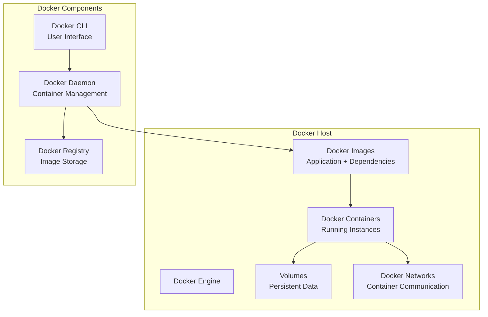

# Why Containerize?

Containerization is the process of packaging an application and its dependencies into a single, isolated unit called a container. This approach offers several advantages over traditional deployment methods and forms the foundation of modern application deployment, including Kubernetes.

## What is Docker?

Docker is the most popular containerization platform that makes it easy to create, deploy, and run applications using containers. It provides a standardized way to package applications with all their dependencies, ensuring consistent behavior across different environments.

### Docker Architecture



## Key Advantages of Containerization

### 1. Portability
Containers can run on any platform that supports a container runtime, eliminating the "it works on my machine" problem.

**Example:** A containerized Node.js application will run identically on:
- Your local development machine
- A colleague's laptop
- A testing server
- Production cloud infrastructure

### 2. Isolation
Containers provide process-level isolation, ensuring applications cannot interfere with each other.

**Benefits:**
- Security: One compromised container doesn't affect others
- Stability: Resource conflicts are prevented
- Debugging: Issues are contained within specific containers

### 3. Efficiency
Containers share the host OS kernel, making them much lighter than traditional virtual machines.

**Comparison:**
- **Virtual Machine:** Includes full OS (GBs), slow startup (minutes)
- **Container:** Shares OS kernel (MBs), fast startup (seconds)

### 4. Scalability
Containers can be easily scaled up or down to meet demand.

**Use Cases:**
- Handle traffic spikes during peak hours
- Scale down during low-traffic periods
- Auto-scaling based on metrics

### 5. Consistency
Containers ensure the same environment from development to production.

**Benefits:**
- Eliminates environment-specific bugs
- Simplifies CI/CD pipelines
- Enables microservices architecture

## Docker Core Concepts

### Images
An image is a read-only template containing the application and its dependencies. Images are built from a Dockerfile.

### Containers
A container is a runnable instance of an image. You can create, start, stop, and delete containers.

### Dockerfile
A text file containing instructions to build a Docker image.

### Example Dockerfile

```dockerfile
# Use official Node.js runtime as base image
FROM node:18-alpine

# Set working directory in container
WORKDIR /app

# Copy package files
COPY package*.json ./

# Install dependencies
RUN npm ci --only=production

# Copy application code
COPY . .

# Expose port
EXPOSE 3000

# Command to run the application
CMD ["npm", "start"]
```

## Docker Commands and Examples

### Basic Container Operations

1. **Pull an image:**
```bash
docker pull nginx:latest
```

2. **List images:**
```bash
docker images
```

3. **Run a container:**
```bash
docker run -d -p 8080:80 --name my-nginx nginx:latest
```

4. **List running containers:**
```bash
docker ps
```

5. **Stop a container:**
```bash
docker stop my-nginx
```

6. **Remove a container:**
```bash
docker rm my-nginx
```

### Building Custom Images

1. **Create a simple web application:**

```bash
mkdir my-app
cd my-app
```

Create `index.html`:
```html
<!DOCTYPE html>
<html>
<head>
    <title>My Docker App</title>
</head>
<body>
    <h1>Hello from Docker!</h1>
    <p>This is served from an Nginx container.</p>
</body>
</html>
```

Create `Dockerfile`:
```dockerfile
FROM nginx:alpine
COPY index.html /usr/share/nginx/html/index.html
EXPOSE 80
```

2. **Build the image:**
```bash
docker build -t my-web-app .
```

3. **Run the container:**
```bash
docker run -d -p 8080:80 my-web-app
```

4. **Access the application:**
Open http://localhost:8080 in your browser

### Advanced Docker Features

#### Volumes for Persistent Data

```bash
# Create a named volume
docker volume create my-data

# Run container with volume
docker run -d -v my-data:/app/data --name my-app my-image

# Mount host directory
docker run -d -v /host/path:/container/path my-image
```

#### Environment Variables

```bash
# Set environment variables
docker run -e APP_ENV=production -e DB_HOST=localhost my-app

# Use .env file
docker run --env-file .env my-app
```

#### Networking

```bash
# Create a custom network
docker network create my-network

# Run containers on the same network
docker run -d --network my-network --name app1 my-app
docker run -d --network my-network --name app2 my-app

# Connect containers
docker network connect my-network existing-container
```

#### Docker Compose

Docker Compose allows you to define and run multi-container applications.

Create `docker-compose.yml`:
```yaml
version: '3.8'
services:
  web:
    build: .
    ports:
      - "8080:80"
    depends_on:
      - db
  db:
    image: postgres:13
    environment:
      POSTGRES_PASSWORD: mypassword
    volumes:
      - db-data:/var/lib/postgresql/data

volumes:
  db-data:
```

Run the application:
```bash
docker-compose up -d
```

## Container Orchestration with Kubernetes

While Docker provides containerization, Kubernetes provides orchestration - managing containers at scale across multiple hosts.

**Why Kubernetes after Docker:**
- **Auto-scaling:** Automatically scale containers based on demand
- **Self-healing:** Restart failed containers automatically
- **Load balancing:** Distribute traffic across containers
- **Rolling updates:** Update applications without downtime
- **Multi-host deployment:** Run containers across multiple servers

## Hands-on Exercises

### Exercise 1: Your First Docker Container

1. **Install Docker:** If you don't already have Docker installed, follow the instructions for your operating system: [https://docs.docker.com/get-docker/](https://docs.docker.com/get-docker/)

2. **Run a simple container:**
```bash
docker run hello-world
```
This command will download and run the `hello-world` container. You should see a message indicating that your installation appears to be working correctly.

3. **Explore the container:**
```bash
docker ps -a
```
You should see the `hello-world` container in the list.

### Exercise 2: Building a Custom Web Application

1. **Create a project directory:**
```bash
mkdir docker-web-app
cd docker-web-app
```

2. **Create a simple HTML page:**
```html
<!-- index.html -->
<!DOCTYPE html>
<html>
<head>
    <title>My Docker Web App</title>
    <style>
        body { font-family: Arial, sans-serif; text-align: center; padding: 50px; }
        h1 { color: #333; }
    </style>
</head>
<body>
    <h1>Welcome to My Docker Web App!</h1>
    <p>This page is served from a Docker container.</p>
    <p><strong>Current time:</strong> <span id="time"></span></p>

    <script>
        function updateTime() {
            document.getElementById('time').textContent = new Date().toLocaleString();
        }
        updateTime();
        setInterval(updateTime, 1000);
    </script>
</body>
</html>
```

3. **Create a Dockerfile:**
```dockerfile
FROM nginx:alpine

# Copy custom HTML file
COPY index.html /usr/share/nginx/html/index.html

# Copy custom nginx configuration (optional)
# COPY nginx.conf /etc/nginx/nginx.conf

# Expose port 80
EXPOSE 80

# Start nginx
CMD ["nginx", "-g", "daemon off;"]
```

4. **Build and run the container:**
```bash
# Build the image
docker build -t my-web-app .

# Run the container
docker run -d -p 8080:80 --name web-app my-web-app
```

5. **Access your application:**
Open http://localhost:8080 in your browser

6. **Explore the running container:**
```bash
# Check running containers
docker ps

# View container logs
docker logs web-app

# Execute commands inside container
docker exec -it web-app sh

# Stop and remove container
docker stop web-app
docker rm web-app
```

### Exercise 3: Multi-Container Application with Docker Compose

1. **Create a Node.js API:**
```javascript
// app.js
const express = require('express');
const app = express();
const port = process.env.PORT || 3000;

app.get('/', (req, res) => {
  res.json({
    message: 'Hello from Docker Compose!',
    timestamp: new Date().toISOString(),
    container: process.env.HOSTNAME
  });
});

app.listen(port, () => {
  console.log(`API listening on port ${port}`);
});
```

2. **Create package.json:**
```json
{
  "name": "docker-compose-app",
  "version": "1.0.0",
  "main": "app.js",
  "scripts": {
    "start": "node app.js"
  },
  "dependencies": {
    "express": "^4.18.2"
  }
}
```

3. **Create Dockerfile:**
```dockerfile
FROM node:18-alpine

WORKDIR /app
COPY package*.json ./
RUN npm ci --only=production

COPY . .
EXPOSE 3000

CMD ["npm", "start"]
```

4. **Create docker-compose.yml:**
```yaml
version: '3.8'
services:
  api:
    build: .
    ports:
      - "3000:3000"
    environment:
      - NODE_ENV=production
    restart: unless-stopped

  web:
    image: nginx:alpine
    ports:
      - "8080:80"
    volumes:
      - ./nginx.conf:/etc/nginx/nginx.conf
    depends_on:
      - api
    restart: unless-stopped
```

5. **Create nginx.conf:**
```
events {
    worker_connections 1024;
}

http {
    upstream api_backend {
        server api:3000;
    }

    server {
        listen 80;
        server_name localhost;

        location /api {
            proxy_pass http://api_backend;
            proxy_set_header Host $host;
            proxy_set_header X-Real-IP $remote_addr;
        }

        location / {
            root /usr/share/nginx/html;
            index index.html;
            try_files $uri $uri/ =404;
        }
    }
}
```

6. **Create a simple HTML page:**
```html
<!-- index.html -->
<!DOCTYPE html>
<html>
<head>
    <title>Docker Compose App</title>
</head>
<body>
    <h1>Docker Compose Multi-Container App</h1>
    <button onclick="callAPI()">Call API</button>
    <div id="result"></div>

    <script>
        async function callAPI() {
            try {
                const response = await fetch('/api');
                const data = await response.json();
                document.getElementById('result').innerHTML =
                    `<pre>${JSON.stringify(data, null, 2)}</pre>`;
            } catch (error) {
                document.getElementById('result').textContent = 'Error: ' + error.message;
            }
        }
    </script>
</body>
</html>
```

7. **Run the application:**
```bash
# Build and start services
docker-compose up --build

# Or run in background
docker-compose up -d --build
```

8. **Test the application:**
- Web interface: http://localhost:8080
- API endpoint: http://localhost:3000 or http://localhost:8080/api

9. **Clean up:**
```bash
docker-compose down
docker-compose down -v  # Remove volumes too
```

## Summary

Containerization with Docker provides the foundation for modern application deployment. By understanding Docker's core concepts and practicing with hands-on exercises, you'll be well-prepared to work with Kubernetes and other container orchestration platforms. The key takeaways are:

- **Images** are blueprints for containers
- **Containers** are running instances of images
- **Dockerfiles** define how to build images
- **Docker Compose** manages multi-container applications
- **Isolation, portability, and efficiency** are the main benefits

In the next section, we'll explore how Kubernetes builds upon these Docker concepts to provide powerful container orchestration capabilities.