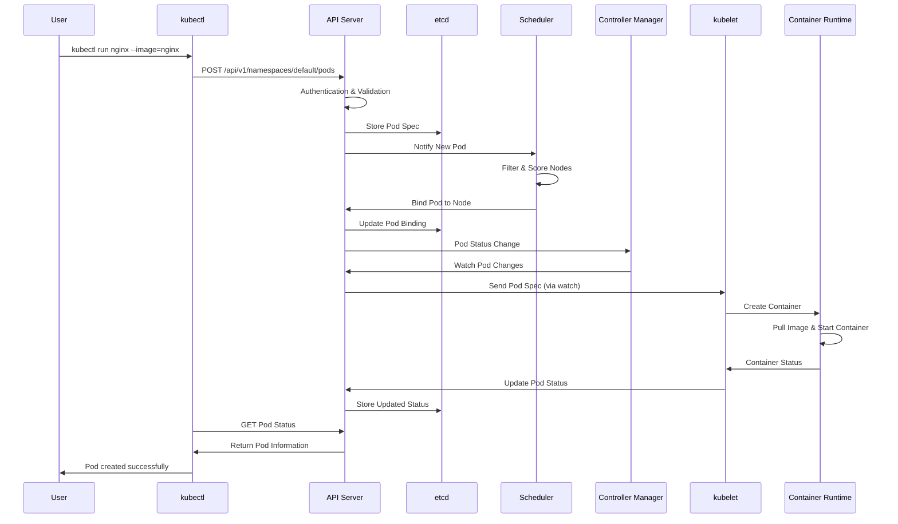
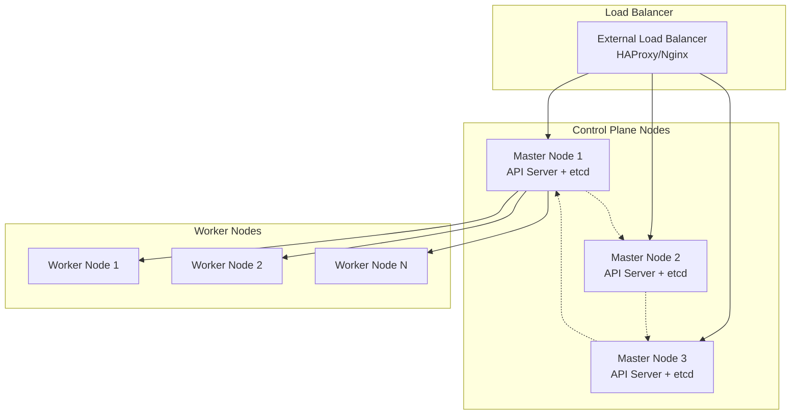
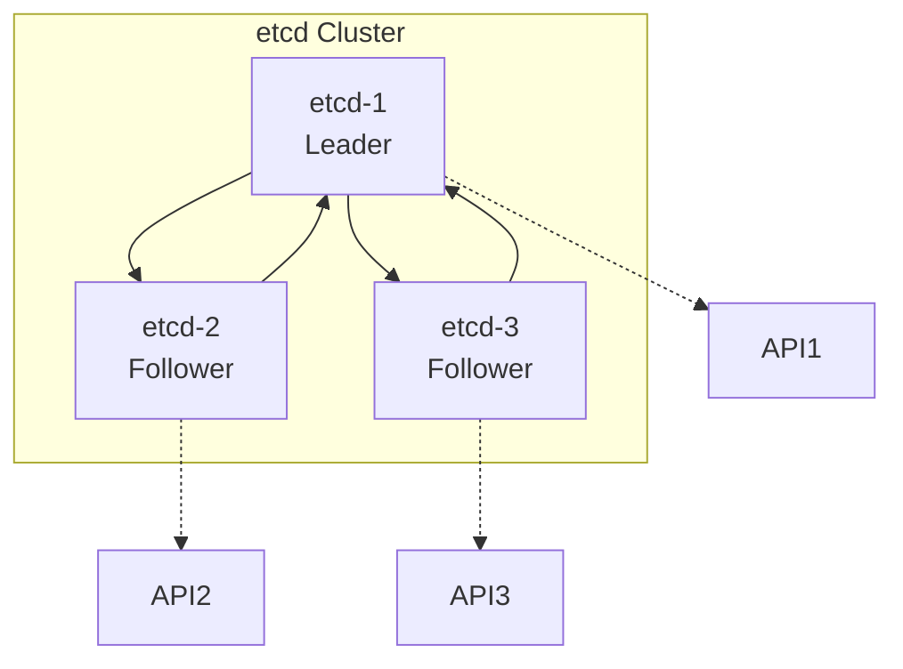

# Kubernetes Architecture Deep Dive

Kubernetes follows a master-worker architecture where the control plane (master) manages the cluster state and worker nodes run the actual applications. This distributed system provides high availability, scalability, and automated management of containerized workloads.

## Control Plane (Master Node) Components

The control plane is the brain of the Kubernetes cluster, responsible for making global decisions about the cluster and detecting/responding to cluster events.

### 1. kube-apiserver: The API Gateway

**Role:** Central management point for the entire cluster - the "front door" for all Kubernetes operations.

**Key Functions:**
- **API Endpoint:** Exposes Kubernetes API (RESTful interface)
- **Authentication & Authorization:** Validates requests and enforces permissions
- **Request Validation:** Ensures API requests are properly formatted
- **API Aggregation:** Extends API with custom resources
- **Admission Controllers:** Mutates or validates requests before persistence

**How it Works:**
- Listens on port 6443 (default) with TLS encryption
- Communicates with etcd for state storage
- Acts as the single source of truth for cluster state
- All kubectl commands flow through the API server

**Example Flow:**
```bash
kubectl get pods
# 1. kubectl sends request to API server
# 2. API server authenticates user
# 3. API server retrieves data from etcd
# 4. API server returns formatted response
```

### 2. kube-controller-manager: The Control Loop Engine

**Role:** Runs controller processes that regulate the state of the cluster.

**Built-in Controllers:**
- **Node Controller:** Handles node failures and updates
- **Replication Controller:** Maintains correct pod replicas
- **Endpoints Controller:** Populates endpoint objects
- **Service Account & Token Controllers:** Manage access tokens

**How Controllers Work:**
```yaml
# Desired State (from etcd)
replicas: 3

# Current State (from API server)
runningPods: 2

# Controller Action
# → Creates 1 new pod to match desired state
```

**Controller Pattern:**
1. **Observe:** Watch for changes in cluster state
2. **Analyze:** Compare current vs. desired state
3. **Act:** Make changes to achieve desired state
4. **Repeat:** Continuous reconciliation loop

### 3. kube-scheduler: The Pod Placement Engine

**Role:** Assigns pods to nodes based on resource requirements, constraints, and policies.

**Scheduling Process:**
1. **Filtering:** Eliminate nodes that don't meet requirements
2. **Scoring:** Rank remaining nodes by suitability
3. **Binding:** Assign pod to highest-scoring node

**Scheduling Criteria:**
- **Resource Requirements:** CPU, memory, storage
- **Node Selectors/Affinity:** Explicit placement rules
- **Taints & Tolerations:** Node restrictions and overrides
- **Pod Anti-Affinity:** Spread pods across nodes
- **Quality of Service:** Guaranteed vs. Burstable vs. BestEffort

**Example Decision:**
```yaml
# Pod requires: CPU=500m, Memory=1Gi
# Node A: Available CPU=2, Memory=4Gi → Score: 8/10
# Node B: Available CPU=1, Memory=2Gi → Score: 6/10
# Result: Pod scheduled on Node A
```

### 4. etcd: The Cluster State Store

**Role:** Distributed key-value store that persists all cluster data.

**Key Characteristics:**
- **Consistency:** Uses Raft consensus algorithm
- **High Availability:** Survives node failures
- **Watch Mechanism:** Real-time change notifications
- **Atomic Operations:** Compare-and-swap for consistency

**Data Stored:**
- Cluster configuration and state
- Pod, service, and deployment specs
- Secrets and ConfigMaps
- RBAC policies and roles

**Backup Criticality:**
```bash
# etcd backup command
ETCDCTL_API=3 etcdctl snapshot save /backup/etcd-snapshot.db \
  --endpoints=https://127.0.0.1:2379 \
  --cacert=/etc/kubernetes/pki/etcd/ca.crt \
  --cert=/etc/kubernetes/pki/etcd/server.crt \
  --key=/etc/kubernetes/pki/etcd/server.key
```

## Worker Node Components

Worker nodes are where application containers actually run. Each worker node contains the necessary services to run pods and communicate with the control plane.

### 1. kubelet: The Node Agent

**Role:** Primary node agent that ensures containers are running in pods as expected.

**Key Responsibilities:**
- **Pod Lifecycle Management:** Creates, updates, and destroys containers
- **Health Monitoring:** Reports pod status to API server
- **Resource Management:** Enforces resource limits and requests
- **Image Management:** Pulls container images as needed
- **Volume Mounting:** Attaches storage volumes to containers

**Communication with Control Plane:**
- Registers node with API server
- Sends heartbeats and status updates
- Receives pod specifications to execute
- Reports pod health and resource usage

### 2. kube-proxy: The Network Proxy

**Role:** Maintains network rules on nodes to enable communication between pods and external traffic.

**Networking Functions:**
- **Service Implementation:** Creates iptables/ipvs rules for services
- **Load Balancing:** Distributes traffic across pod endpoints
- **Network Policies:** Enforces network segmentation rules
- **DNS Resolution:** Enables service discovery

**Service Types Implementation:**
- **ClusterIP:** Internal cluster networking
- **NodePort:** External access via node ports
- **LoadBalancer:** Integration with cloud load balancers

### 3. Container Runtime: The Container Engine

**Role:** Software responsible for running containers.

**Supported Runtimes:**
- **Docker:** Original runtime (being phased out)
- **containerd:** Industry standard, used by Docker and others
- **CRI-O:** Lightweight runtime specifically for Kubernetes
- **Podman:** Alternative container engine

**Runtime Interface:**
- **Container Runtime Interface (CRI):** Standard plugin interface
- **Image Management:** Pull, store, and manage container images
- **Container Lifecycle:** Create, start, stop, and destroy containers

## Complete kubectl Command Flow

Let's trace what happens when you run: `kubectl run nginx --image=nginx`



### Detailed Flow Breakdown:

1. **Command Parsing:** kubectl parses the command and converts to API call
2. **Authentication:** API server validates user credentials and permissions
3. **Admission Control:** Webhooks and policies validate the request
4. **Persistence:** Pod specification stored in etcd
5. **Scheduling:** Scheduler selects optimal node based on constraints
6. **Binding:** Pod assigned to specific node in cluster
7. **Execution:** kubelet receives pod spec and creates containers
8. **Monitoring:** Continuous health checks and status reporting
9. **Networking:** kube-proxy sets up network rules for pod communication

## Advanced Architecture Patterns

### High Availability Control Plane



### etcd Clustering



## Security Considerations

### Control Plane Security
- **API Server Encryption:** All communication uses TLS
- **RBAC:** Role-based access control for all operations
- **Admission Controllers:** Security policies enforced at API level
- **Audit Logging:** All API calls logged for compliance

### Node Security
- **kubelet Authentication:** Certificate-based authentication
- **Container Isolation:** Namespaces, cgroups, and seccomp profiles
- **Image Security:** Image scanning and trusted registries
- **Network Policies:** Pod-to-pod traffic control

## Troubleshooting Architecture Issues

### Common Control Plane Problems

1. **API Server Unreachable:**
```bash
# Check API server logs
kubectl logs -n kube-system kube-apiserver-controlplane

# Verify certificates
openssl x509 -in /etc/kubernetes/pki/apiserver.crt -text
```

2. **Scheduler Not Working:**
```bash
# Check scheduler logs
kubectl logs -n kube-system kube-scheduler-controlplane

# Verify node capacity
kubectl describe node <node-name>
```

3. **etcd Issues:**
```bash
# Check etcd health
kubectl exec -n kube-system etcd-controlplane -- etcdctl endpoint health

# Verify cluster status
kubectl exec -n kube-system etcd-controlplane -- etcdctl member list
```

### Worker Node Issues

1. **kubelet Problems:**
```bash
# Check kubelet status
systemctl status kubelet

# View kubelet logs
journalctl -u kubelet -f
```

2. **Container Runtime Issues:**
```bash
# Check container runtime
docker ps  # or containerd equivalent

# Verify CRI socket
ls -la /var/run/containerd/containerd.sock
```

## Performance Optimization

### Control Plane Tuning
- **API Server:** Adjust `--max-requests-inflight` and `--max-mutating-requests-inflight`
- **etcd:** Configure heartbeat intervals and snapshot frequencies
- **Scheduler:** Tune scheduling algorithms for large clusters

### Worker Node Optimization
- **Resource Limits:** Set appropriate CPU and memory limits
- **Network Tuning:** Optimize kube-proxy and CNI settings
- **Storage:** Use efficient storage backends and caching

## Hands-on Exercises

### Exercise 1: Explore Control Plane Components

1. **View API server configuration:**
```bash
# Check API server pod
kubectl get pods -n kube-system -l component=kube-apiserver

# View API server logs
kubectl logs -n kube-system kube-apiserver-controlplane -f
```

2. **Examine etcd operations:**
```bash
# Access etcd (if available)
kubectl exec -n kube-system etcd-controlplane -- etcdctl get / --prefix --keys-only
```

3. **Monitor scheduler decisions:**
```bash
# View scheduler logs
kubectl logs -n kube-system kube-scheduler-controlplane --tail=50
```

### Exercise 2: Worker Node Investigation

1. **Inspect kubelet configuration:**
```bash
# Check kubelet status
kubectl get nodes -o wide

# Describe a specific node
kubectl describe node <node-name>
```

2. **Examine network configuration:**
```bash
# View kube-proxy configuration
kubectl get configmap kube-proxy -n kube-system -o yaml

# Check network policies
kubectl get networkpolicies
```

### Exercise 3: kubectl Command Tracing

1. **Enable verbose logging:**
```bash
# Run kubectl with verbose output
kubectl get pods -v=8

# This shows the HTTP requests made to API server
```

2. **Monitor API server requests:**
```bash
# Watch API server audit logs (if enabled)
kubectl logs -n kube-system kube-apiserver-controlplane | grep audit
```

## Summary

Understanding Kubernetes architecture is crucial for effective cluster management and troubleshooting. The control plane provides centralized control and decision-making, while worker nodes execute the actual workloads. The distributed nature ensures high availability and scalability, but requires careful configuration and monitoring.

Key takeaways:
- **API Server** is the central communication hub
- **etcd** provides the single source of truth
- **Controllers** maintain desired cluster state
- **Scheduler** optimizes pod placement
- **kubelet** manages pod execution on nodes
- **kube-proxy** handles networking
- **Container runtime** executes containers

This architecture enables Kubernetes to manage complex, distributed applications reliably and efficiently.