# Kubernetes Architecture Deep Dive

Kubernetes follows a master-worker architecture where the control plane (master) manages the cluster state and worker nodes run the actual applications. This distributed system provides high availability, scalability, and automated management of containerized workloads.

## Architecture Overview


### Core Components at a Glance

- **Control Plane**: Manages cluster state and makes scheduling decisions
- **Worker Nodes**: Run application containers and handle networking
- **API Server**: RESTful interface for cluster management
- **etcd**: Distributed key-value store for cluster data
- **Scheduler**: Assigns pods to nodes based on resource requirements
- **Controller Manager**: Runs control loops to maintain desired state
- **kubelet**: Node agent that manages pod lifecycle
- **kube-proxy**: Handles network rules and load balancing

## Control Plane (Master Node) Components

The control plane is the brain of the Kubernetes cluster, responsible for making global decisions about the cluster and detecting/responding to cluster events.

### 1. kube-apiserver: The API Gateway

**Role:** Central management point for the entire cluster - the "front door" for all Kubernetes operations.

**Key Functions:**
- **API Endpoint:** Exposes Kubernetes API (RESTful interface)
- **Authentication & Authorization:** Validates requests and enforces permissions
- **Request Validation:** Ensures API requests are properly formatted
- **API Aggregation:** Extends API with custom resources
- **Admission Controllers:** Mutates or validates requests before persistence

**How it Works:**
- Listens on port 6443 (default) with TLS encryption
- Communicates with etcd for state storage
- Acts as the single source of truth for cluster state
- All kubectl commands flow through the API server

**Example Flow:**
```bash
kubectl get pods
# 1. kubectl sends request to API server
# 2. API server authenticates user
# 3. API server retrieves data from etcd
# 4. API server returns formatted response
```

### 2. kube-controller-manager: The Control Loop Engine

**Role:** Runs controller processes that regulate the state of the cluster.

**Built-in Controllers:**
- **Node Controller:** Handles node failures and updates
- **Replication Controller:** Maintains correct pod replicas
- **Endpoints Controller:** Populates endpoint objects
- **Service Account & Token Controllers:** Manage access tokens

**How Controllers Work:**
```yaml
# Desired State (from etcd)
replicas: 3

# Current State (from API server)
runningPods: 2

# Controller Action
# → Creates 1 new pod to match desired state
```

**Controller Pattern:**
1. **Observe:** Watch for changes in cluster state
2. **Analyze:** Compare current vs. desired state
3. **Act:** Make changes to achieve desired state
4. **Repeat:** Continuous reconciliation loop

### 3. kube-scheduler: The Pod Placement Engine

**Role:** Assigns pods to nodes based on resource requirements, constraints, and policies.

**Scheduling Process:**
1. **Filtering:** Eliminate nodes that don't meet requirements
2. **Scoring:** Rank remaining nodes by suitability
3. **Binding:** Assign pod to highest-scoring node

**Scheduling Criteria:**
- **Resource Requirements:** CPU, memory, storage
- **Node Selectors/Affinity:** Explicit placement rules
- **Taints & Tolerations:** Node restrictions and overrides
- **Pod Anti-Affinity:** Spread pods across nodes
- **Quality of Service:** Guaranteed vs. Burstable vs. BestEffort

**Example Decision:**
```yaml
# Pod requires: CPU=500m, Memory=1Gi
# Node A: Available CPU=2, Memory=4Gi → Score: 8/10
# Node B: Available CPU=1, Memory=2Gi → Score: 6/10
# Result: Pod scheduled on Node A
```

### 4. etcd: The Cluster State Store

**Role:** Distributed key-value store that persists all cluster data.

**Key Characteristics:**
- **Consistency:** Uses Raft consensus algorithm
- **High Availability:** Survives node failures
- **Watch Mechanism:** Real-time change notifications
- **Atomic Operations:** Compare-and-swap for consistency

**Data Stored:**
- Cluster configuration and state
- Pod, service, and deployment specs
- Secrets and ConfigMaps
- RBAC policies and roles

**Backup Criticality:**
```bash
# etcd backup command
ETCDCTL_API=3 etcdctl snapshot save /backup/etcd-snapshot.db \
  --endpoints=https://127.0.0.1:2379 \
  --cacert=/etc/kubernetes/pki/etcd/ca.crt \
  --cert=/etc/kubernetes/pki/etcd/server.crt \
  --key=/etc/kubernetes/pki/etcd/server.key
```

## Worker Node Components

Worker nodes are where application containers actually run. Each worker node contains the necessary services to run pods and communicate with the control plane.

### 1. kubelet: The Node Agent

**Role:** Primary node agent that ensures containers are running in pods as expected.

**Key Responsibilities:**
- **Pod Lifecycle Management:** Creates, updates, and destroys containers
- **Health Monitoring:** Reports pod status to API server
- **Resource Management:** Enforces resource limits and requests
- **Image Management:** Pulls container images as needed
- **Volume Mounting:** Attaches storage volumes to containers

**Communication with Control Plane:**
- Registers node with API server
- Sends heartbeats and status updates
- Receives pod specifications to execute
- Reports pod health and resource usage

### 2. kube-proxy: The Network Proxy

**Role:** Maintains network rules on nodes to enable communication between pods and external traffic.

**Networking Functions:**
- **Service Implementation:** Creates iptables/ipvs rules for services
- **Load Balancing:** Distributes traffic across pod endpoints
- **Network Policies:** Enforces network segmentation rules
- **DNS Resolution:** Enables service discovery

**Service Types Implementation:**
- **ClusterIP:** Internal cluster networking
- **NodePort:** External access via node ports
- **LoadBalancer:** Integration with cloud load balancers

### 3. Container Runtime: The Container Engine

**Role:** Software responsible for running containers.

**Supported Runtimes:**
- **Docker:** Original runtime (being phased out)
- **containerd:** Industry standard, used by Docker and others
- **CRI-O:** Lightweight runtime specifically for Kubernetes
- **Podman:** Alternative container engine

**Runtime Interface:**
- **Container Runtime Interface (CRI):** Standard plugin interface
- **Image Management:** Pull, store, and manage container images
- **Container Lifecycle:** Create, start, stop, and destroy containers

## Complete kubectl Command Flow

Let's trace what happens when you run: `kubectl run nginx --image=nginx`


### Detailed Flow Breakdown:

1. **Command Parsing:** kubectl parses the command and converts to API call
2. **Authentication:** API server validates user credentials and permissions
3. **Admission Control:** Webhooks and policies validate the request
4. **Persistence:** Pod specification stored in etcd
5. **Scheduling:** Scheduler selects optimal node based on constraints
6. **Binding:** Pod assigned to specific node in cluster
7. **Execution:** kubelet receives pod spec and creates containers
8. **Monitoring:** Continuous health checks and status reporting
9. **Networking:** kube-proxy sets up network rules for pod communication

## Failure Scenarios: Single Master vs High Availability

Understanding what happens during failures is crucial for designing resilient Kubernetes clusters. Let's compare single-master and HA setups.

### Scenario 1: Single Master Setup - Master Node Fails

**Architecture Before Failure:**

```mermaid
graph TB
    subgraph "Single Master Cluster"
        MASTER[Master Node ⚡<br/>API Server + etcd + Scheduler]
        W1[Worker Node 1 ✅<br/>Running Pods]
        W2[Worker Node 2 ✅<br/>Running Pods]
        W3[Worker Node 3 ✅<br/>Running Pods]
    end
    
    MASTER --> W1
    MASTER --> W2
    MASTER --> W3
    
    style MASTER fill:#4CAF50,color:#fff
```


**What Happens When Master Goes Down:**

```mermaid
graph TB
    subgraph "After Master Failure"
        MASTER[Master Node 💀<br/>CRASHED]
        W1[Worker Node 1 ✅<br/>Pods Still Running]
        W2[Worker Node 2 ✅<br/>Pods Still Running]
        W3[Worker Node 3 ✅<br/>Pods Still Running]
        
        ISSUE1[❌ Cannot deploy new pods]
        ISSUE2[❌ Cannot scale existing deployments]
        ISSUE3[❌ No pod restart if crashed]
        ISSUE4[❌ No kubectl commands work]
        ISSUE5[❌ No healing or recovery]
    end
    
    MASTER -.X.-> W1
    MASTER -.X.-> W2
    MASTER -.X.-> W3
    
    style MASTER fill:#F44336,color:#fff
    style ISSUE1 fill:#FF9800,color:#000
    style ISSUE2 fill:#FF9800,color:#000
    style ISSUE3 fill:#FF9800,color:#000
    style ISSUE4 fill:#FF9800,color:#000
    style ISSUE5 fill:#FF9800,color:#000
```


**Impact:**

| Category | Status | Details |
|----------|--------|---------|
| **Running Pods** | ✅ Continue Running | Existing pods keep serving traffic |
| **Services** | ✅ Still Work | Load balancing continues (handled by kube-proxy on workers) |
| **New Deployments** | ❌ FAIL | Cannot create new pods - no scheduler available |
| **Scaling** | ❌ FAIL | Cannot increase/decrease replicas - no controller manager |
| **Pod Restart** | ❌ FAIL | If pod crashes, it won't be restarted - no kubelet supervision from control plane |
| **kubectl** | ❌ FAIL | All kubectl commands fail - no API server |
| **Self-Healing** | ❌ FAIL | No automatic recovery - controllers are down |
| **Cluster State** | ❌ LOST | etcd data still there but inaccessible |

**Real-World Impact:**
```
Time: 10:00 AM - Master node crashes (hardware failure)

10:00 AM: ✅ 100 pods still serving traffic normally
10:15 AM: ⚠️ Pod crashes in Worker 2 - NOT RESTARTED
10:30 AM: ⚠️ Traffic spike - cannot auto-scale
11:00 AM: ❌ 5 pods crashed - services degraded
12:00 PM: ❌ 20 pods crashed - major outage
02:00 PM: 💀 CRITICAL: 50% of services down

Recovery: Must restore master node before cluster recovers
```

**Recovery Steps:**
```bash
# Option 1: Restore master node
# - Fix hardware/network issue
# - Restart control plane components
# - Cluster resumes normal operation

# Option 2: Restore from etcd backup
etcdctl snapshot restore /backup/etcd-snapshot.db
# Then bring up new master with restored data
```

### Scenario 2: Single Master Setup - Worker Node Fails

**What Happens When Worker Goes Down:**


**Impact:**

| Category | Status | Details |
|----------|--------|---------|
| **Master** | ✅ Healthy | Full control plane operational |
| **Failed Worker Pods** | ⚠️ Terminated | Pods on crashed worker are gone |
| **Pod Rescheduling** | ✅ Automatic | Controller manager creates replacement pods on healthy workers |
| **Other Workers** | ✅ Unaffected | Pods on other workers continue normally |
| **Services** | ✅ Auto-Update | Endpoints updated automatically, traffic rerouted |
| **New Deployments** | ✅ Work | Can deploy new pods to healthy workers |
| **Scaling** | ✅ Work | Auto-scaling functions normally |
| **Recovery Time** | ~30-60 sec | Pods rescheduled within 1 minute |

**Timeline:**
```
Time: 10:00 AM - Worker-2 crashes

10:00:00 - Worker-2 fails (hardware issue)
10:00:05 - kubelet heartbeat stops
10:00:40 - Master marks node as NotReady (after timeout)
10:00:45 - Controller manager detects pod disruption
10:00:50 - Scheduler assigns replacement pods to Worker-1 and Worker-3
10:01:00 - New pods starting on healthy workers
10:01:15 - Pods ready, endpoints updated
10:01:20 - ✅ Full service restored

Total disruption: ~80 seconds
Workloads automatically recovered! 🎉
```

### Scenario 3: HA Setup - Master Node Fails

**HA Architecture (3 Master Nodes):**


**When One Master Fails:**

```mermaid
graph TB
    subgraph "After Master-1 Failure"
        LB[Load Balancer ✅<br/>Detects failure]
        M1[Master 1 💀<br/>CRASHED]
        M2[Master 2 ✅<br/>API + etcd Leader]
        M3[Master 3 ✅<br/>API + etcd Follower]
        W1[Worker 1 ✅]
        W2[Worker 2 ✅]
        W3[Worker 3 ✅]
        
        ACTION1[✅ etcd elects new leader]
        ACTION2[✅ Load balancer reroutes traffic]
        ACTION3[✅ Zero impact on workloads]
    end
    
    LB -.X.-> M1
    LB --> M2
    LB --> M3
    
    M2 -.etcd sync.-> M3
    M3 -.etcd sync.-> M2
    
    M2 --> W1
    M2 --> W2
    M3 --> W3
    
    M2 --> ACTION1
    ACTION1 --> ACTION2
    ACTION2 --> ACTION3
    
    style M1 fill:#F44336,color:#fff
    style M2 fill:#4CAF50,color:#fff
    style M3 fill:#4CAF50,color:#fff
    style ACTION3 fill:#4CAF50,color:#fff
```


**Impact with HA:**

| Category | Status | Details |
|----------|--------|---------|
| **Cluster Operations** | ✅ Unaffected | Remaining masters handle all requests |
| **etcd Quorum** | ✅ Maintained | 2 of 3 etcd members still available (quorum intact) |
| **API Requests** | ✅ Work | Load balancer routes to healthy API servers |
| **Running Pods** | ✅ Unaffected | All workloads continue normally |
| **New Deployments** | ✅ Work | Can create new pods via healthy masters |
| **Scaling** | ✅ Work | Auto-scaling operates normally |
| **kubectl** | ✅ Work | All commands work via healthy masters |
| **Recovery Time** | ~0 seconds | ZERO DOWNTIME! |
| **Manual Intervention** | Not urgent | Can fix failed master at convenient time |

**Timeline:**
```
Time: 10:00 AM - Master-1 crashes

10:00:00 - Master-1 fails (hardware issue)
10:00:02 - Load balancer detects failure (health check)
10:00:03 - Traffic automatically rerouted to Master-2 and Master-3
10:00:05 - etcd cluster elects new leader (Master-2)
10:00:10 - ✅ Cluster fully operational

Total disruption: 0 seconds
No user-facing impact whatsoever! 🎉
```

**Key Differences:**
- **etcd Quorum:** 2 of 3 nodes still approve changes
- **Load Balancer:** Automatically routes around failed master
- **Zero Downtime:** Users experience no interruption
- **Continued Operations:** All cluster functions work normally

### Scenario 4: HA Setup - Worker Node Fails

**What Happens with HA (Same as Single Master):**

```mermaid
graph TB
    subgraph "After Worker Failure - HA Cluster"
        LB[Load Balancer ✅]
        M1[Master 1 ✅]
        M2[Master 2 ✅]
        M3[Master 3 ✅]
        W1[Worker 1 ✅<br/>Receiving rescheduled pods]
        W2[Worker 2 💀<br/>CRASHED]
        W3[Worker 3 ✅<br/>Receiving rescheduled pods]
        
        ACTION1[✅ Multiple masters detect failure]
        ACTION2[✅ Faster consensus on pod rescheduling]
        ACTION3[✅ Pods rescheduled to W1 & W3]
        ACTION4[✅ Load distributed across healthy workers]
    end
    
    LB --> M1
    LB --> M2
    LB --> M3
    
    M1 --> W1
    M2 -.X.-> W2
    M3 --> W3
    
    M1 --> ACTION1
    ACTION1 --> ACTION2
    ACTION2 --> ACTION3
    ACTION3 --> ACTION4
    
    style M1 fill:#4CAF50,color:#fff
    style M2 fill:#4CAF50,color:#fff
    style M3 fill:#4CAF50,color:#fff
    style W2 fill:#F44336,color:#fff
    style ACTION4 fill:#4CAF50,color:#fff
```


**Impact:**

| Category | Status | Details |
|----------|--------|---------|
| **Failure Detection** | ✅ Faster | Multiple masters detect failure simultaneously |
| **Decision Making** | ✅ Faster | etcd quorum enables quick consensus |
| **Pod Rescheduling** | ✅ Immediate | Multiple schedulers can work in parallel |
| **Recovery Time** | ✅ ~20-30 sec | Faster than single master due to parallel processing |
| **Resilience** | ✅ Higher | Can lose 1 worker with minimal impact |

**Timeline Comparison:**

**Single Master:**
```
10:00:00 - Worker fails
10:00:40 - Master detects (single point of detection)
10:00:45 - Controller decides to reschedule
10:00:50 - Scheduler assigns pods
10:01:20 - Pods ready
Total: ~80 seconds
```

**HA Setup:**
```
10:00:00 - Worker fails
10:00:15 - Multiple masters detect faster (distributed monitoring)
10:00:18 - etcd quorum quickly agrees on action
10:00:20 - Scheduler assigns pods
10:00:35 - Pods ready
Total: ~35 seconds (55% faster!)
```

## Side-by-Side Comparison

### Single Master Configuration

```mermaid
graph TB
    subgraph "Single Master - Single Point of Failure"
        M[Master Node<br/>ALL Control Plane]
        W1[Worker 1]
        W2[Worker 2]
        
        RISK[⚠️ RISK: If master fails<br/>Cluster management stops]
    end
    
    M --> W1
    M --> W2
    M -.-> RISK
    
    style M fill:#FF9800,color:#fff
    style RISK fill:#F44336,color:#fff
```



**Characteristics:**
- ✅ **Simple Setup:** Easier to configure and maintain
- ✅ **Lower Cost:** Fewer servers required
- ✅ **Good for:** Development, testing, small non-critical apps
- ❌ **Single Point of Failure:** Master failure = cluster management down
- ❌ **No Deployment During Master Maintenance:** Must schedule downtime
- ❌ **Risk:** Production workloads at risk

**When to Use:**
- Development environments
- Learning and testing
- Non-production workloads
- Cost-constrained scenarios
- Temporary clusters

### High Availability Configuration

```mermaid
graph TB
    subgraph "HA - Redundant Control Plane"
        LB[Load Balancer]
        M1[Master 1<br/>API + etcd]
        M2[Master 2<br/>API + etcd]
        M3[Master 3<br/>API + etcd]
        W1[Worker 1]
        W2[Worker 2]
        W3[Worker 3]
        
        BENEFIT[✅ BENEFIT: Master failure<br/>Zero impact on cluster]
    end
    
    LB --> M1
    LB --> M2
    LB --> M3
    
    M1 -.etcd.-> M2
    M2 -.etcd.-> M3
    M3 -.etcd.-> M1
    
    M1 --> W1
    M2 --> W2
    M3 --> W3
    
    LB -.-> BENEFIT
    
    style M1 fill:#4CAF50,color:#fff
    style M2 fill:#4CAF50,color:#fff
    style M3 fill:#4CAF50,color:#fff
    style BENEFIT fill:#4CAF50,color:#fff
```



**Characteristics:**
- ✅ **No Single Point of Failure:** Can lose 1 master (3-node) or 2 masters (5-node)
- ✅ **Zero Downtime:** Cluster operations continue during failures
- ✅ **Production Ready:** Suitable for critical workloads
- ✅ **Maintenance Friendly:** Upgrade masters one at a time
- ✅ **Better Performance:** Distributed load across API servers
- ❌ **Higher Cost:** More servers required
- ❌ **More Complex:** Requires load balancer and proper configuration

**When to Use:**
- Production environments
- Critical business applications
- 24/7 availability requirements
- Regulated industries
- Enterprise deployments

## Real-World Failure Examples

### Example 1: E-commerce Site (Single Master)

**Setup:**
- 1 Master node
- 3 Worker nodes
- Running e-commerce application
- Black Friday sale

**Incident:**
```
11:00 AM - Black Friday sale starts
11:30 AM - Master node network card fails
11:31 AM - kubectl commands stop working
11:35 AM - A pod crashes on Worker 1
11:40 AM - Pod NOT restarted (no controller manager)
11:45 AM - More pods crash under load
12:00 PM - 30% of application capacity lost
12:30 PM - Engineers frantically trying to fix master
01:00 PM - Master restored, pods rescheduled
01:15 PM - Service returns to normal

LOSS: 1.75 hours of degraded service
IMPACT: Lost sales, customer complaints, reputation damage
COST: Estimated $100,000+ in lost revenue
```

### Example 2: E-commerce Site (HA Setup)

**Setup:**
- 3 Master nodes with load balancer
- 3 Worker nodes
- Same e-commerce application
- Black Friday sale

**Incident:**
```
11:00 AM - Black Friday sale starts
11:30 AM - Master-1 network card fails
11:30:03 - Load balancer detects, reroutes to Master-2 and Master-3
11:30:05 - etcd quorum maintained (2/3 nodes)
11:35 AM - A pod crashes on Worker 1
11:35:10 - Controller manager (on Master-2) creates replacement
11:35:15 - Scheduler (on Master-3) assigns to Worker 2
11:35:30 - New pod ready and serving

LOSS: 0 seconds of service disruption
IMPACT: None - users unaware of any issue
COST: $0 lost revenue
BONUS: Engineers fix Master-1 during normal hours, no rush
```

## Comparative Analysis

### Availability Calculations

**Single Master:**
```
Component Availability:
- Master Node: 99.9% (assuming good hardware)
- Worker Nodes: 99.9% each

Cluster Availability: 99.9% × 0.999³ = ~99.6%
Downtime per year: ~35 hours
```

**HA Setup (3 Masters):**
```
Component Availability:
- Control Plane: 1 - (0.001³) = 99.9999%
- Worker Nodes: 99.9% each

Cluster Availability: 99.9999% × 0.999³ = ~99.9%
Downtime per year: ~8 hours (mostly planned maintenance)
```

### Cost-Benefit Analysis

**Single Master:**
- **Cost:** Lower (3 servers vs 6 servers)
- **Management:** Simpler
- **Risk:** High for production
- **Best For:** Dev/test environments

**HA Setup:**
- **Cost:** Higher (2x infrastructure)
- **Management:** More complex
- **Risk:** Minimal
- **Best For:** Production workloads

**ROI Calculation Example:**
```
E-commerce Site:
- Revenue lost per hour of downtime: $50,000
- Single master downtime/year: 35 hours
- Annual risk: $1,750,000

HA Setup:
- Additional infrastructure cost: $50,000/year
- Downtime reduced to: 8 hours (planned only)
- Savings: $1,350,000/year

ROI: 2,700% return on HA investment! 💰
```

## Best Practices for High Availability

### Control Plane HA:
1. **Odd Number of Masters:** 3 or 5 nodes (for etcd quorum)
2. **Geographic Distribution:** Spread across availability zones
3. **Load Balancer:** Use redundant load balancers
4. **Monitoring:** Alert on master node health
5. **Automated Failover:** Configure automatic recovery

### Worker Node Resilience:
1. **Pod Disruption Budgets:** Prevent simultaneous pod terminations
2. **Pod Anti-Affinity:** Spread replicas across workers
3. **Resource Overprovisioning:** Ensure capacity for rescheduling
4. **Node Autoscaling:** Automatically add workers when needed
5. **Health Checks:** Proper liveness and readiness probes

### Example Pod Disruption Budget:
```yaml
apiVersion: policy/v1
kind: PodDisruptionBudget
metadata:
  name: app-pdb
spec:
  minAvailable: 2  # Always keep at least 2 pods running
  selector:
    matchLabels:
      app: critical-app
```

## Advanced Architecture Patterns

### High Availability Control Plane


### etcd Clustering


## Security Considerations

### Control Plane Security
- **API Server Encryption:** All communication uses TLS
- **RBAC:** Role-based access control for all operations
- **Admission Controllers:** Security policies enforced at API level
- **Audit Logging:** All API calls logged for compliance

### Node Security
- **kubelet Authentication:** Certificate-based authentication
- **Container Isolation:** Namespaces, cgroups, and seccomp profiles
- **Image Security:** Image scanning and trusted registries
- **Network Policies:** Pod-to-pod traffic control

## Troubleshooting Architecture Issues

### Common Control Plane Problems

1. **API Server Unreachable:**
```bash
# Check API server logs
kubectl logs -n kube-system kube-apiserver-controlplane

# Verify certificates
openssl x509 -in /etc/kubernetes/pki/apiserver.crt -text
```

2. **Scheduler Not Working:**
```bash
# Check scheduler logs
kubectl logs -n kube-system kube-scheduler-controlplane

# Verify node capacity
kubectl describe node <node-name>
```

3. **etcd Issues:**
```bash
# Check etcd health
kubectl exec -n kube-system etcd-controlplane -- etcdctl endpoint health

# Verify cluster status
kubectl exec -n kube-system etcd-controlplane -- etcdctl member list
```

### Worker Node Issues

1. **kubelet Problems:**
```bash
# Check kubelet status
systemctl status kubelet

# View kubelet logs
journalctl -u kubelet -f
```

2. **Container Runtime Issues:**
```bash
# Check container runtime
docker ps  # or containerd equivalent

# Verify CRI socket
ls -la /var/run/containerd/containerd.sock
```

## Performance Optimization

### Control Plane Tuning
- **API Server:** Adjust `--max-requests-inflight` and `--max-mutating-requests-inflight`
- **etcd:** Configure heartbeat intervals and snapshot frequencies
- **Scheduler:** Tune scheduling algorithms for large clusters

### Worker Node Optimization
- **Resource Limits:** Set appropriate CPU and memory limits
- **Network Tuning:** Optimize kube-proxy and CNI settings
- **Storage:** Use efficient storage backends and caching

## Hands-on Exercises

### Exercise 1: Explore Control Plane Components

1. **View API server configuration:**
```bash
# Check API server pod
kubectl get pods -n kube-system -l component=kube-apiserver

# View API server logs
kubectl logs -n kube-system kube-apiserver-controlplane -f
```

2. **Examine etcd operations:**
```bash
# Access etcd (if available)
kubectl exec -n kube-system etcd-controlplane -- etcdctl get / --prefix --keys-only
```

3. **Monitor scheduler decisions:**
```bash
# View scheduler logs
kubectl logs -n kube-system kube-scheduler-controlplane --tail=50
```

### Exercise 2: Worker Node Investigation

1. **Inspect kubelet configuration:**
```bash
# Check kubelet status
kubectl get nodes -o wide

# Describe a specific node
kubectl describe node <node-name>
```

2. **Examine network configuration:**
```bash
# View kube-proxy configuration
kubectl get configmap kube-proxy -n kube-system -o yaml

# Check network policies
kubectl get networkpolicies
```

### Exercise 3: kubectl Command Tracing

1. **Enable verbose logging:**
```bash
# Run kubectl with verbose output
kubectl get pods -v=8

# This shows the HTTP requests made to API server
```

2. **Monitor API server requests:**
```bash
# Watch API server audit logs (if enabled)
kubectl logs -n kube-system kube-apiserver-controlplane | grep audit
```

## Summary

Understanding Kubernetes architecture is crucial for effective cluster management and troubleshooting. The control plane provides centralized control and decision-making, while worker nodes execute the actual workloads. The distributed nature ensures high availability and scalability, but requires careful configuration and monitoring.

Key takeaways:
- **API Server** is the central communication hub
- **etcd** provides the single source of truth
- **Controllers** maintain desired cluster state
- **Scheduler** optimizes pod placement
- **kubelet** manages pod execution on nodes
- **kube-proxy** handles networking
- **Container runtime** executes containers

This architecture enables Kubernetes to manage complex, distributed applications reliably and efficiently.