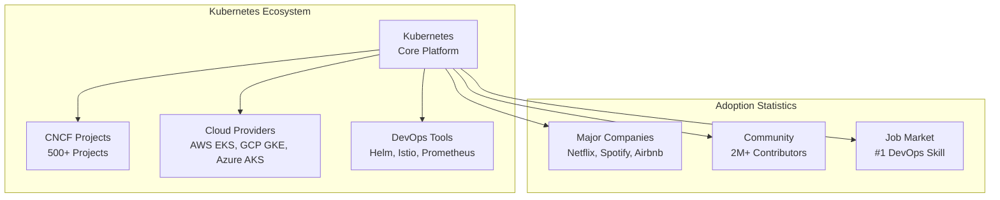
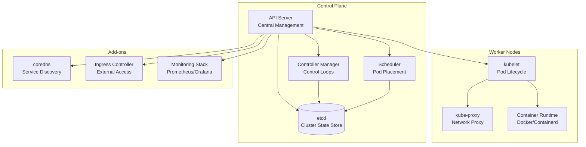

# Why Kubernetes? Container Orchestration in the Real World

While Docker provides excellent containerization capabilities, managing containers at scale in production environments requires orchestration. Kubernetes (K8s) is the industry-standard container orchestration platform that automates deployment, scaling, and management of containerized applications. This section explains why Kubernetes is essential and how it addresses real-world challenges.

## The Problem: Managing Containers at Scale

### Traditional Container Management Challenges

**Without Orchestration:**
- Manual container lifecycle management
- No automatic recovery from failures
- Difficult to scale applications dynamically
- Complex networking between containers
- Manual load balancing and service discovery
- No standardized deployment patterns

**Real-World Pain Points:**
- **E-commerce Platform:** During Black Friday sales, traffic spikes cause manual scaling bottlenecks
- **Microservices Architecture:** Dozens of services with complex interdependencies
- **DevOps Teams:** Different environments (dev/staging/prod) with configuration drift
- **Multi-Cloud Deployments:** Managing containers across different cloud providers

## What is Container Orchestration?

Container orchestration automates the deployment, scaling, networking, and lifecycle management of containers. It treats your infrastructure as code and provides declarative configuration for desired application states.

### Key Orchestration Features

1. **Automated Scheduling:** Intelligently places containers on available nodes
2. **Self-Healing:** Automatically restarts failed containers and reschedules workloads
3. **Horizontal Scaling:** Automatically scales applications based on resource usage or custom metrics
4. **Service Discovery:** Automatic service registration and discovery
5. **Load Balancing:** Distributes traffic across multiple container instances
6. **Rolling Updates:** Updates applications without downtime
7. **Resource Management:** Efficiently allocates CPU, memory, and storage


## Why Kubernetes? The Industry Standard

### Market Adoption and Ecosystem



### Kubernetes vs. Other Orchestrators

| Feature | Kubernetes | Docker Swarm | Apache Mesos | Nomad |
|---------|------------|--------------|--------------|-------|
| **Maturity** | Production-Ready | Production-Ready | Mature | Growing |
| **Community** | Largest | Smaller | Medium | Growing |
| **Ecosystem** | Extensive | Limited | Good | Good |
| **Complexity** | Steep Learning Curve | Easier | Complex | Moderate |
| **Scalability** | Massive Scale | Good | Excellent | Good |
| **Cloud Integration** | Excellent | Good | Good | Good |

## Real-World Kubernetes Use Cases

### 1. E-commerce Platform Scaling

**Challenge:** Handle 10x traffic during holiday sales without service degradation.

**Kubernetes Solution:**
```yaml
apiVersion: apps/v1
kind: Deployment
metadata:
  name: ecommerce-app
spec:
  replicas: 3  # Starts with 3 replicas
  selector:
    matchLabels:
      app: ecommerce
  template:
    metadata:
      labels:
        app: ecommerce
    spec:
      containers:
      - name: web
        image: ecommerce/web:latest
        resources:
          requests:
            cpu: 100m
            memory: 128Mi
          limits:
            cpu: 500m
            memory: 512Mi
---
apiVersion: autoscaling/v2
kind: HorizontalPodAutoscaler
metadata:
  name: ecommerce-hpa
spec:
  scaleTargetRef:
    apiVersion: apps/v1
    kind: Deployment
    name: ecommerce-app
  minReplicas: 3
  maxReplicas: 50
  metrics:
  - type: Resource
    resource:
      name: cpu
      target:
        type: Utilization
        averageUtilization: 70
```

**Benefits:**
- Automatic scaling from 3 to 50 replicas based on CPU usage
- Zero-downtime deployments during updates
- Efficient resource utilization

### 2. Microservices Management

**Challenge:** Deploy and manage 50+ microservices with complex dependencies.

**Kubernetes Solution:**
```yaml
apiVersion: apps/v1
kind: Deployment
metadata:
  name: user-service
spec:
  replicas: 3
  template:
    spec:
      containers:
      - name: user-service
        image: myapp/user-service:v1.2.3
        ports:
        - containerPort: 8080
        env:
        - name: DB_HOST
          valueFrom:
            configMapKeyRef:
              name: app-config
              key: database.host
---
apiVersion: v1
kind: Service
metadata:
  name: user-service
spec:
  selector:
    app: user-service
  ports:
  - port: 80
    targetPort: 8080
  type: ClusterIP
```

**Benefits:**
- Declarative service definitions
- Automatic service discovery
- Rolling updates without service interruption
- Centralized configuration management

### 3. Multi-Environment Consistency

**Challenge:** Ensure identical deployments across dev, staging, and production.

**Kubernetes Solution:**
```yaml
# base/deployment.yaml
apiVersion: apps/v1
kind: Deployment
metadata:
  name: myapp
spec:
  template:
    spec:
      containers:
      - name: app
        image: myapp:latest
        envFrom:
        - configMapRef:
            name: app-config
---
# overlays/production/deployment.yaml
apiVersion: apps/v1
kind: Deployment
metadata:
  name: myapp
spec:
  replicas: 10  # Production needs more replicas
  template:
    spec:
      containers:
      - name: app
        resources:
          limits:
            cpu: 1000m
            memory: 2Gi
```

**Benefits:**
- GitOps workflows with Kustomize or Helm
- Environment-specific customizations
- Consistent deployment patterns
- Audit trails and rollbacks

### 4. Disaster Recovery and High Availability

**Challenge:** Ensure application availability during infrastructure failures.

**Kubernetes Solution:**
```yaml
apiVersion: policy/v1
kind: PodDisruptionBudget
metadata:
  name: app-pdb
spec:
  minAvailable: 2
  selector:
    matchLabels:
      app: critical-app
---
apiVersion: apps/v1
kind: Deployment
metadata:
  name: critical-app
spec:
  replicas: 5
  strategy:
    type: RollingUpdate
    rollingUpdate:
      maxUnavailable: 1
      maxSurge: 1
  template:
    spec:
      affinity:
        podAntiAffinity:
          requiredDuringSchedulingIgnoredDuringExecution:
          - labelSelector:
              matchLabels:
                app: critical-app
            topologyKey: kubernetes.io/hostname
```

**Benefits:**
- Pod disruption budgets prevent outages during maintenance
- Anti-affinity rules spread pods across nodes
- Rolling updates ensure zero downtime
- Self-healing capabilities

## Kubernetes Architecture Deep Dive

### Control Plane Components



### Declarative vs. Imperative Management

**Imperative (Traditional):**
```bash
# Manual commands for each action
docker run -d --name web1 nginx
docker run -d --name web2 nginx
docker run -d --name loadbalancer nginx

# Manual scaling
docker run -d --name web3 nginx
# Update load balancer configuration
```

**Declarative (Kubernetes):**
```yaml
apiVersion: apps/v1
kind: Deployment
metadata:
  name: web-app
spec:
  replicas: 3  # Declarative: "I want 3 replicas"
  selector:
    matchLabels:
      app: web
  template:
    metadata:
      labels:
        app: web
    spec:
      containers:
      - name: nginx
        image: nginx
```

**Benefits of Declarative Approach:**
- **Idempotent:** Same result regardless of current state
- **Version Control:** Infrastructure as code
- **Audit Trail:** Track all changes
- **Reconciliation:** System continuously ensures desired state

## Real-World Success Stories

### Netflix: Microservices at Scale

**Challenge:** Migrate from monolithic architecture to microservices while maintaining reliability.

**Kubernetes Implementation:**
- 100+ microservices running on Kubernetes
- Automated canary deployments
- Service mesh with Istio for traffic management
- Custom operators for Netflix-specific requirements

**Results:**
- 99.99% uptime
- 50% reduction in deployment time
- Improved developer productivity

### Spotify: Developer Experience

**Challenge:** Enable 3,000+ developers to deploy services independently.

**Kubernetes Solution:**
- Internal Kubernetes platform ("Spotify Infrastructure")
- Self-service deployment workflows
- Automated testing and security scanning
- Multi-region deployments

**Outcomes:**
- Developers deploy 50,000+ times per day
- Reduced time-to-market for new features
- Improved service reliability

### Airbnb: Resource Optimization

**Challenge:** Optimize cloud costs while maintaining performance.

**Kubernetes Implementation:**
- Custom schedulers for workload placement
- Resource quotas and limits
- Horizontal pod autoscaling
- Cluster autoscaling

**Benefits:**
- 30% cost reduction
- Improved resource utilization
- Better performance during peak loads

## Getting Started with Kubernetes

### Learning Path

1. **Container Basics:** Understand Docker fundamentals
2. **Kubernetes Concepts:** Learn pods, services, deployments
3. **Local Development:** Use KIND or Minikube for testing
4. **Production Deployment:** Set up multi-node clusters
5. **Advanced Topics:** Security, networking, monitoring

### First Steps

```bash
# Install kubectl
curl -LO "https://dl.k8s.io/release/$(curl -L -s https://dl.k8s.io/release/stable.txt)/bin/linux/amd64/kubectl"
chmod +x kubectl
sudo mv kubectl /usr/local/bin/

# Install KIND for local clusters
curl -Lo ./kind https://kind.sigs.k8s.io/dl/v0.20.0/kind-linux-amd64
chmod +x ./kind
sudo mv ./kind /usr/local/bin/

# Create your first cluster
kind create cluster --name my-first-cluster

# Verify installation
kubectl cluster-info --context kind-my-first-cluster
kubectl get nodes
```

### Common Beginner Mistakes to Avoid

1. **Not Setting Resource Limits:** Always define CPU and memory requests/limits
2. **Ignoring Namespaces:** Use namespaces for multi-tenant environments
3. **Manual Scaling:** Use deployments instead of managing pods directly
4. **No Health Checks:** Implement readiness and liveness probes
5. **Insecure Configurations:** Follow security best practices from day one

## Summary

Kubernetes addresses the critical need for container orchestration in modern application development. By providing automated deployment, scaling, and management capabilities, it enables organizations to:

- **Scale Applications Efficiently:** Handle traffic spikes and resource optimization
- **Improve Reliability:** Self-healing and high availability features
- **Accelerate Development:** Consistent environments and automated operations
- **Reduce Operational Overhead:** Declarative configuration and automation
- **Enable Microservices:** Manage complex distributed systems

The investment in learning Kubernetes pays dividends through improved deployment velocity, system reliability, and operational efficiency. As the de facto standard for container orchestration, Kubernetes skills are highly valuable in today's cloud-native landscape.

In the next section, we'll dive into Kubernetes architecture and core components to give you a solid foundation for working with this powerful platform.