# Kubernetes Architecture Deep Dive

Kubernetes follows a master-worker architecture where the control plane (master) manages the cluster state and worker nodes run the actual applications. This distributed system provides high availability, scalability, and automated management of containerized workloads.

## Architecture Overview


### Core Components at a Glance

- **Control Plane**: Manages cluster state and makes scheduling decisions
- **Worker Nodes**: Run application containers and handle networking
- **API Server**: RESTful interface for cluster management
- **etcd**: Distributed key-value store for cluster data
- **Scheduler**: Assigns pods to nodes based on resource requirements
- **Controller Manager**: Runs control loops to maintain desired state
- **kubelet**: Node agent that manages pod lifecycle
- **kube-proxy**: Handles network rules and load balancing

## Control Plane (Master Node) Components

The control plane is the brain of the Kubernetes cluster, responsible for making global decisions about the cluster and detecting/responding to cluster events.

### 1. kube-apiserver: The API Gateway

**Role:** Central management point for the entire cluster - the "front door" for all Kubernetes operations.

**Key Functions:**
- **API Endpoint:** Exposes Kubernetes API (RESTful interface)
- **Authentication & Authorization:** Validates requests and enforces permissions
- **Request Validation:** Ensures API requests are properly formatted
- **API Aggregation:** Extends API with custom resources
- **Admission Controllers:** Mutates or validates requests before persistence

**How it Works:**
- Listens on port 6443 (default) with TLS encryption
- Communicates with etcd for state storage
- Acts as the single source of truth for cluster state
- All kubectl commands flow through the API server

**Example Flow:**
```bash
kubectl get pods
# 1. kubectl sends request to API server
# 2. API server authenticates user
# 3. API server retrieves data from etcd
# 4. API server returns formatted response
```

### 2. kube-controller-manager: The Control Loop Engine

**Role:** Runs controller processes that regulate the state of the cluster.

**Built-in Controllers:**
- **Node Controller:** Handles node failures and updates
- **Replication Controller:** Maintains correct pod replicas
- **Endpoints Controller:** Populates endpoint objects
- **Service Account & Token Controllers:** Manage access tokens

**How Controllers Work:**
```yaml
# Desired State (from etcd)
replicas: 3

# Current State (from API server)
runningPods: 2

# Controller Action
# → Creates 1 new pod to match desired state
```

**Controller Pattern:**
1. **Observe:** Watch for changes in cluster state
2. **Analyze:** Compare current vs. desired state
3. **Act:** Make changes to achieve desired state
4. **Repeat:** Continuous reconciliation loop

### 3. kube-scheduler: The Pod Placement Engine

**Role:** Assigns pods to nodes based on resource requirements, constraints, and policies.

**Scheduling Process:**
1. **Filtering:** Eliminate nodes that don't meet requirements
2. **Scoring:** Rank remaining nodes by suitability
3. **Binding:** Assign pod to highest-scoring node

**Scheduling Criteria:**
- **Resource Requirements:** CPU, memory, storage
- **Node Selectors/Affinity:** Explicit placement rules
- **Taints & Tolerations:** Node restrictions and overrides
- **Pod Anti-Affinity:** Spread pods across nodes
- **Quality of Service:** Guaranteed vs. Burstable vs. BestEffort

**Example Decision:**
```yaml
# Pod requires: CPU=500m, Memory=1Gi
# Node A: Available CPU=2, Memory=4Gi → Score: 8/10
# Node B: Available CPU=1, Memory=2Gi → Score: 6/10
# Result: Pod scheduled on Node A
```

### 4. etcd: The Cluster State Store

**Role:** Distributed key-value store that persists all cluster data.

**Key Characteristics:**
- **Consistency:** Uses Raft consensus algorithm
- **High Availability:** Survives node failures
- **Watch Mechanism:** Real-time change notifications
- **Atomic Operations:** Compare-and-swap for consistency

**Data Stored:**
- Cluster configuration and state
- Pod, service, and deployment specs
- Secrets and ConfigMaps
- RBAC policies and roles

**Backup Criticality:**
```bash
# etcd backup command
ETCDCTL_API=3 etcdctl snapshot save /backup/etcd-snapshot.db \
  --endpoints=https://127.0.0.1:2379 \
  --cacert=/etc/kubernetes/pki/etcd/ca.crt \
  --cert=/etc/kubernetes/pki/etcd/server.crt \
  --key=/etc/kubernetes/pki/etcd/server.key
```

## Worker Node Components

Worker nodes are where application containers actually run. Each worker node contains the necessary services to run pods and communicate with the control plane.

### 1. kubelet: The Node Agent

**Role:** Primary node agent that ensures containers are running in pods as expected.

**Key Responsibilities:**
- **Pod Lifecycle Management:** Creates, updates, and destroys containers
- **Health Monitoring:** Reports pod status to API server
- **Resource Management:** Enforces resource limits and requests
- **Image Management:** Pulls container images as needed
- **Volume Mounting:** Attaches storage volumes to containers

**Communication with Control Plane:**
- Registers node with API server
- Sends heartbeats and status updates
- Receives pod specifications to execute
- Reports pod health and resource usage

### 2. kube-proxy: The Network Proxy

**Role:** Maintains network rules on nodes to enable communication between pods and external traffic.

**Networking Functions:**
- **Service Implementation:** Creates iptables/ipvs rules for services
- **Load Balancing:** Distributes traffic across pod endpoints
- **Network Policies:** Enforces network segmentation rules
- **DNS Resolution:** Enables service discovery

**Service Types Implementation:**
- **ClusterIP:** Internal cluster networking
- **NodePort:** External access via node ports
- **LoadBalancer:** Integration with cloud load balancers

### 3. Container Runtime: The Container Engine

**Role:** Software responsible for running containers.

**Supported Runtimes:**
- **Docker:** Original runtime (being phased out)
- **containerd:** Industry standard, used by Docker and others
- **CRI-O:** Lightweight runtime specifically for Kubernetes
- **Podman:** Alternative container engine

**Runtime Interface:**
- **Container Runtime Interface (CRI):** Standard plugin interface
- **Image Management:** Pull, store, and manage container images
- **Container Lifecycle:** Create, start, stop, and destroy containers

## Complete kubectl Command Flow

Let's trace what happens when you run: `kubectl run nginx --image=nginx`


### Detailed Flow Breakdown:

1. **Command Parsing:** kubectl parses the command and converts to API call
2. **Authentication:** API server validates user credentials and permissions
3. **Admission Control:** Webhooks and policies validate the request
4. **Persistence:** Pod specification stored in etcd
5. **Scheduling:** Scheduler selects optimal node based on constraints
6. **Binding:** Pod assigned to specific node in cluster
7. **Execution:** kubelet receives pod spec and creates containers
8. **Monitoring:** Continuous health checks and status reporting
9. **Networking:** kube-proxy sets up network rules for pod communication

## Failure Scenarios: Single Master vs High Availability

Understanding what happens during failures is crucial for designing resilient Kubernetes clusters. Let's compare single-master and HA setups.

### Scenario 1: Single Master Setup - Master Node Fails

**Architecture Before Failure:**
```mermaid
graph TB
    subgraph "Single Master Cluster"
        MASTER[Master Node ⚡<br/>API Server + etcd + Scheduler]
        W1[Worker Node 1 ✅<br/>Running Pods]
        W2[Worker Node 2 ✅<br/>Running Pods]
        W3[Worker Node 3 ✅<br/>Running Pods]
    end
    
    MASTER --> W1
    MASTER --> W2
    MASTER --> W3
    
    style MASTER fill:#4CAF50,color:#fff
```

**What Happens When Master Goes Down:**
```mermaid
graph TB
    subgraph "After Master Failure"
        MASTER[Master Node 💀<br/>CRASHED]
        W1[Worker Node 1 ✅<br/>Pods Still Running]
        W2[Worker Node 2 ✅<br/>Pods Still Running]
        W3[Worker Node 3 ✅<br/>Pods Still Running]
        
        ISSUE1[❌ Cannot deploy new pods]
        ISSUE2[❌ Cannot scale existing deployments]
        ISSUE3[❌ No pod restart if crashed]
        ISSUE4[❌ No kubectl commands work]
        ISSUE5[❌ No healing or recovery]
    end
    
    MASTER -.X.-> W1
    MASTER -.X.-> W2
    MASTER -.X.-> W3
    
    style MASTER fill:#F44336,color:#fff
    style ISSUE1 fill:#FF9800,color:#000
    style ISSUE2 fill:#FF9800,color:#000
    style ISSUE3 fill:#FF9800,color:#000
    style ISSUE4 fill:#FF9800,color:#000
    style ISSUE5 fill:#FF9800,color:#000
```

**Impact:**

| Category | Status | Details |
|----------|--------|---------|
| **Running Pods** | ✅ Continue Running | Existing pods keep serving traffic |
| **Services** | ✅ Still Work | Load balancing continues (handled by kube-proxy on workers) |
| **New Deployments** | ❌ FAIL | Cannot create new pods - no scheduler available |
| **Scaling** | ❌ FAIL | Cannot increase/decrease replicas - no controller manager |
| **Pod Restart** | ❌ FAIL | If pod crashes, it won't be restarted - no kubelet supervision from control plane |
| **kubectl** | ❌ FAIL | All kubectl commands fail - no API server |
| **Self-Healing** | ❌ FAIL | No automatic recovery - controllers are down |
| **Cluster State** | ❌ LOST | etcd data still there but inaccessible |

**Real-World Impact:**
```
Time: 10:00 AM - Master node crashes (hardware failure)

10:00 AM: ✅ 100 pods still serving traffic normally
10:15 AM: ⚠️ Pod crashes in Worker 2 - NOT RESTARTED
10:30 AM: ⚠️ Traffic spike - cannot auto-scale
11:00 AM: ❌ 5 pods crashed - services degraded
12:00 PM: ❌ 20 pods crashed - major outage
02:00 PM: 💀 CRITICAL: 50% of services down

Recovery: Must restore master node before cluster recovers
```

**Recovery Steps:**
```bash
# Option 1: Restore master node
# - Fix hardware/network issue
# - Restart control plane components
# - Cluster resumes normal operation

# Option 2: Restore from etcd backup
etcdctl snapshot restore /backup/etcd-snapshot.db
# Then bring up new master with restored data
```

### Scenario 2: Single Master Setup - Worker Node Fails

**What Happens When Worker Goes Down:**


**Impact:**

| Category | Status | Details |
|----------|--------|---------|
| **Master** | ✅ Healthy | Full control plane operational |
| **Failed Worker Pods** | ⚠️ Terminated | Pods on crashed worker are gone |
| **Pod Rescheduling** | ✅ Automatic | Controller manager creates replacement pods on healthy workers |
| **Other Workers** | ✅ Unaffected | Pods on other workers continue normally |
| **Services** | ✅ Auto-Update | Endpoints updated automatically, traffic rerouted |
| **New Deployments** | ✅ Work | Can deploy new pods to healthy workers |
| **Scaling** | ✅ Work | Auto-scaling functions normally |
| **Recovery Time** | ~30-60 sec | Pods rescheduled within 1 minute |

**Timeline:**
```
Time: 10:00 AM - Worker-2 crashes

10:00:00 - Worker-2 fails (hardware issue)
10:00:05 - kubelet heartbeat stops
10:00:40 - Master marks node as NotReady (after timeout)
10:00:45 - Controller manager detects pod disruption
10:00:50 - Scheduler assigns replacement pods to Worker-1 and Worker-3
10:01:00 - New pods starting on healthy workers
10:01:15 - Pods ready, endpoints updated
10:01:20 - ✅ Full service restored

Total disruption: ~80 seconds
Workloads automatically recovered! 🎉
```

### Scenario 3: HA Setup - Master Node Fails

**HA Architecture (3 Master Nodes):**


**When One Master Fails:**
```mermaid
graph TB
    subgraph "After Master-1 Failure"
        LB[Load Balancer ✅<br/>Detects failure]
        M1[Master 1 💀<br/>CRASHED]
        M2[Master 2 ✅<br/>API + etcd Leader]
        M3[Master 3 ✅<br/>API + etcd Follower]
        W1[Worker 1 ✅]
        W2[Worker 2 ✅]
        W3[Worker 3 ✅]
        
        ACTION1[✅ etcd elects new leader]
        ACTION2[✅ Load balancer reroutes traffic]
        ACTION3[✅ Zero impact on workloads]
    end
    
    LB -.X.-> M1
    LB --> M2
    LB --> M3
    
    M2 -.etcd sync.-> M3
    M3 -.etcd sync.-> M2
    
    M2 --> W1
    M2 --> W2
    M3 --> W3
    
    M2 --> ACTION1
    ACTION1 --> ACTION2
    ACTION2 --> ACTION3
    
    style M1 fill:#F44336,color:#fff
    style M2 fill:#4CAF50,color:#fff
    style M3 fill:#4CAF50,color:#fff
    style ACTION3 fill:#4CAF50,color:#fff
```

**Impact with HA:**

| Category | Status | Details |
|----------|--------|---------|
| **Cluster Operations** | ✅ Unaffected | Remaining masters handle all requests |
| **etcd Quorum** | ✅ Maintained | 2 of 3 etcd members still available (quorum intact) |
| **API Requests** | ✅ Work | Load balancer routes to healthy API servers |
| **Running Pods** | ✅ Unaffected | All workloads continue normally |
| **New Deployments** | ✅ Work | Can create new pods via healthy masters |
| **Scaling** | ✅ Work | Auto-scaling operates normally |
| **kubectl** | ✅ Work | All commands work via healthy masters |
| **Recovery Time** | ~0 seconds | ZERO DOWNTIME! |
| **Manual Intervention** | Not urgent | Can fix failed master at convenient time |

**Timeline:**
```
Time: 10:00 AM - Master-1 crashes

10:00:00 - Master-1 fails (hardware issue)
10:00:02 - Load balancer detects failure (health check)
10:00:03 - Traffic automatically rerouted to Master-2 and Master-3
10:00:05 - etcd cluster elects new leader (Master-2)
10:00:10 - ✅ Cluster fully operational

Total disruption: 0 seconds
No user-facing impact whatsoever! 🎉
```

**Key Differences:**
- **etcd Quorum:** 2 of 3 nodes still approve changes
- **Load Balancer:** Automatically routes around failed master
- **Zero Downtime:** Users experience no interruption
- **Continued Operations:** All cluster functions work normally

### Scenario 4: HA Setup - Worker Node Fails

**What Happens with HA (Same as Single Master):**
```mermaid
graph TB
    subgraph "After Worker Failure - HA Cluster"
        LB[Load Balancer ✅]
        M1[Master 1 ✅]
        M2[Master 2 ✅]
        M3[Master 3 ✅]
        W1[Worker 1 ✅<br/>Receiving rescheduled pods]
        W2[Worker 2 💀<br/>CRASHED]
        W3[Worker 3 ✅<br/>Receiving rescheduled pods]
        
        ACTION1[✅ Multiple masters detect failure]
        ACTION2[✅ Faster consensus on pod rescheduling]
        ACTION3[✅ Pods rescheduled to W1 & W3]
        ACTION4[✅ Load distributed across healthy workers]
    end
    
    LB --> M1
    LB --> M2
    LB --> M3
    
    M1 --> W1
    M2 -.X.-> W2
    M3 --> W3
    
    M1 --> ACTION1
    ACTION1 --> ACTION2
    ACTION2 --> ACTION3
    ACTION3 --> ACTION4
    
    style M1 fill:#4CAF50,color:#fff
    style M2 fill:#4CAF50,color:#fff
    style M3 fill:#4CAF50,color:#fff
    style W2 fill:#F44336,color:#fff
    style ACTION4 fill:#4CAF50,color:#fff
```

**Impact:**

| Category | Status | Details |
|----------|--------|---------|
| **Failure Detection** | ✅ Faster | Multiple masters detect failure simultaneously |
| **Decision Making** | ✅ Faster | etcd quorum enables quick consensus |
| **Pod Rescheduling** | ✅ Immediate | Multiple schedulers can work in parallel |
| **Recovery Time** | ✅ ~20-30 sec | Faster than single master due to parallel processing |
| **Resilience** | ✅ Higher | Can lose 1 worker with minimal impact |

**Timeline Comparison:**

**Single Master:**
```
10:00:00 - Worker fails
10:00:40 - Master detects (single point of detection)
10:00:45 - Controller decides to reschedule
10:00:50 - Scheduler assigns pods
10:01:20 - Pods ready
Total: ~80 seconds
```

**HA Setup:**
```
10:00:00 - Worker fails
10:00:15 - Multiple masters detect faster (distributed monitoring)
10:00:18 - etcd quorum quickly agrees on action
10:00:20 - Scheduler assigns pods
10:00:35 - Pods ready
Total: ~35 seconds (55% faster!)
```

## Side-by-Side Comparison

### Single Master Configuration

```mermaid
graph TB
    subgraph "Single Master - Single Point of Failure"
        M[Master Node<br/>ALL Control Plane]
        W1[Worker 1]
        W2[Worker 2]
        
        RISK[⚠️ RISK: If master fails<br/>Cluster management stops]
    end
    
    M --> W1
    M --> W2
    M -.-> RISK
    
    style M fill:#FF9800,color:#fff
    style RISK fill:#F44336,color:#fff
```

**Characteristics:**
- ✅ **Simple Setup:** Easier to configure and maintain
- ✅ **Lower Cost:** Fewer servers required
- ✅ **Good for:** Development, testing, small non-critical apps
- ❌ **Single Point of Failure:** Master failure = cluster management down
- ❌ **No Deployment During Master Maintenance:** Must schedule downtime
- ❌ **Risk:** Production workloads at risk

**When to Use:**
- Development environments
- Learning and testing
- Non-production workloads
- Cost-constrained scenarios
- Temporary clusters

### High Availability Configuration

```mermaid
graph TB
    subgraph "HA - Redundant Control Plane"
        LB[Load Balancer]
        M1[Master 1<br/>API + etcd]
        M2[Master 2<br/>API + etcd]
        M3[Master 3<br/>API + etcd]
        W1[Worker 1]
        W2[Worker 2]
        W3[Worker 3]
        
        BENEFIT[✅ BENEFIT: Master failure<br/>Zero impact on cluster]
    end
    
    LB --> M1
    LB --> M2
    LB --> M3
    
    M1 -.etcd.-> M2
    M2 -.etcd.-> M3
    M3 -.etcd.-> M1
    
    M1 --> W1
    M2 --> W2
    M3 --> W3
    
    LB -.-> BENEFIT
    
    style M1 fill:#4CAF50,color:#fff
    style M2 fill:#4CAF50,color:#fff
    style M3 fill:#4CAF50,color:#fff
    style BENEFIT fill:#4CAF50,color:#fff
```

**Characteristics:**
- ✅ **No Single Point of Failure:** Can lose 1 master (3-node) or 2 masters (5-node)
- ✅ **Zero Downtime:** Cluster operations continue during failures
- ✅ **Production Ready:** Suitable for critical workloads
- ✅ **Maintenance Friendly:** Upgrade masters one at a time
- ✅ **Better Performance:** Distributed load across API servers
- ❌ **Higher Cost:** More servers required
- ❌ **More Complex:** Requires load balancer and proper configuration

**When to Use:**
- Production environments
- Critical business applications
- 24/7 availability requirements
- Regulated industries
- Enterprise deployments

## Understanding HA: Leader Election vs Load Balancer

A common question when learning about Kubernetes HA setups is: "If etcd already has leader election, why do we still need an external load balancer?" This section clarifies the distinct purposes of these two mechanisms.

### The Two Different Concepts

#### 1. Internal Leader Election (etcd Consensus)

**Purpose:** Ensures data consistency and prevents split-brain scenarios in the distributed database.

```mermaid
graph TB
    subgraph "etcd Leader Election - Internal Consensus"
        E1[Master 1 - etcd<br/>Role: Follower]
        E2[Master 2 - etcd<br/>Role: LEADER ⭐<br/>Handles ALL writes]
        E3[Master 3 - etcd<br/>Role: Follower]
        
        INFO[etcd Leader Election:<br/>• Only ONE leader at a time<br/>• Leader handles all writes<br/>• Followers replicate data<br/>• Auto-elects new leader if current fails]
    end
    
    E1 -.RAFT Protocol.-> E2
    E3 -.RAFT Protocol.-> E2
    E2 -.Replication.-> E1
    E2 -.Replication.-> E3
    
    style E2 fill:#4CAF50,color:#fff
    style INFO fill:#2196F3,color:#fff
```

**What etcd Leader Does:**
- Receives all write operations (cluster state changes)
- Replicates data to follower nodes
- Maintains data consistency using RAFT consensus
- Automatically elected by the etcd cluster
- **Scope:** Internal to the control plane only

**Key Point:** The etcd leader election is about **data consistency**, NOT about serving API requests to clients.

#### 2. External Load Balancer (API Server Distribution)

**Purpose:** Distributes client requests across all healthy master nodes for high availability.

```mermaid
graph TB
    subgraph "External Load Balancer - API Request Distribution"
        CLIENT[Clients:<br/>kubectl, kubelet, apps]
        LB[Load Balancer<br/>HAProxy/Nginx/kube-vip<br/>VIP: 10.0.0.100:6443]
        
        M1[Master 1<br/>API Server: ACTIVE ✅<br/>Can serve requests]
        M2[Master 2<br/>API Server: ACTIVE ✅<br/>Can serve requests]
        M3[Master 3<br/>API Server: ACTIVE ✅<br/>Can serve requests]
        
        INFO[Load Balancer Purpose:<br/>• ALL masters can serve API requests<br/>• Distributes load across masters<br/>• Routes around failed masters<br/>• Single entry point for clients]
    end
    
    CLIENT --> LB
    LB -->|Health check: OK| M1
    LB -->|Round robin| M2
    LB -->|Distributes load| M3
    
    style M1 fill:#4CAF50,color:#fff
    style M2 fill:#4CAF50,color:#fff
    style M3 fill:#4CAF50,color:#fff
    style INFO fill:#FF9800,color:#000
```

**What Load Balancer Does:**
- Routes external requests to ANY healthy API server
- Performs health checks on master nodes
- Automatically removes failed masters from rotation
- Provides a single, stable endpoint for clients
- **Scope:** External access to the control plane

**Key Point:** ALL API servers can handle requests independently - the load balancer is about **request distribution and availability**, not data storage.

### Why Both Are Necessary

```mermaid
graph TB
    subgraph "Complete HA Picture"
        subgraph "External Layer"
            CLIENT[kubectl/kubelet/apps]
            LB[Load Balancer<br/>Purpose: Request Distribution]
        end
        
        subgraph "API Server Layer - ALL Active"
            API1[Master 1 API<br/>Serves requests ✅]
            API2[Master 2 API<br/>Serves requests ✅]
            API3[Master 3 API<br/>Serves requests ✅]
        end
        
        subgraph "Data Layer - Leader Election"
            ETCD1[Master 1 etcd<br/>Follower]
            ETCD2[Master 2 etcd<br/>LEADER ⭐]
            ETCD3[Master 3 etcd<br/>Follower]
        end
        
        CLIENT --> LB
        LB -.Distributes.-> API1
        LB -.Distributes.-> API2
        LB -.Distributes.-> API3
        
        API1 --> ETCD1
        API2 --> ETCD2
        API3 --> ETCD3
        
        ETCD1 -.Replication.-> ETCD2
        ETCD3 -.Replication.-> ETCD2
    end
    
    style ETCD2 fill:#4CAF50,color:#fff
    style API1 fill:#2196F3,color:#fff
    style API2 fill:#2196F3,color:#fff
    style API3 fill:#2196F3,color:#fff
```

### Real-World Request Flow

#### Scenario 1: kubectl get pods (Read Operation)

```
1. User runs: kubectl get pods

2. kubectl → Load Balancer (10.0.0.100:6443)
   │
3. LB → Master 1 API Server (load balanced)
   │
4. Master 1 API → Master 1 etcd (Follower)
   │  Note: etcd followers can serve READ operations
   │
5. etcd Follower → Returns pod data
   │
6. Master 1 API → Response to kubectl
   │
7. kubectl → Displays pods to user

Key Points:
- Request went to Master 1 (load balancer choice)
- etcd Follower served the read (no leader needed)
- Even though Master 2 has the etcd leader, Master 1 served the request
```

#### Scenario 2: kubectl apply deployment (Write Operation)

```
1. User runs: kubectl apply -f deployment.yaml

2. kubectl → Load Balancer (10.0.0.100:6443)
   │
3. LB → Master 3 API Server (different master this time!)
   │
4. Master 3 API → Validates request
   │
5. Master 3 API → Needs to write to etcd
   │
6. Master 3 etcd (Follower) → Forwards to Master 2 etcd (Leader)
   │
7. Master 2 etcd (Leader) → Writes data
   │
8. Master 2 etcd → Replicates to all followers
   │
9. Master 3 API → Confirms success to kubectl
   │
10. kubectl → Shows success message

Key Points:
- Request went to Master 3 (load balancer choice)
- Write was forwarded to etcd leader (Master 2)
- API server on Master 3 still handled the entire request
- Client doesn't know or care which etcd node is leader
```

### What Happens Without Load Balancer?

#### Problem: Single Point of Access

```mermaid
graph TB
    subgraph "NO Load Balancer - Problem"
        CLIENT[kubectl configured to:<br/>server: https://10.0.0.11:6443<br/>Master 1 ONLY!]
        
        M1[Master 1 ❌<br/>CRASHED]
        M2[Master 2 ✅<br/>etcd Leader<br/>API Server HEALTHY]
        M3[Master 3 ✅<br/>API Server HEALTHY]
        
        PROBLEM[PROBLEM:<br/>• Master 2 & 3 are healthy<br/>• etcd leader is healthy<br/>• But kubectl can't connect!<br/>• Manual kubeconfig update needed]
    end
    
    CLIENT -.X.-> M1
    CLIENT -.Cannot reach.-> M2
    CLIENT -.Cannot reach.-> M3
    
    style M1 fill:#F44336,color:#fff
    style M2 fill:#4CAF50,color:#fff
    style M3 fill:#4CAF50,color:#fff
    style PROBLEM fill:#F44336,color:#fff
```

**Timeline Without Load Balancer:**
```
10:00:00 - Master 1 crashes (kubectl points here)
10:00:01 - kubectl commands start failing
10:00:05 - etcd elects Master 2 as new leader ✅
10:00:10 - Cluster is technically healthy ✅
          BUT... kubectl still can't connect! ❌

Manual intervention required:
1. Edit kubectl config
2. Change server: https://10.0.0.11:6443
   to server: https://10.0.0.12:6443
3. Distribute new config to all users/systems
4. Update kubelet configs on all workers
5. Update all automation scripts

Impact: 30+ minutes of downtime for manual changes
```

#### Solution: With Load Balancer

```mermaid
graph TB
    subgraph "WITH Load Balancer - Solution"
        CLIENT[kubectl configured to:<br/>server: https://10.0.0.100:6443<br/>Load Balancer VIP]
        
        LB[Load Balancer ✅<br/>Detects failures<br/>Routes automatically]
        
        M1[Master 1 ❌<br/>CRASHED]
        M2[Master 2 ✅<br/>etcd Leader<br/>API Server HEALTHY]
        M3[Master 3 ✅<br/>API Server HEALTHY]
        
        SUCCESS[SUCCESS:<br/>• LB detects Master 1 failure<br/>• Auto-routes to Master 2 & 3<br/>• Zero configuration changes<br/>• Transparent failover]
    end
    
    CLIENT --> LB
    LB -.X.-> M1
    LB --> M2
    LB --> M3
    
    style M1 fill:#F44336,color:#fff
    style M2 fill:#4CAF50,color:#fff
    style M3 fill:#4CAF50,color:#fff
    style LB fill:#4CAF50,color:#fff
    style SUCCESS fill:#4CAF50,color:#fff
```

**Timeline With Load Balancer:**
```
10:00:00 - Master 1 crashes
10:00:02 - Load balancer health check fails
10:00:03 - LB removes Master 1 from pool
10:00:03 - kubectl routes to Master 2 automatically ✅
10:00:05 - etcd elects Master 2 as new leader ✅

No manual intervention required!
Impact: ~3 seconds of potential request retry
        Zero configuration changes
```

### Key Differences Table

| Aspect | etcd Leader Election | External Load Balancer |
|--------|---------------------|----------------------|
| **Purpose** | Data consistency | Request distribution |
| **Scope** | Internal control plane | External client access |
| **Component** | etcd database | API servers |
| **Election** | Auto-elects ONE leader | Routes to ALL healthy masters |
| **Handles** | Database writes & replication | Client API requests |
| **Failure Impact** | New leader elected in seconds | Routes around failed master instantly |
| **Can all serve?** | NO - Only leader writes | YES - All can serve API requests |
| **Client Visible** | NO - Internal mechanism | YES - Single access point |
| **Configuration** | Automatic (RAFT) | Manual setup required |

### Why You Need Both

#### Without etcd Leader Election:
```
❌ Multiple masters try to write simultaneously
❌ Data conflicts and corruption
❌ Split-brain scenarios
❌ Cluster state inconsistency
Result: BROKEN CLUSTER
```

#### Without Load Balancer:
```
❌ Clients hardcoded to single master IP
❌ Master failure = access failure
❌ Manual intervention required for failover
❌ No automatic request distribution
Result: NOT HIGHLY AVAILABLE
```

#### With Both (Best Practice):
```
✅ etcd maintains data consistency (leader election)
✅ All API servers serve requests (load balanced)
✅ Automatic failover for client access
✅ Load distributed across masters
✅ Zero-downtime operations
✅ True high availability
Result: PRODUCTION READY! 🎉
```

### Load Balancer Options for HA Kubernetes

#### 1. HAProxy (Most Popular)

**Configuration Example:**
```haproxy
frontend k8s-api-frontend
    bind *:6443
    mode tcp
    option tcplog
    default_backend k8s-api-backend

backend k8s-api-backend
    mode tcp
    balance roundrobin
    option tcp-check
    # Health check every 2 seconds
    server master1 10.0.0.11:6443 check inter 2000 rise 2 fall 3
    server master2 10.0.0.12:6443 check inter 2000 rise 2 fall 3
    server master3 10.0.0.13:6443 check inter 2000 rise 2 fall 3
```

**Features:**
- Layer 4 (TCP) load balancing
- Active health checks
- Automatic failover
- Session persistence if needed
- Detailed statistics

#### 2. Nginx (Lightweight Alternative)

**Configuration Example:**
```nginx
stream {
    upstream k8s_api_servers {
        least_conn;  # Use least connections algorithm
        server 10.0.0.11:6443 max_fails=3 fail_timeout=30s;
        server 10.0.0.12:6443 max_fails=3 fail_timeout=30s;
        server 10.0.0.13:6443 max_fails=3 fail_timeout=30s;
    }

    server {
        listen 6443;
        proxy_pass k8s_api_servers;
        proxy_timeout 10m;
        proxy_connect_timeout 1s;
    }
}
```

#### 3. kube-vip (Cloud-Native Solution)

**Benefits:**
- Runs as pod inside Kubernetes
- No external dependency
- Uses ARP/BGP for VIP
- Built-in health checking
- Easy to deploy

**Example Deployment:**
```yaml
apiVersion: v1
kind: Pod
metadata:
  name: kube-vip
  namespace: kube-system
spec:
  containers:
  - name: kube-vip
    image: ghcr.io/kube-vip/kube-vip:latest
    env:
    - name: vip_interface
      value: "eth0"
    - name: vip_address
      value: "10.0.0.100"  # Virtual IP
    - name: port
      value: "6443"
    - name: vip_arp
      value: "true"
```

### Complete HA Setup Example

**Step 1: Deploy Load Balancer (HAProxy)**
```bash
# Install HAProxy on separate node
apt-get install haproxy

# Configure /etc/haproxy/haproxy.cfg (as shown above)

# Start HAProxy
systemctl start haproxy
systemctl enable haproxy
```

**Step 2: Deploy RKE2/K3s Masters**
```bash
# Master 1
curl -sfL https://get.rke2.io | sh -
systemctl enable rke2-server.service
systemctl start rke2-server.service

# Get token for other masters
cat /var/lib/rancher/rke2/server/node-token

# Master 2 & 3 (join cluster)
curl -sfL https://get.rke2.io | sh -
mkdir -p /etc/rancher/rke2/
cat > /etc/rancher/rke2/config.yaml <<EOF
server: https://10.0.0.100:6443  # Load balancer VIP!
token: <token-from-master-1>
tls-san:
  - 10.0.0.100  # LB VIP in certificate
EOF
systemctl enable rke2-server.service
systemctl start rke2-server.service
```

**Step 3: Configure kubectl**
```bash
# Point to load balancer, not individual master
export KUBECONFIG=/etc/rancher/rke2/rke2.yaml

# Verify server in config points to LB
kubectl config view | grep server:
# Should show: server: https://10.0.0.100:6443

# Test failover
kubectl get nodes
# Works! And will continue working even if one master fails
```

### Summary

**Two Separate Systems with Different Jobs:**

1. **etcd Leader Election (Internal)**
   - Keeps data consistent
   - Prevents corruption
   - Runs automatically
   - Invisible to clients
   - About: Data integrity

2. **Load Balancer (External)**
   - Distributes client requests
   - Provides failover
   - Requires configuration
   - Single entry point
   - About: High availability

**Together they provide:**
- ✅ Consistent data (etcd leader)
- ✅ Zero-downtime access (load balancer)
- ✅ Automatic failover (both)
- ✅ True high availability (combination)

**Remember:** The etcd leader is like the "manager" of the database keeping records straight, while the load balancer is like the "front desk" directing customers to available service representatives. You need both for a fully functioning, highly available system!

## The 2-Node HA Master Dilemma: Why It Works But Isn't Recommended

A frequent question in Kubernetes HA discussions: "Can I set up a 2-node HA master cluster?" The answer is nuanced: **Yes, it technically works and has leader election and load balancing, but NO, it provides zero fault tolerance and defeats the purpose of HA.**

### How 2-Node Setup Actually Works

#### Both Components Function Normally

```mermaid
graph TB
    subgraph "2-Node Setup - Appears to Work"
        LB[Load Balancer<br/>Distributes traffic ✅]
        
        M1[Master 1<br/>API Server ✅<br/>etcd Node ✅]
        M2[Master 2<br/>API Server ✅<br/>etcd Node ✅]
        
        E1[etcd on Master 1<br/>Role: Follower or Leader]
        E2[etcd on Master 2<br/>Role: Follower or Leader]
        
        INFO[What Works:<br/>✅ Leader election happens<br/>✅ API servers serve requests<br/>✅ Load balancer distributes<br/>✅ etcd replication works]
    end
    
    LB --> M1
    LB --> M2
    
    M1 --> E1
    M2 --> E2
    
    E1 -.RAFT Election.-> E2
    E2 -.Replication.-> E1
    
    style M1 fill:#2196F3,color:#fff
    style M2 fill:#2196F3,color:#fff
    style INFO fill:#2196F3,color:#fff
```

**Yes, everything appears to work:**
- ✅ etcd performs leader election between 2 nodes
- ✅ Both API servers actively serve requests
- ✅ Load balancer distributes traffic
- ✅ Data replicates between both etcd members
- ✅ kubectl commands work fine

### The Critical Problem: Zero Fault Tolerance

#### Understanding etcd Quorum Requirements

etcd uses the **RAFT consensus algorithm** requiring **strict majority (quorum)** to operate.

**Quorum Formula:** `(Total Nodes / 2) + 1 = Required Nodes`


**2-Node Configuration:**
- Total nodes: 2
- Quorum required: 2 nodes (100%)
- Fault tolerance: **0 nodes**
- Result: If either fails, NO QUORUM!

**3-Node Configuration:**
- Total nodes: 3
- Quorum required: 2 nodes (67%)
- Fault tolerance: **1 node**
- Result: Can lose one and still operate

### What Happens When One Node Fails (2-Node Setup)

```mermaid
graph TB
    subgraph "2-Node Failure Scenario"
        M1[Master 1 💀<br/>CRASHED]
        M2[Master 2 ✅<br/>Still Running]
        
        LB[Load Balancer ⚠️<br/>Routes to M2 only]
        
        QUORUM[Quorum Check:<br/>Available: 1 node<br/>Required: 2 nodes<br/>1 is NOT ≥ 2<br/>QUORUM LOST! ❌]
        
        IMPACT[Cluster Impact:<br/>❌ etcd enters READ-ONLY mode<br/>❌ Cannot create/update/delete resources<br/>❌ No new deployments<br/>❌ No scaling operations<br/>✅ Existing pods keep running<br/>⚠️ Cluster effectively frozen]
    end
    
    LB -.X.-> M1
    LB --> M2
    M2 --> QUORUM
    QUORUM --> IMPACT
    
    style M1 fill:#F44336,color:#fff
    style M2 fill:#FF9800,color:#000
    style QUORUM fill:#F44336,color:#fff
    style IMPACT fill:#F44336,color:#fff
```

**Detailed Timeline:**
```
10:00:00 - Master 1 crashes (hardware failure)
10:00:01 - Master 2 detects peer is gone
10:00:02 - Master 2 calculates: "1 of 2 nodes = 50%"
10:00:03 - Master 2 decides: "50% is NOT > 50% (NOT majority)"
10:00:04 - etcd enters READ-ONLY mode ⚠️
10:00:05 - API server starts rejecting write operations ❌

Commands that FAIL:
kubectl create deployment nginx --image=nginx     ❌
kubectl scale deployment myapp --replicas=5       ❌
kubectl delete pod mypod                          ❌
kubectl apply -f deployment.yaml                  ❌

Commands that WORK:
kubectl get pods                                  ✅
kubectl get nodes                                 ✅
kubectl logs mypod                                ✅
kubectl describe deployment myapp                 ✅

Result: Cluster is DOWN for all write operations!
```

### Side-by-Side: 2-Node vs 3-Node Failure

#### 2-Node Cluster - One Master Fails

```mermaid
graph TB
    subgraph "2-Node: Master 1 Fails"
        M1_2[Master 1 💀]
        M2_2[Master 2 ✅]
        
        STATUS_2[Status:<br/>1/2 nodes = 50%<br/>Quorum LOST ❌<br/>Cluster READ-ONLY]
    end
    
    M1_2 -.X.-> M2_2
    M2_2 --> STATUS_2
    
    style M1_2 fill:#F44336,color:#fff
    style M2_2 fill:#FF9800,color:#000
    style STATUS_2 fill:#F44336,color:#fff
```

**Result:**
```
Available: 1 node
Required: 2 nodes
Math: 1/2 = 50% (NOT majority)
Status: ❌ CLUSTER DOWN for writes
Recovery: MUST fix failed master
```

#### 3-Node Cluster - One Master Fails

```mermaid
graph TB
    subgraph "3-Node: Master 1 Fails"
        M1_3[Master 1 💀]
        M2_3[Master 2 ✅]
        M3_3[Master 3 ✅]
        
        STATUS_3[Status:<br/>2/3 nodes = 67%<br/>Quorum MAINTAINED ✅<br/>Cluster OPERATIONAL]
    end
    
    M1_3 -.X.-> M2_3
    M1_3 -.X.-> M3_3
    M2_3 -.Sync.-> M3_3
    M2_3 --> STATUS_3
    M3_3 --> STATUS_3
    
    style M1_3 fill:#F44336,color:#fff
    style M2_3 fill:#4CAF50,color:#fff
    style M3_3 fill:#4CAF50,color:#fff
    style STATUS_3 fill:#4CAF50,color:#fff
```

**Result:**
```
Available: 2 nodes
Required: 2 nodes
Math: 2/3 = 67% (IS majority!)
Status: ✅ CLUSTER CONTINUES NORMALLY
Recovery: Can fix failed master at leisure
```

### Comprehensive Comparison Table

| Aspect | 1 Master | **2 Masters** | 3 Masters | 5 Masters |
|--------|----------|---------------|-----------|-----------|
| **Total Nodes** | 1 | 2 | 3 | 5 |
| **Quorum Required** | 1 (100%) | **2 (100%)** | 2 (67%) | 3 (60%) |
| **Can Tolerate Failures** | 0 | **0** ⚠️ | 1 ✅ | 2 ✅ |
| **Cost (servers)** | Low | **Medium** | Medium | High |
| **Setup Complexity** | Simple | **Medium** | Medium | Medium |
| **True HA?** | No | **NO!** ❌ | Yes ✅ | Yes ✅ |
| **Recommended For** | Dev/Test | **NEVER** ❌ | Production ✅ | Mission Critical ✅ |
| **Cost/Benefit** | Good for dev | **WORST** ❌ | Best balance | Premium HA |

**Key Insight:** 2 masters costs almost as much as 3 masters but provides ZERO additional fault tolerance over 1 master!

### Real-World Incident: 2-Node Disaster

**Company:** Mid-size SaaS company
**Setup:** 2 master nodes (to "save costs" vs 3)
**Workload:** Customer-facing application

**Incident Timeline:**
```
Monday 02:00 PM - Normal operations, all green
Monday 02:15 PM - Master 1 experiences disk failure
Monday 02:15:05 - Master 2 loses etcd quorum immediately
Monday 02:15:10 - All write operations fail across cluster
Monday 02:15:15 - DevOps alerts start firing
Monday 02:20:00 - Kubernetes dashboard shows cluster "healthy" but frozen
Monday 02:25:00 - Deployment pipeline fails (can't create pods)
Monday 02:30:00 - Auto-scaling attempts fail
Monday 02:35:00 - Random pod crashes on workers
Monday 02:36:00 - Pod NOT restarted (no writes allowed)
Monday 03:00:00 - Multiple pods crashed, services degrading
Monday 03:30:00 - 40% service capacity lost
Monday 04:00:00 - Emergency hardware procurement
Monday 05:30:00 - Master 1 repaired and brought back online
Monday 05:35:00 - Quorum restored, writes resume
Monday 05:40:00 - Pods rescheduled, services recovering
Monday 06:00:00 - Full service restoration

Total Impact:
- Downtime: 3 hours 45 minutes
- Lost revenue: $80,000
- Customer churn: 12 accounts
- Engineering overtime: $10,000
- Reputation damage: Immeasurable

Lesson: Should have spent $200/month more for 3rd master!
```

### Why Odd Numbers Matter for etcd

#### The Mathematics of Fault Tolerance

| Config | Total Nodes | Quorum | Can Lose | Efficiency | Recommended |
|--------|-------------|--------|----------|------------|-------------|
| 1 node | 1 | 1 | 0 | N/A | Dev only |
| **2 nodes** | 2 | 2 | **0** | **0%** | ❌ **NEVER** |
| 3 nodes | 3 | 2 | 1 | ✅ Good | ✅ Yes |
| **4 nodes** | 4 | 3 | **1** | ⚠️ **Waste** | ❌ No |
| 5 nodes | 5 | 3 | 2 | ✅ Great | ✅ Yes |
| **6 nodes** | 6 | 4 | **2** | ⚠️ **Waste** | ❌ No |
| 7 nodes | 7 | 4 | 3 | ✅ Excellent | ✅ Yes |

**Pattern Revealed:**
- **Even numbers (2, 4, 6):** Same fault tolerance as (N-1), but cost more
- **Odd numbers (3, 5, 7):** Optimal fault tolerance per node
- **2 nodes = Worst possible configuration:** Costs 2x but provides 0x benefit

### Visual: Fault Tolerance vs Cost

```mermaid
graph LR
    subgraph "Cost vs Fault Tolerance Analysis"
        N1[1 Node<br/>Cost: $100<br/>Failures: 0<br/>❌ No HA]
        
        N2[2 Nodes<br/>Cost: $200<br/>Failures: 0<br/>❌ FALSE HA]
        
        N3[3 Nodes<br/>Cost: $300<br/>Failures: 1<br/>✅ TRUE HA]
        
        N4[4 Nodes<br/>Cost: $400<br/>Failures: 1<br/>⚠️ Wasteful]
        
        N5[5 Nodes<br/>Cost: $500<br/>Failures: 2<br/>✅ HIGH HA]
    end
    
    style N1 fill:#FF9800,color:#000
    style N2 fill:#F44336,color:#fff
    style N3 fill:#4CAF50,color:#fff
    style N4 fill:#FF9800,color:#000
    style N5 fill:#4CAF50,color:#fff
```

### Decision Matrix: How Many Masters?

#### For Development/Testing:
```
✅ USE: 1 Master
- Simple setup
- Low cost
- No HA pretense
- Perfect for learning
```

#### For Staging/Pre-Production:
```
✅ USE: 3 Masters
- Test real HA behavior
- Validate failover procedures
- Mirror production architecture
- Reasonable cost
```

#### For Production:
```
✅ USE: 3 Masters (minimum)
- True high availability
- Can tolerate 1 failure
- Best cost/benefit ratio
- Industry standard

✅ USE: 5 Masters (mission-critical)
- Higher availability
- Can tolerate 2 failures
- For critical workloads
- Premium protection
```

#### Never Use:
```
❌ NEVER USE: 2 Masters
- False sense of security
- Zero fault tolerance
- Wastes resources
- Worst of all worlds
- Not recommended by ANY vendor
```

### Technical Explanation: Split-Brain Prevention

#### Why 2 Nodes Can't Prevent Split-Brain

In a network partition scenario:

**2-Node Setup:**
```
Normal: [Master 1] ←→ [Master 2]
                ✅ Both online

Network Partition:
[Master 1]  |  Split  |  [Master 2]

Each node sees:
- Master 1: "I'm 1 of 2 = 50%, no quorum" ❌
- Master 2: "I'm 1 of 2 = 50%, no quorum" ❌

Result: BOTH sides go read-only!
Neither can write! Cluster completely frozen! 💀
```

**3-Node Setup:**
```
Normal: [Master 1] ←→ [Master 2] ←→ [Master 3]
                    ✅ All online

Network Partition:
[Master 1]  |  Split  |  [Master 2] ←→ [Master 3]

Each side sees:
- Master 1: "I'm 1 of 3 = 33%, no quorum" ❌
- Masters 2+3: "We're 2 of 3 = 67%, have quorum!" ✅

Result: Majority side continues!
Minority side is read-only.
Cluster keeps functioning! 🎉
```

### Verification Commands

If you're stuck with a 2-node setup, here's how to check cluster health:

```bash
# Check etcd member list
kubectl exec -n kube-system etcd-master1 -- etcdctl member list

# Check etcd health
kubectl exec -n kube-system etcd-master1 -- etcdctl endpoint health

# Check cluster status
kubectl get cs

# Try creating a test pod (will fail if quorum lost)
kubectl run test --image=nginx

# Check etcd logs for quorum errors
kubectl logs -n kube-system etcd-master1 | grep quorum
```

### Migration Path: From 2 Nodes to 3 Nodes

If you're currently running 2 masters and want to fix it:

```bash
# Step 1: Prepare new master node
# Step 2: Join as 3rd master to existing cluster
# Step 3: Wait for etcd sync
# Step 4: Update load balancer to include 3rd master
# Step 5: Verify quorum
kubectl get pods -n kube-system | grep etcd
# Should see 3 etcd pods

# Step 6: Test failover (optional)
# Shutdown one master, verify cluster still works
```

### The Paradox: Why 1 Master Works But 2-Masters-With-1-Failed Doesn't

This is perhaps the most confusing aspect of the 2-node setup and requires special explanation.

#### The Question

> "If 1 master node works fine and I can do everything, why can't I do the same when I have 2 masters and 1 crashes? Aren't I left with 1 master just like the initial setup?"

**Short Answer:** No, because etcd operates in fundamentally different modes depending on how it was initially configured!

#### The Core Difference: Standalone vs Cluster Mode

```mermaid
graph TB
    subgraph "1 Master - Standalone Mode"
        M1_SINGLE[Master Node 1<br/>etcd: STANDALONE mode]
        INFO1[etcd Configuration:<br/>• No cluster members<br/>• No quorum checks<br/>• No replication<br/>• Writes directly ✅]
    end
    
    subgraph "2 Masters - Cluster Mode (Both Healthy)"
        M1_CLUSTER[Master Node 1<br/>etcd: CLUSTER mode]
        M2_CLUSTER[Master Node 2<br/>etcd: CLUSTER mode]
        INFO2[etcd Configuration:<br/>• Cluster of 2 members<br/>• Quorum required: 2/2<br/>• Replication enabled<br/>• Writes need majority ✅]
    end
    
    subgraph "2 Masters - One Failed"
        M1_FAILED[Master Node 1 💀<br/>CRASHED]
        M2_STUCK[Master Node 2<br/>STILL IN CLUSTER MODE!<br/>Expecting 2 members]
        INFO3[etcd Configuration:<br/>• Still configured for 2 members<br/>• Quorum still requires: 2/2<br/>• Available: 1/2 = 50%<br/>• 50% ≠ majority ❌<br/>• REFUSES to operate!]
    end
    
    M1_SINGLE --> INFO1
    M1_CLUSTER -.Cluster sync.-> M2_CLUSTER
    M1_FAILED -.X.-> M2_STUCK
    M2_STUCK --> INFO3
    
    style M1_SINGLE fill:#4CAF50,color:#fff
    style M1_CLUSTER fill:#4CAF50,color:#fff
    style M2_CLUSTER fill:#4CAF50,color:#fff
    style M1_FAILED fill:#F44336,color:#fff
    style M2_STUCK fill:#F44336,color:#fff
    style INFO1 fill:#4CAF50,color:#fff
    style INFO2 fill:#4CAF50,color:#fff
    style INFO3 fill:#F44336,color:#fff
```

#### Technical Explanation

**Single Master Configuration:**
```yaml
# etcd starts in standalone mode
etcd:
  name: master1
  data-dir: /var/lib/etcd
  # NO cluster configuration
  # NO initial-cluster setting
  # Works independently
```

**Two Master Configuration:**
```yaml
# etcd starts in cluster mode
etcd:
  name: master1
  data-dir: /var/lib/etcd
  initial-cluster: "master1=https://10.0.0.11:2380,master2=https://10.0.0.12:2380"
  initial-cluster-state: "new"
  # THIS SETTING IS REMEMBERED!
  # etcd knows it's part of a 2-member cluster
```

#### What Happens Internally

**Scenario 1: Single Master (Works):**
```
kubectl create deployment nginx --image=nginx
    ↓
API Server receives request ✅
    ↓
API Server → etcd (standalone)
    ↓
etcd thinks:
  "I'm running in standalone mode"
  "I'm the only decision maker"
  "No need to check with anyone else"
  "Writing directly to disk..."
    ↓
Write succeeds immediately ✅
    ↓
Deployment created! ✅
```

**Scenario 2: Two Masters, Both Healthy (Works):**
```
kubectl create deployment nginx --image=nginx
    ↓
API Server on Master 1 receives request ✅
    ↓
API Server → etcd on Master 1 (cluster mode)
    ↓
etcd thinks:
  "I'm in a 2-member cluster"
  "Let me check cluster health..."
  "Master 1: online ✅"
  "Master 2: online ✅"
  "2 out of 2 = 100% available ✅"
  "That's a majority, I can proceed"
  "Forwarding to leader for write..."
    ↓
Leader writes, replicates to follower
    ↓
Write succeeds ✅
    ↓
Deployment created! ✅
```

**Scenario 3: Two Masters, One Failed (FAILS):**
```
kubectl create deployment nginx --image=nginx
    ↓
API Server on Master 2 receives request ✅
    ↓
API Server → etcd on Master 2 (cluster mode)
    ↓
etcd thinks:
  "I'm in a 2-member cluster"
  "Let me check cluster health..."
  "Master 1: OFFLINE ❌"
  "Master 2: online (myself) ✅"
  "1 out of 2 = 50% available"
  "50% is NOT a majority (need >50%)"
  "I was configured to coordinate with 2 members"
  "I REFUSE to operate without majority!"
    ↓
Write REJECTED ❌
    ↓
Error: "etcd cluster is unavailable" ❌
```

#### The Critical Insight: Configuration Memory

```mermaid
graph TB
    subgraph "Why They're NOT Equivalent"
        SINGLE["1 Master = Standalone<br/><br/>etcd mode: standalone<br/>Cluster size: N/A<br/>Quorum: N/A<br/><br/>'I work alone,<br/>no coordination needed'<br/><br/>✅ Always operational"]
        
        CLUSTER_GOOD["2 Masters (healthy) = Clustered<br/><br/>etcd mode: cluster<br/>Cluster size: 2<br/>Quorum: 2 out of 2<br/><br/>'We work together,<br/>both must agree'<br/><br/>✅ Operational (2/2 = 100%)"]
        
        CLUSTER_FAILED["2 Masters (1 failed) = Still Clustered!<br/><br/>etcd mode: cluster<br/>Cluster size: STILL 2!<br/>Quorum: STILL need 2!<br/><br/>'I'm configured for 2 members,<br/>but I can only see 1.<br/>This violates quorum!'<br/><br/>❌ NOT operational (1/2 = 50%)"]
        
        REASON["The Problem:<br/><br/>etcd doesn't automatically<br/>convert from cluster mode<br/>to standalone mode.<br/><br/>Once configured as a cluster,<br/>it STAYS a cluster and<br/>REQUIRES quorum forever!"]
    end
    
    style SINGLE fill:#4CAF50,color:#fff
    style CLUSTER_GOOD fill:#4CAF50,color:#fff
    style CLUSTER_FAILED fill:#F44336,color:#fff
    style REASON fill:#FF9800,color:#000
```

#### Real-World Analogy

Think of it like a business decision-making process:

**Single Owner Business (1 Master):**
```
Decision needed? → Owner decides alone → Done! ✅
- No voting required
- No quorum needed
- Owner is the sole authority
- Always works (as long as owner is present)
```

**Partnership of 2 (2 Masters):**
```
Decision needed? → Partners must vote
- Both present? → 2 votes → Majority achieved (2/2) → Done! ✅
- One absent? → 1 vote → NO majority (1/2 = 50%) → BLOCKED! ❌

The remaining partner thinks:
"We formed a partnership that requires both partners to vote.
 I can't just make unilateral decisions now.
 That would violate our partnership agreement!"
```

**What You CANNOT Do:**
```
"Make Partner 2 act like a single owner when Partner 1 is absent"

That would fundamentally change the business structure!
The partnership agreement (cluster configuration) is binding.
```

#### Why etcd Can't "Auto-Downgrade"

**Safety First - Preventing Split-Brain:**
```
Imagine if et cd auto-downgraded to standalone:

10:00 - Both masters running, cluster mode
10:01 - Network partition separates them
10:02 - Master 1 thinks Master 2 is dead → downgrades to standalone
10:02 - Master 2 thinks Master 1 is dead → downgrades to standalone
10:03 - BOTH accept writes independently!
10:04 - Network heals
10:05 - CONFLICT! Two different versions of cluster state!
10:06 - DATA CORRUPTION! 💀

This is called "split-brain" and destroys

 data integrity!

RAFT prevents this by REFUSING operations without quorum,
even if it means temporary unavailability.
Safety > Availability = RAFT's design principle
```

#### RAFT Consensus Algorithm

etcd uses RAFT which has **strict member tracking**:

**Standalone RAFT:**
```python
class StandaloneEtcd:
    def __init__(self):
        self.cluster_mode = False
        
    def can_write(self):
        # No cluster, no quorum check
        return True  # Always OK ✅
```

**Cluster RAFT:**
```python
class ClusterEtcd:
    def __init__(self, cluster_size):
        self.cluster_mode = True
        self.cluster_size = cluster_size  # SET AT STARTUP!
        
    def can_write(self):
        available = self.count_reachable_members()  # Returns 1
        required_quorum = (self.cluster_size // 2) + 1  # Returns 2
        
        if available >= required_quorum:
            return True  ✅
        else:
            # 1 is NOT >= 2
            print("Lost quorum! Refusing writes for safety!")
            return False  ❌  # THIS IS THE ISSUE!
```

**The key:** `cluster_size` is configured at cluster formation and etcd remembers it permanently! It doesn't change based on how many nodes are currently reachable.

#### Side-by-Side Comparison

| Aspect | 1 Master (Standalone) | 2 Masters When 1 Fails (Cluster) |
|--------|-----------------------|-----------------------------------|
| **etcd Mode** | Standalone | Cluster (doesn't change) |
| **Cluster Size Config** | N/A (not clustered) | 2 (remembered from init) |
| **Quorum Needed** | N/A (no quorum in standalone) | 2 out of 2 (still enforced) |
| **Available Nodes** | 1 | 1 |
| **Meets Quorum?** | N/A (not applicable) | NO (1/2 = 50% ≠ >50%) |
| **Can Write?** | ✅ Yes | ❌ No |
| **Why?** | Operates independently | Configured for coordination |

#### Complete Failure Comparison Table

| Setup | Initial Config | Nodes Running | etcd Mode | Cluster Size | Available/Required | Can Write? |
|-------|---------------|---------------|-----------|--------------|-------------------|------------|
| **1 Master (healthy)** | Standalone | 1 | Standalone | N/A | 1/1 (100%) | ✅ Yes |
| **1 Master (crashed)** | Standalone | 0 | N/A | N/A | 0/1 (0%) | ❌ No (node down) |
| **2 Masters (both)** | Cluster | 2 | Cluster | 2 | 2/2 (100%) | ✅ Yes |
| **2 Masters (1 fails)** | Cluster | 1 | Cluster | 2 | 1/2 (50%) | ❌ No (no quorum) |
| **3 Masters (all)** | Cluster | 3 | Cluster | 3 | 3/2 (150%) | ✅ Yes |
| **3 Masters (1 fails)** | Cluster | 2 | Cluster | 3 | 2/2 (100%) | ✅ Yes (has quorum!) |
| **3 Masters (2 fail)** | Cluster | 1 | Cluster | 3 | 1/2 (50%) | ❌ No (no quorum) |

**Notice:** A single master in standalone mode is NOT equivalent to a single master in cluster mode!

#### How to Verify Mode

```bash
# Check if etcd is in cluster mode
kubectl exec -n kube-system etcd-master1 -- etcdctl member list

# Standalone mode output:
# (Single member, no cluster peers)

# Cluster mode output:
# abc123, started, master1, https://10.0.0.11:2380, https://10.0.0.11:2379, false
# def456, started, master2, https://10.0.0.12:2380, https://10.0.0.12:2379, false
# ^ Shows multiple members = cluster mode

# Check quorum health
kubectl exec -n kube-system etcd-master1 -- etcdctl endpoint health
# In cluster mode with quorum lost:
# https://10.0.0.11:2379 is healthy but has no quorum
```

#### Recovery Options

If you're stuck with 2 masters and 1 is down:

**Option 1: Fix the failed master (BEST)**
```bash
# Repair the failed master's hardware/network
# Restart services
# Quorum automatically restores
# Cluster resumes operation
```

**Option 2: Add emergency 3rd master**
```bash
# Quickly provision and join a 3rd master
# This gives you 2/3 quorum
# Cluster resumes operation immediately
# This is why you should have started with 3!
```

**Option 3: Disaster recovery (DANGEROUS)**
```bash
# This is complex and risky - last resort only!
# 1. Backup existing etcd data
# 2. Force remove the dead member from cluster
# 3. May cause data corruption
# 4. Requires cluster downtime
# NOT RECOMMENDED - better to add 3rd master
```

#### Summary: The Fundamental Difference

**1 Master Works Because:**
```
✅ etcd runs in standalone mode
✅ No quorum requirements
✅ No cluster coordination
✅ No membership tracking
✅ Writes directly without checks
✅ Simple and reliable for its purpose
```

**2-Masters-With-1-Failed Doesn't Work Because:**
```
❌ etcd runs in cluster mode (doesn't auto-change)
❌ MUST maintain quorum (configured for 2 members)
❌ 1 of 2 = 50% (not a majority)
❌ RAFT requires >50% for safety
❌ Cannot auto-downgrade to standalone
❌ Refuses operations to prevent split-brain
❌ This is BY DESIGN for data integrity
```

**The Lesson:**
```
1 standalone master = Works as designed ✅
2 masters with 1 failed ≠ 1 standalone master

They are FUNDAMENTALLY DIFFERENT:
- Different operating modes
- Different safety guarantees
- Different configuration

Once clustered, always needs quorum!
This is etcd's core design principle!
```

**Bottom Line:**
- Starting with 1 master = Standalone mode (works independently) ✅
- Starting with 2 masters = Cluster mode (needs majority) ⚠️
- Losing 1 of 2 masters = Still in cluster mode, but no quorum ❌
- They are NOT equivalent configurations!

This is precisely why 2-node setups are the worst possible configuration—you pay for clustering but get no fault tolerance, ending up worse than just using a single master!

### Summary: The 2-Node Trap

**What Works:**
- ✅ Leader election functions
- ✅ API servers serve requests
- ✅ Load balancer distributes traffic
- ✅ Data replication happens
- ✅ System appears "HA"

**What Doesn't Work:**
- ❌ Zero fault tolerance
- ❌ One failure = complete outage
- ❌ No better than single master
- ❌ Wastes money and resources
- ❌ False sense of security

**Golden Rules:**
1. **For Production:** Always use **3 or 5 masters** (odd numbers)
2. **For Dev/Test:** Use **1 master** (simpler and cheaper)
3. **NEVER:** Use **2 masters** (worst configuration possible)

**Final Recommendation:**
```
If you can afford 2 masters, you can afford 3.
If you cannot afford 3, use 1.
Never, ever, settle for 2!
```

## Real-World Failure Examples

### Example 1: E-commerce Site (Single Master)

**Setup:**
- 1 Master node
- 3 Worker nodes
- Running e-commerce application
- Black Friday sale

**Incident:**
```
11:00 AM - Black Friday sale starts
11:30 AM - Master node network card fails
11:31 AM - kubectl commands stop working
11:35 AM - A pod crashes on Worker 1
11:40 AM - Pod NOT restarted (no controller manager)
11:45 AM - More pods crash under load
12:00 PM - 30% of application capacity lost
12:30 PM - Engineers frantically trying to fix master
01:00 PM - Master restored, pods rescheduled
01:15 PM - Service returns to normal

LOSS: 1.75 hours of degraded service
IMPACT: Lost sales, customer complaints, reputation damage
COST: Estimated $100,000+ in lost revenue
```

### Example 2: E-commerce Site (HA Setup)

**Setup:**
- 3 Master nodes with load balancer
- 3 Worker nodes
- Same e-commerce application
- Black Friday sale

**Incident:**
```
11:00 AM - Black Friday sale starts
11:30 AM - Master-1 network card fails
11:30:03 - Load balancer detects, reroutes to Master-2 and Master-3
11:30:05 - etcd quorum maintained (2/3 nodes)
11:35 AM - A pod crashes on Worker 1
11:35:10 - Controller manager (on Master-2) creates replacement
11:35:15 - Scheduler (on Master-3) assigns to Worker 2
11:35:30 - New pod ready and serving

LOSS: 0 seconds of service disruption
IMPACT: None - users unaware of any issue
COST: $0 lost revenue
BONUS: Engineers fix Master-1 during normal hours, no rush
```

## Comparative Analysis

### Availability Calculations

**Single Master:**
```
Component Availability:
- Master Node: 99.9% (assuming good hardware)
- Worker Nodes: 99.9% each

Cluster Availability: 99.9% × 0.999³ = ~99.6%
Downtime per year: ~35 hours
```

**HA Setup (3 Masters):**
```
Component Availability:
- Control Plane: 1 - (0.001³) = 99.9999%
- Worker Nodes: 99.9% each

Cluster Availability: 99.9999% × 0.999³ = ~99.9%
Downtime per year: ~8 hours (mostly planned maintenance)
```

### Cost-Benefit Analysis

**Single Master:**
- **Cost:** Lower (3 servers vs 6 servers)
- **Management:** Simpler
- **Risk:** High for production
- **Best For:** Dev/test environments

**HA Setup:**
- **Cost:** Higher (2x infrastructure)
- **Management:** More complex
- **Risk:** Minimal
- **Best For:** Production workloads

**ROI Calculation Example:**
```
E-commerce Site:
- Revenue lost per hour of downtime: $50,000
- Single master downtime/year: 35 hours
- Annual risk: $1,750,000

HA Setup:
- Additional infrastructure cost: $50,000/year
- Downtime reduced to: 8 hours (planned only)
- Savings: $1,350,000/year

ROI: 2,700% return on HA investment! 💰
```

## Best Practices for High Availability

### Control Plane HA:
1. **Odd Number of Masters:** 3 or 5 nodes (for etcd quorum)
2. **Geographic Distribution:** Spread across availability zones
3. **Load Balancer:** Use redundant load balancers
4. **Monitoring:** Alert on master node health
5. **Automated Failover:** Configure automatic recovery

### Worker Node Resilience:
1. **Pod Disruption Budgets:** Prevent simultaneous pod terminations
2. **Pod Anti-Affinity:** Spread replicas across workers
3. **Resource Overprovisioning:** Ensure capacity for rescheduling
4. **Node Autoscaling:** Automatically add workers when needed
5. **Health Checks:** Proper liveness and readiness probes

### Example Pod Disruption Budget:
```yaml
apiVersion: policy/v1
kind: PodDisruptionBudget
metadata:
  name: app-pdb
spec:
  minAvailable: 2  # Always keep at least 2 pods running
  selector:
    matchLabels:
      app: critical-app
```

## Advanced Architecture Patterns

### High Availability Control Plane

```mermaid
graph TB
    subgraph "Load Balancer"
        LB[External Load Balancer<br/>HAProxy/Nginx]
    end

    subgraph "Control Plane Nodes"
        CP1[Master Node 1<br/>API Server + etcd]
        CP2[Master Node 2<br/>API Server + etcd]
        CP3[Master Node 3<br/>API Server + etcd]
    end

    subgraph "Worker Nodes"
        W1[Worker Node 1]
        W2[Worker Node 2]
        WN[Worker Node N]
    end

    LB --> CP1
    LB --> CP2
    LB --> CP3

    CP1 -.-> CP2
    CP2 -.-> CP3
    CP3 -.-> CP1

    CP1 --> W1
    CP1 --> W2
    CP1 --> WN
```

### etcd Clustering

```mermaid
graph TB
    subgraph "etcd Cluster"
        E1[etcd-1<br/>Leader]
        E2[etcd-2<br/>Follower]
        E3[etcd-3<br/>Follower]
    end

    E1 --> E2
    E1 --> E3
    E2 --> E1
    E3 --> E1

    E1 -.-> API1
    E2 -.-> API2
    E3 -.-> API3
```

## Security Considerations

### Control Plane Security
- **API Server Encryption:** All communication uses TLS
- **RBAC:** Role-based access control for all operations
- **Admission Controllers:** Security policies enforced at API level
- **Audit Logging:** All API calls logged for compliance

### Node Security
- **kubelet Authentication:** Certificate-based authentication
- **Container Isolation:** Namespaces, cgroups, and seccomp profiles
- **Image Security:** Image scanning and trusted registries
- **Network Policies:** Pod-to-pod traffic control

## Troubleshooting Architecture Issues

### Common Control Plane Problems

1. **API Server Unreachable:**
```bash
# Check API server logs
kubectl logs -n kube-system kube-apiserver-controlplane

# Verify certificates
openssl x509 -in /etc/kubernetes/pki/apiserver.crt -text
```

2. **Scheduler Not Working:**
```bash
# Check scheduler logs
kubectl logs -n kube-system kube-scheduler-controlplane

# Verify node capacity
kubectl describe node <node-name>
```

3. **etcd Issues:**
```bash
# Check etcd health
kubectl exec -n kube-system etcd-controlplane -- etcdctl endpoint health

# Verify cluster status
kubectl exec -n kube-system etcd-controlplane -- etcdctl member list
```

### Worker Node Issues

1. **kubelet Problems:**
```bash
# Check kubelet status
systemctl status kubelet

# View kubelet logs
journalctl -u kubelet -f
```

2. **Container Runtime Issues:**
```bash
# Check container runtime
docker ps  # or containerd equivalent

# Verify CRI socket
ls -la /var/run/containerd/containerd.sock
```

## Performance Optimization

### Control Plane Tuning
- **API Server:** Adjust `--max-requests-inflight` and `--max-mutating-requests-inflight`
- **etcd:** Configure heartbeat intervals and snapshot frequencies
- **Scheduler:** Tune scheduling algorithms for large clusters

### Worker Node Optimization
- **Resource Limits:** Set appropriate CPU and memory limits
- **Network Tuning:** Optimize kube-proxy and CNI settings
- **Storage:** Use efficient storage backends and caching

## Hands-on Exercises

### Exercise 1: Explore Control Plane Components

1. **View API server configuration:**
```bash
# Check API server pod
kubectl get pods -n kube-system -l component=kube-apiserver

# View API server logs
kubectl logs -n kube-system kube-apiserver-controlplane -f
```

2. **Examine etcd operations:**
```bash
# Access etcd (if available)
kubectl exec -n kube-system etcd-controlplane -- etcdctl get / --prefix --keys-only
```

3. **Monitor scheduler decisions:**
```bash
# View scheduler logs
kubectl logs -n kube-system kube-scheduler-controlplane --tail=50
```

### Exercise 2: Worker Node Investigation

1. **Inspect kubelet configuration:**
```bash
# Check kubelet status
kubectl get nodes -o wide

# Describe a specific node
kubectl describe node <node-name>
```

2. **Examine network configuration:**
```bash
# View kube-proxy configuration
kubectl get configmap kube-proxy -n kube-system -o yaml

# Check network policies
kubectl get networkpolicies
```

### Exercise 3: kubectl Command Tracing

1. **Enable verbose logging:**
```bash
# Run kubectl with verbose output
kubectl get pods -v=8

# This shows the HTTP requests made to API server
```

2. **Monitor API server requests:**
```bash
# Watch API server audit logs (if enabled)
kubectl logs -n kube-system kube-apiserver-controlplane | grep audit
```

## Summary

Understanding Kubernetes architecture is crucial for effective cluster management and troubleshooting. The control plane provides centralized control and decision-making, while worker nodes execute the actual workloads. The distributed nature ensures high availability and scalability, but requires careful configuration and monitoring.

Key takeaways:
- **API Server** is the central communication hub
- **etcd** provides the single source of truth
- **Controllers** maintain desired cluster state
- **Scheduler** optimizes pod placement
- **kubelet** manages pod execution on nodes
- **kube-proxy** handles networking
- **Container runtime** executes containers

This architecture enables Kubernetes to manage complex, distributed applications reliably and efficiently.