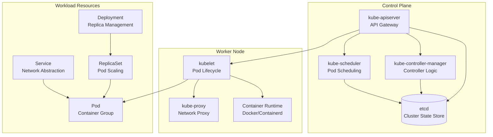
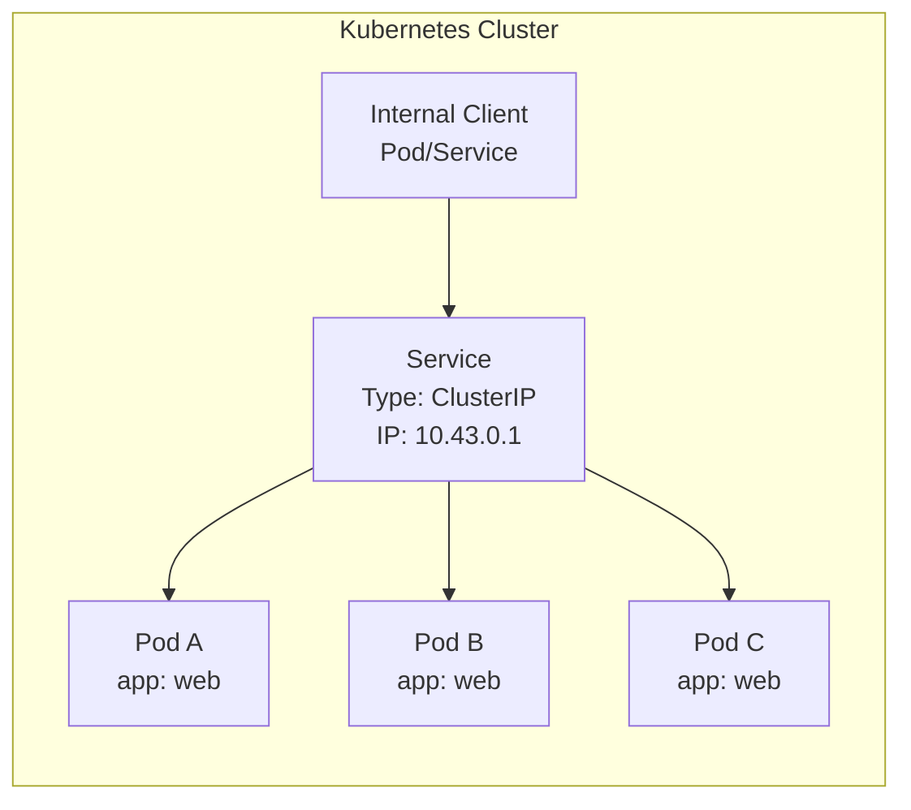
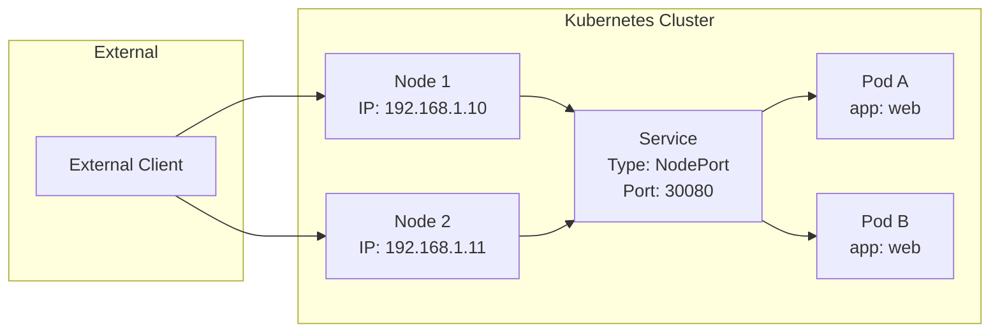
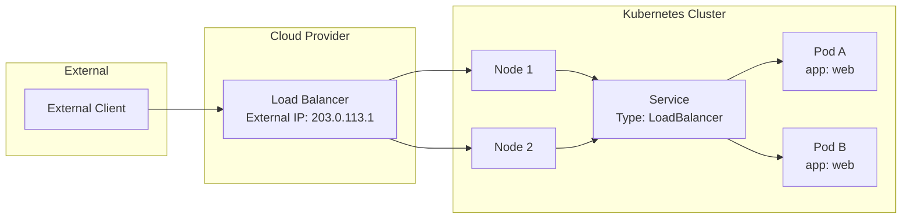
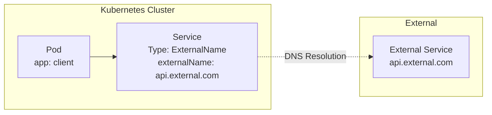
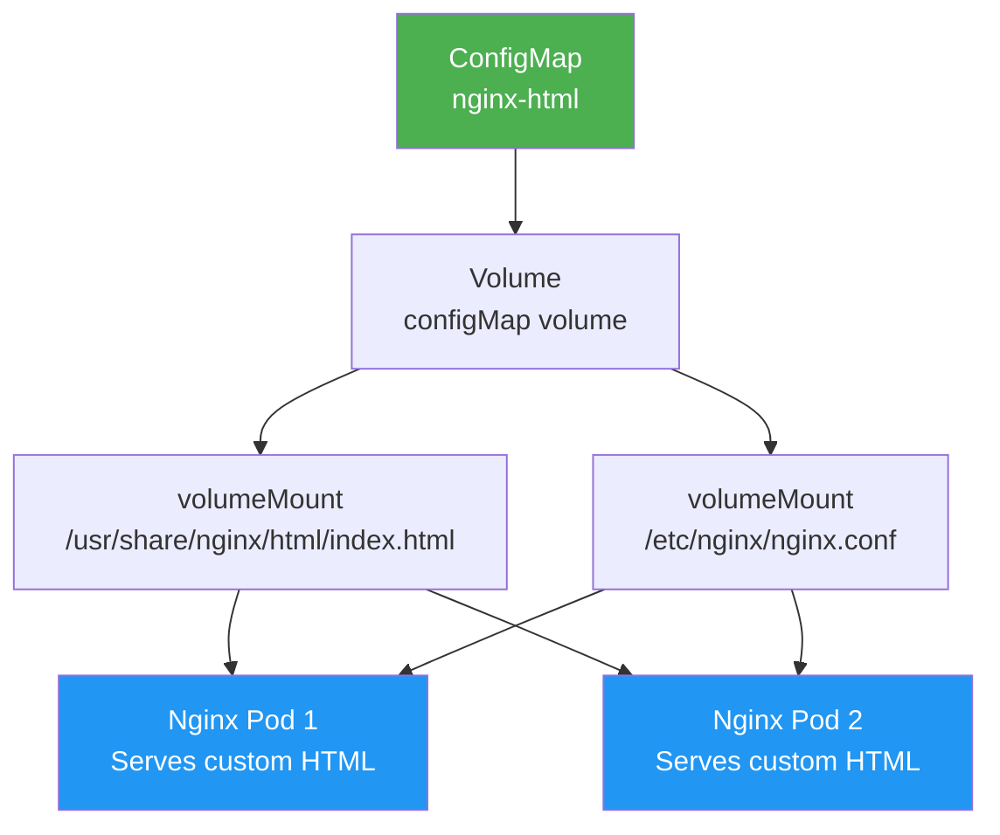
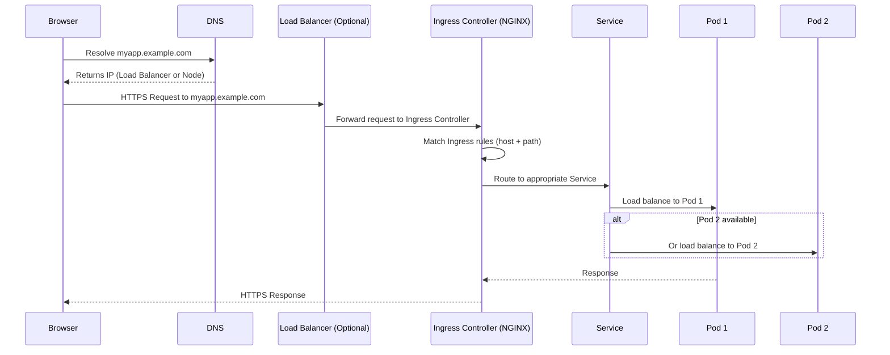
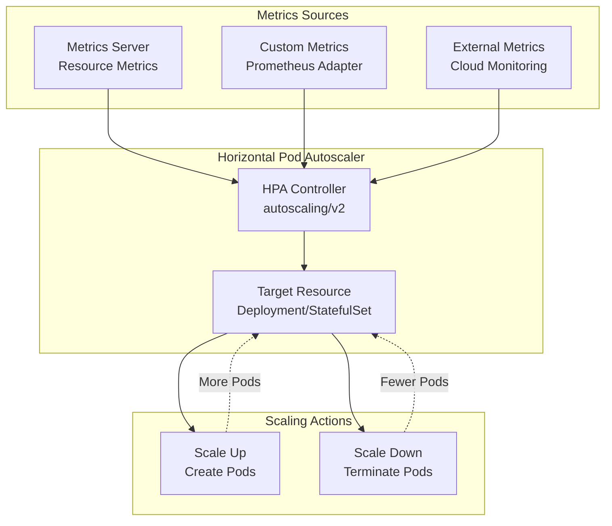
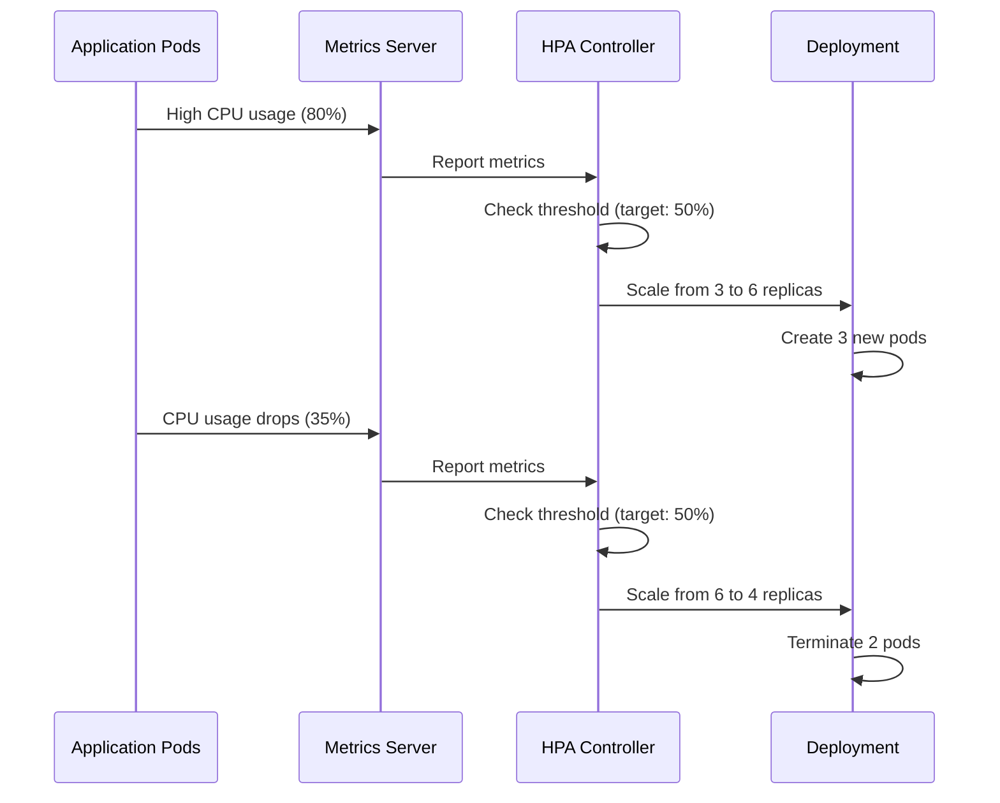

# Kubernetes Components

Kubernetes is composed of several key components that work together to manage containerized applications. These components can be categorized into control plane components (responsible for cluster management) and worker node components (responsible for running applications). Additionally, there are workload resources that define how applications run.

## Core Concepts Overview

Before diving into specific components, let's understand the fundamental building blocks:

- **Pods**: The smallest deployable units in Kubernetes, containing one or more containers
- **Services**: Abstractions that define a logical set of pods and enable network access
- **Deployments**: Controllers that manage pod replicas and provide declarative updates
- **Namespaces**: Virtual clusters within a physical cluster for resource isolation

## Control Plane Components

Control plane components are responsible for managing the cluster as a whole. They include:

*   **kube-apiserver:** The API server is the central point of contact for all communication with the cluster.
*   **kube-controller-manager:** The controller manager is responsible for ensuring that the desired state of the cluster is maintained.
*   **kube-scheduler:** The scheduler is responsible for scheduling pods to worker nodes.
*   **etcd:** etcd is a distributed key-value store that is used to store the state of the cluster.

## Worker Node Components

Worker node components are responsible for running the applications. They include:

*   **kubelet:** The kubelet is responsible for communicating with the master node and managing the pods on the worker node.
*   **kube-proxy:** The kube-proxy is responsible for networking between pods.
*   **Container runtime:** The container runtime is responsible for running the containers.

## Other Components

In addition to the control plane and worker node components, there are a number of other components that are used in Kubernetes. These components include:

*   **Pods:** A pod is the smallest and simplest unit in the Kubernetes object model. It represents a single instance of a running process in a cluster.
*   **Services:** A service is an abstraction that defines a logical set of pods and a policy by which to access them.
*   **Deployments:** A deployment is a controller that provides declarative updates for pods and replica sets.
*   **ReplicaSets:** A replica set is a controller that ensures that a specified number of pod replicas are running at any given time.
*   **Namespaces:** A namespace is a way to divide cluster resources between multiple users.

## Component Relationships Diagram



## Detailed Component Explanations

### Pods: The Atomic Unit

A Pod is the smallest and most basic deployable object in Kubernetes. It represents a single instance of a running process in your cluster and can contain one or more containers that share storage, network, and specifications about how to run them.

**Key Characteristics:**
- **Ephemeral**: Pods are not designed to be long-lived
- **Shared Context**: Containers in a pod share the same network namespace, IPC namespace, and can share volumes
- **Atomic Scheduling**: All containers in a pod are scheduled together on the same node

**Pod Lifecycle:**
1. **Pending**: Pod accepted by Kubernetes but containers not yet created
2. **Running**: All containers in the pod are running
3. **Succeeded**: All containers terminated successfully
4. **Failed**: At least one container terminated with failure
5. **Unknown**: State cannot be determined

---

### Services: Network Abstraction

A Service is an abstraction that defines a logical set of pods and a policy by which to access them. Services enable loose coupling between dependent pods and provide a stable endpoint for accessing applications.

**Service Types:**

#### 1. ClusterIP (Default)
The default service type that exposes the service on an internal IP within the cluster.

**Use Case:** Internal communication between services within the cluster.



**Example:**
```yaml
apiVersion: v1
kind: Service
metadata:
  name: my-service
spec:
  selector:
    app: my-app
  ports:
  - port: 80
    targetPort: 8080
  type: ClusterIP  # Default
```

**Access:** Only accessible within the cluster via `my-service:80` or `10.43.0.1:80`

#### 2. NodePort
Exposes the service on each node's IP at a static port (range: 30000-32767).

**Use Case:** External access to services, development environments, or when LoadBalancer is not available.



**Example:**
```yaml
apiVersion: v1
kind: Service
metadata:
  name: my-service
spec:
  selector:
    app: my-app
  ports:
  - port: 80
    targetPort: 8080
    nodePort: 30080  # Optional: specify port, otherwise auto-assigned
  type: NodePort
```

**Access:** Via any node IP and the NodePort: `http://192.168.1.10:30080`

#### 3. LoadBalancer
Creates an external load balancer in supported cloud environments (AWS ELB, GCP LoadBalancer, Azure LB).

**Use Case:** Production applications requiring external load balancing and SSL termination.



**Example:**
```yaml
apiVersion: v1
kind: Service
metadata:
  name: my-service
spec:
  selector:
    app: my-app
  ports:
  - port: 80
    targetPort: 8080
  type: LoadBalancer
```

**Access:** Via the load balancer's external IP (automatically assigned by cloud provider)

#### 4. ExternalName
Maps a service to an external DNS name without creating endpoints.

**Use Case:** Accessing external services or legacy systems via DNS names.



**Example:**
```yaml
apiVersion: v1
kind: Service
metadata:
  name: external-api
spec:
  type: ExternalName
  externalName: api.external-service.com
```

**Access:** Pods access via `external-api` which resolves to `api.external-service.com`

### Deployments: Declarative Updates

A Deployment provides declarative updates for Pods and ReplicaSets. It describes a desired state and the Deployment controller changes the actual state to the desired state at a controlled rate.

**Key Features:**
- **Rolling Updates**: Update pods without downtime
- **Rollback**: Revert to previous versions
- **Scaling**: Change number of replicas
- **Pause/Resume**: Control update process

**Understanding `kubectl get deployments` Output:**

When you run `kubectl get deployments`, you'll see output like this:

```
NAME               READY   UP-TO-DATE   AVAILABLE   AGE
nginx-deployment   3/3     3            3           2m
```

**Column Explanations:**
- **NAME**: The name of the deployment
- **READY**: Shows `current/desired` replicas (e.g., 3/3 means 3 out of 3 desired pods are ready)
- **UP-TO-DATE**: Number of replicas that have been updated to the latest pod spec
- **AVAILABLE**: Number of replicas available to users (ready and able to serve traffic)
- **AGE**: How long ago the deployment was created

**Example Scenarios:**
- `3/3  3  3  2m`: Perfect state - all desired pods are ready, up-to-date, and available
- `2/3  3  2  2m`: Rolling update in progress - 3 pods updated but only 2 are ready yet
- `3/3  0  3  2m`: Deployment created but pods not updated (paused deployment)
- `1/3  1  1  2m`: Only 1 pod ready, likely due to resource constraints or failures

**Deployment Status Details:**

For more detailed information, use `kubectl describe deployment <name>`:

```bash
kubectl describe deployment nginx-deployment
```

This shows:
- **Replicas**: Desired, current, ready, available, and unavailable counts
- **Strategy**: Rolling update configuration (max unavailable, max surge)
- **Conditions**: Status conditions like Available, Progressing, ReplicaFailure
- **Events**: Timeline of deployment events and status changes
- **Pod Template**: The pod specification being deployed

---

### ConfigMaps and Secrets: Configuration Management

**ConfigMaps** are Kubernetes objects that store non-confidential configuration data as key-value pairs. They decouple configuration from container images, making your applications more portable and easier to manage.

### What ConfigMaps Store

- Configuration files
- Environment variables
- Command-line arguments
- Any non-sensitive configuration data (text-based)

### Key Benefits

**Separation of Concerns**: Keep configuration separate from application code, so you can change settings without rebuilding container images.

**Environment Flexibility**: Use different ConfigMaps for dev, staging, and production environments with the same container image.

**Centralized Management**: Update configuration in one place and have it reflected across multiple pods.

### Common Scenarios When to Use ConfigMaps

**1. Application Configuration Files**
You have an nginx web server that needs custom configuration. Instead of baking the config into the image:
- Store `nginx.conf` in a ConfigMap
- Mount it as a file in the container
- Update the ConfigMap to change nginx behavior without redeploying

**2. Environment-Specific Settings**
Your application needs different database URLs for dev/staging/prod:
- Create separate ConfigMaps for each environment
- Inject them as environment variables
- Deploy the same application image to all environments

**3. Feature Flags**
You want to enable/disable features without redeploying:
- Store feature flags in a ConfigMap
- Your app reads these flags at runtime
- Toggle features by updating the ConfigMap

**4. Shared Configuration Across Services**
Multiple microservices need the same API endpoint or shared settings:
- Store common config in one ConfigMap
- Reference it from multiple deployments
- Update once, affects all services

**5. Application Tuning Parameters**
Your app has performance settings (thread pools, timeouts, cache sizes):
- Store these in a ConfigMap
- Adjust values based on load testing
- No need to rebuild or redeploy containers

### When NOT to Use ConfigMaps

- **Sensitive data** (passwords, tokens, certificates) → Use **Secrets** instead
- **Large data** (>1MB) → ConfigMaps have size limits
- **Binary data** → Better suited for Secrets or volume mounts
- **Frequently changing data** → Consider external configuration services

### Quick Example

```yaml
apiVersion: v1
kind: ConfigMap
metadata:
  name: app-config
data:
  database_url: "postgres://db.example.com:5432"
  log_level: "info"
  max_connections: "100"
  app.properties: |
    feature.newUI=true
    cache.ttl=3600
```

Then use it in a Pod:
```yaml
apiVersion: v1
kind: Pod
metadata:
  name: myapp
spec:
  containers:
  - name: app
    image: myapp:1.0
    envFrom:
    - configMapRef:
        name: app-config
```

Change nginx index.html using Volume mounts

```yaml
apiVersion: v1
kind: ConfigMap
metadata:
  name: nginx-html
data:
  index.html: |
    <!DOCTYPE html>
    <html>
    <head>
      <title>Welcome</title>
    </head>
    <body>
      <h1>Hello from ConfigMap!</h1>
      <p>Environment: Production</p>
    </body>
    </html>
```

```yaml
apiVersion: apps/v1
kind: Deployment
metadata:
  name: nginx
spec:
  replicas: 2
  selector:
    matchLabels:
      app: nginx
  template:
    metadata:
      labels:
        app: nginx
    spec:
      containers:
      - name: nginx
        image: nginx:latest
        ports:
        - containerPort: 80
        volumeMounts:
        - name: html-content
          mountPath: /usr/share/nginx/html
          readOnly: true
      volumes:
      - name: html-content
        configMap:
          name: nginx-html
```

ConfigMaps are essential for following the **12-factor app methodology**, particularly the principle of storing config in the environment rather than in code.

**Secrets** store sensitive information like passwords, tokens, and keys, encoded in base64.

---

### Persistent Volumes: Storage Abstraction

Persistent Volumes (PV) provide API for users and administrators to abstract details of how storage is provided from how it is consumed.

**Key Concepts:**
- **PersistentVolume (PV)**: Storage resource in the cluster
- **PersistentVolumeClaim (PVC)**: Request for storage by a user
- **StorageClass**: Defines different classes of storage

## Persistent Volumes (PV), Persistent Volume Claims (PVC), and StorageClass

These three components work together to provide persistent storage in Kubernetes that survives pod restarts and rescheduling.

## The Three Components

### **Persistent Volume (PV)**
- A piece of storage in the cluster
- Provisioned by an administrator or dynamically via StorageClass
- Has its own lifecycle independent of pods
- Cluster-level resource (not namespaced)

### **Persistent Volume Claim (PVC)**
- A request for storage by a user/pod
- Like a "ticket" to claim a PV
- Namespaced resource
- Specifies size, access modes, and storage class

### **StorageClass**
- Defines "classes" of storage (SSD, HDD, NFS, etc.)
- Enables dynamic provisioning of PVs
- Specifies the provisioner and parameters
- Allows automatic PV creation when PVC is created

## The Relationship

```
User/Pod          Kubernetes Cluster              Storage Backend
   │                      │                             │
   │  1. Create PVC       │                             │
   │─────────────────────>│                             │
   │                      │  2. StorageClass            │
   │                      │     provisions PV           │
   │                      │────────────────────────────>│
   │                      │                             │
   │                      │  3. PV created              │
   │                      │<────────────────────────────│
   │                      │                             │
   │  4. PVC binds to PV  │                             │
   │<─────────────────────│                             │
   │                      │                             │
   │  5. Pod mounts PVC   │                             │
   │─────────────────────>│                             │
```

## Static vs Dynamic Provisioning

### Static Provisioning (Manual)

**Step 1: Admin creates PV manually**
```yaml
apiVersion: v1
kind: PersistentVolume
metadata:
  name: my-pv
spec:
  capacity:
    storage: 10Gi
  volumeMode: Filesystem
  accessModes:
    - ReadWriteOnce
  persistentVolumeReclaimPolicy: Retain
  storageClassName: manual
  hostPath:
    path: /mnt/data
```

**Step 2: User creates PVC**
```yaml
apiVersion: v1
kind: PersistentVolumeClaim
metadata:
  name: my-pvc
spec:
  accessModes:
    - ReadWriteOnce
  resources:
    requests:
      storage: 5Gi
  storageClassName: manual
```

**Step 3: Kubernetes binds PVC to PV**
- Finds a PV that matches the requirements
- Binds them together (1:1 relationship)

### Dynamic Provisioning (Automatic)

**Step 1: Admin creates StorageClass**
```yaml
apiVersion: storage.k8s.io/v1
kind: StorageClass
metadata:
  name: fast-ssd
provisioner: kubernetes.io/aws-ebs
parameters:
  type: gp3
  iops: "3000"
  fsType: ext4
reclaimPolicy: Delete
allowVolumeExpansion: true
volumeBindingMode: WaitForFirstConsumer
```

**Step 2: User creates PVC (no PV needed)**
```yaml
apiVersion: v1
kind: PersistentVolumeClaim
metadata:
  name: my-pvc
spec:
  accessModes:
    - ReadWriteOnce
  resources:
    requests:
      storage: 10Gi
  storageClassName: fast-ssd  # References StorageClass
```

**Step 3: Kubernetes automatically creates PV**
- StorageClass provisioner creates the PV
- PVC automatically binds to the new PV

## Access Modes

| Mode | Abbreviation | Description | Use Case |
|------|-------------|-------------|----------|
| **ReadWriteOnce** | RWO | Single node read-write | Most common, databases |
| **ReadOnlyMany** | ROX | Multiple nodes read-only | Shared configuration |
| **ReadWriteMany** | RWX | Multiple nodes read-write | Shared files (NFS) |
| **ReadWriteOncePod** | RWOP | Single pod read-write | Exclusive access |

**Important:** Not all storage backends support all modes!

```
Storage Backend Support:
├── Local/HostPath: RWO only
├── AWS EBS: RWO only
├── GCE PD: RWO only
├── Azure Disk: RWO only
├── NFS: RWO, ROX, RWX
├── CephFS: RWO, ROX, RWX
└── Longhorn: RWO, RWX
```

## How Volume Mounting Works

### The Complete Flow

```
1. PVC Created
   └─> Kubernetes finds/creates matching PV
       └─> PVC status: Bound

2. Pod References PVC
   └─> Kubelet on node receives pod spec
       └─> Checks if volume is attached

3. Attach Volume (if needed)
   └─> Cloud provider attaches disk to node
       └─> Example: AWS EBS disk attached to EC2 instance

4. Mount Volume
   └─> Kubelet creates mount point on node
       └─> Mounts storage device to node filesystem
           └─> Example: /var/lib/kubelet/pods/{pod-uid}/volumes/...

5. Bind Mount into Container
   └─> Container runtime bind-mounts from node to container
       └─> Container sees volume at specified mountPath
```

### Visual Example

```
Physical Infrastructure:
┌─────────────────────────────────────────────┐
│ Node (Physical/VM)                          │
│                                             │
│  ┌───────────────────────────────────────┐  │
│  │ Storage Device (EBS, Disk, NFS)       │  │
│  │ /dev/xvdf (10GB)                      │  │
│  └───────────────────────────────────────┘  │
│              │                              │
│              │ (kubelet mounts)             │
│              ↓                              │
│  ┌───────────────────────────────────────┐  │
│  │ Node Filesystem                       │  │
│  │ /var/lib/kubelet/pods/{uid}/volumes/  │  │
│  │   kubernetes.io~aws-ebs/pvc-xxx/      │  │
│  │     ├── data1.txt                     │  │
│  │     └── data2.txt                     │  │
│  └───────────────────────────────────────┘  │
│              │                              │
│              │ (bind mount)                 │
│              ↓                              │
│  ┌───────────────────────────────────────┐  │
│  │ Container                             │  │
│  │                                       │  │
│  │  /app/data/  ←──(mounted here)        │  │
│  │    ├── data1.txt                      │  │
│  │    └── data2.txt                      │  │
│  │                                       │  │
│  │  Container sees files at /app/data    │  │
│  └───────────────────────────────────────┘  │
└─────────────────────────────────────────────┘
```

## Complete Example: Database with Persistent Storage

### Step 1: Create StorageClass

```yaml
apiVersion: storage.k8s.io/v1
kind: StorageClass
metadata:
  name: fast-storage
provisioner: kubernetes.io/no-provisioner  # For local storage
volumeBindingMode: WaitForFirstConsumer
```

### Step 2: Create PersistentVolume (Static)

```yaml
apiVersion: v1
kind: PersistentVolume
metadata:
  name: postgres-pv
spec:
  capacity:
    storage: 20Gi
  volumeMode: Filesystem
  accessModes:
    - ReadWriteOnce
  persistentVolumeReclaimPolicy: Retain
  storageClassName: fast-storage
  local:
    path: /mnt/disks/vol1
  nodeAffinity:
    required:
      nodeSelectorTerms:
      - matchExpressions:
        - key: kubernetes.io/hostname
          operator: In
          values:
          - node01  # PV is on this specific node
```

### Step 3: Create PersistentVolumeClaim

```yaml
apiVersion: v1
kind: PersistentVolumeClaim
metadata:
  name: postgres-pvc
  namespace: default
spec:
  accessModes:
    - ReadWriteOnce
  resources:
    requests:
      storage: 20Gi
  storageClassName: fast-storage
```

**Check binding:**
```bash
kubectl get pvc postgres-pvc
# NAME           STATUS   VOLUME        CAPACITY   ACCESS MODES   STORAGECLASS
# postgres-pvc   Bound    postgres-pv   20Gi       RWO            fast-storage
```

### Step 4: Create Pod/Deployment Using PVC

```yaml
apiVersion: apps/v1
kind: StatefulSet
metadata:
  name: postgres
spec:
  serviceName: postgres
  replicas: 1
  selector:
    matchLabels:
      app: postgres
  template:
    metadata:
      labels:
        app: postgres
    spec:
      containers:
      - name: postgres
        image: postgres:15
        ports:
        - containerPort: 5432
        env:
        - name: POSTGRES_PASSWORD
          value: "password123"
        - name: PGDATA
          value: /var/lib/postgresql/data/pgdata
        volumeMounts:
        - name: postgres-storage
          mountPath: /var/lib/postgresql/data
      volumes:
      - name: postgres-storage
        persistentVolumeClaim:
          claimName: postgres-pvc
```

### What Happens When Pod Starts

1. **Scheduler assigns pod to node01** (because PV has nodeAffinity)
2. **Kubelet on node01 mounts the local disk:**
   ```bash
   # On node01
   ls -la /var/lib/kubelet/pods/{pod-uid}/volumes/kubernetes.io~local-volume/postgres-pv/
   # Shows: pgdata directory and PostgreSQL files
   ```
3. **Container sees mounted volume:**
   ```bash
   kubectl exec -it postgres-0 -- ls -la /var/lib/postgresql/data
   # Shows: pgdata directory with database files
   ```

4. **Data persists even if pod is deleted:**
   ```bash
   kubectl delete pod postgres-0
   # Pod recreates, but data remains on PV
   ```

## Volume Mount Configuration Options

### Basic Mount

```yaml
volumeMounts:
- name: data-volume
  mountPath: /app/data
```

### With subPath (mount specific subdirectory)

```yaml
volumeMounts:
- name: data-volume
  mountPath: /app/config
  subPath: config  # Mounts only 'config' subdirectory from PV
```

**Use case:** Multiple containers sharing one PVC:
```yaml
volumes:
- name: shared-storage
  persistentVolumeClaim:
    claimName: shared-pvc
containers:
- name: app1
  volumeMounts:
  - name: shared-storage
    mountPath: /data
    subPath: app1-data
- name: app2
  volumeMounts:
  - name: shared-storage
    mountPath: /data
    subPath: app2-data
```

### ReadOnly Mount

```yaml
volumeMounts:
- name: data-volume
  mountPath: /app/data
  readOnly: true
```

### Mount Propagation

```yaml
volumeMounts:
- name: data-volume
  mountPath: /app/data
  mountPropagation: HostToContainer  # Bidirectional, None
```

## Reclaim Policies

What happens to PV when PVC is deleted?

### 1. **Retain** (Default for manually created PVs)
```yaml
persistentVolumeReclaimPolicy: Retain
```
- PV remains after PVC deletion
- Data preserved
- PV must be manually deleted
- **Use case:** Production data you don't want to lose

### 2. **Delete**
```yaml
persistentVolumeReclaimPolicy: Delete
```
- PV and underlying storage deleted when PVC is deleted
- Data is lost
- **Use case:** Development, temporary storage

### 3. **Recycle** (Deprecated)
```yaml
persistentVolumeReclaimPolicy: Recycle
```
- Performs basic scrub (`rm -rf /volume/*`)
- Makes PV available for new claims
- **Deprecated:** Use dynamic provisioning instead

## StorageClass Examples

### AWS EBS (Dynamic)

```yaml
apiVersion: storage.k8s.io/v1
kind: StorageClass
metadata:
  name: aws-ebs-gp3
provisioner: ebs.csi.aws.com
parameters:
  type: gp3
  iops: "3000"
  throughput: "125"
  fsType: ext4
  encrypted: "true"
reclaimPolicy: Delete
allowVolumeExpansion: true
volumeBindingMode: WaitForFirstConsumer
```

### NFS (Dynamic with NFS provisioner)

```yaml
apiVersion: storage.k8s.io/v1
kind: StorageClass
metadata:
  name: nfs-storage
provisioner: nfs.csi.k8s.io
parameters:
  server: nfs-server.example.com
  share: /exported/path
reclaimPolicy: Retain
volumeBindingMode: Immediate
```

### Local Storage (Static)

```yaml
apiVersion: storage.k8s.io/v1
kind: StorageClass
metadata:
  name: local-storage
provisioner: kubernetes.io/no-provisioner
volumeBindingMode: WaitForFirstConsumer
```

### Longhorn (Distributed storage)

```yaml
apiVersion: storage.k8s.io/v1
kind: StorageClass
metadata:
  name: longhorn
provisioner: driver.longhorn.io
parameters:
  numberOfReplicas: "3"
  staleReplicaTimeout: "30"
  fsType: "ext4"
reclaimPolicy: Delete
allowVolumeExpansion: true
```

## Volume Binding Modes

### Immediate
```yaml
volumeBindingMode: Immediate
```
- PV created/bound immediately when PVC is created
- May cause pod scheduling issues if PV is on wrong node

### WaitForFirstConsumer (Recommended)
```yaml
volumeBindingMode: WaitForFirstConsumer
```
- PV creation/binding delayed until pod using PVC is scheduled
- Ensures PV is created on the right node
- Better for local storage and topology-aware provisioning

## Real-World Scenarios

### Scenario 1: WordPress with MySQL

```yaml
---
# MySQL PVC
apiVersion: v1
kind: PersistentVolumeClaim
metadata:
  name: mysql-pvc
spec:
  accessModes:
    - ReadWriteOnce
  resources:
    requests:
      storage: 20Gi
  storageClassName: fast-storage
---
# WordPress PVC
apiVersion: v1
kind: PersistentVolumeClaim
metadata:
  name: wordpress-pvc
spec:
  accessModes:
    - ReadWriteOnce
  resources:
    requests:
      storage: 10Gi
  storageClassName: fast-storage
---
# MySQL Deployment
apiVersion: apps/v1
kind: Deployment
metadata:
  name: mysql
spec:
  replicas: 1
  selector:
    matchLabels:
      app: mysql
  template:
    metadata:
      labels:
        app: mysql
    spec:
      containers:
      - name: mysql
        image: mysql:8.0
        env:
        - name: MYSQL_ROOT_PASSWORD
          value: "rootpassword"
        - name: MYSQL_DATABASE
          value: "wordpress"
        volumeMounts:
        - name: mysql-storage
          mountPath: /var/lib/mysql
      volumes:
      - name: mysql-storage
        persistentVolumeClaim:
          claimName: mysql-pvc
---
# WordPress Deployment
apiVersion: apps/v1
kind: Deployment
metadata:
  name: wordpress
spec:
  replicas: 1
  selector:
    matchLabels:
      app: wordpress
  template:
    metadata:
      labels:
        app: wordpress
    spec:
      containers:
      - name: wordpress
        image: wordpress:latest
        env:
        - name: WORDPRESS_DB_HOST
          value: "mysql:3306"
        - name: WORDPRESS_DB_NAME
          value: "wordpress"
        - name: WORDPRESS_DB_PASSWORD
          value: "rootpassword"
        volumeMounts:
        - name: wordpress-storage
          mountPath: /var/www/html
      volumes:
      - name: wordpress-storage
        persistentVolumeClaim:
          claimName: wordpress-pvc
```

### Scenario 2: Shared Storage (ReadWriteMany)

```yaml
---
# NFS-based PVC for shared storage
apiVersion: v1
kind: PersistentVolumeClaim
metadata:
  name: shared-pvc
spec:
  accessModes:
    - ReadWriteMany
  resources:
    requests:
      storage: 50Gi
  storageClassName: nfs-storage
---
# Multiple pods sharing the same volume
apiVersion: apps/v1
kind: Deployment
metadata:
  name: file-processor
spec:
  replicas: 3  # Multiple pods
  selector:
    matchLabels:
      app: file-processor
  template:
    metadata:
      labels:
        app: file-processor
    spec:
      containers:
      - name: processor
        image: file-processor:1.0
        volumeMounts:
        - name: shared-files
          mountPath: /shared-data
      volumes:
      - name: shared-files
        persistentVolumeClaim:
          claimName: shared-pvc
```

All 3 pods can read and write to `/shared-data` simultaneously.

### Scenario 3: StatefulSet with Dynamic Provisioning

```yaml
apiVersion: apps/v1
kind: StatefulSet
metadata:
  name: mongodb
spec:
  serviceName: mongodb
  replicas: 3
  selector:
    matchLabels:
      app: mongodb
  template:
    metadata:
      labels:
        app: mongodb
    spec:
      containers:
      - name: mongodb
        image: mongo:6.0
        ports:
        - containerPort: 27017
        volumeMounts:
        - name: mongo-data
          mountPath: /data/db
  volumeClaimTemplates:  # Creates PVC for each pod automatically
  - metadata:
      name: mongo-data
    spec:
      accessModes:
        - ReadWriteOnce
      resources:
        requests:
          storage: 100Gi
      storageClassName: fast-storage
```

This creates:
- `mongo-data-mongodb-0` (100Gi)
- `mongo-data-mongodb-1` (100Gi)
- `mongo-data-mongodb-2` (100Gi)

Each pod gets its own dedicated persistent storage.

## Troubleshooting

### Check PVC Status
```bash
kubectl get pvc
# STATUS: Pending, Bound, Lost

kubectl describe pvc my-pvc
# Shows events and binding information
```

### Check PV Status
```bash
kubectl get pv
# STATUS: Available, Bound, Released, Failed

kubectl describe pv my-pv
```

### Common Issues

**1. PVC stuck in Pending:**
```bash
# Check events
kubectl describe pvc my-pvc

# Common causes:
# - No PV matches the requirements
# - No StorageClass found
# - Insufficient capacity
# - Access mode mismatch
```

**2. Pod can't mount volume:**
```bash
kubectl describe pod my-pod

# Look for:
# - "FailedAttachVolume"
# - "FailedMount"
# - Permissions issues
```

**3. Volume already mounted elsewhere:**
```
Error: Volume is already exclusively attached to one node and can't be attached to another
```
Solution: Use RWX access mode or wait for previous pod to terminate.

## Best Practices

1. **Use StorageClass for dynamic provisioning** - Don't manually create PVs in production
2. **Set appropriate reclaim policies** - Retain for production, Delete for dev
3. **Use WaitForFirstConsumer** - Better scheduling for local storage
4. **Enable volume expansion** - `allowVolumeExpansion: true`
5. **Monitor storage usage** - Set up alerts for PVC capacity
6. **Use StatefulSets for databases** - Better than Deployments for stateful apps
7. **Backup your data** - PVs are not backups!
8. **Use appropriate access modes** - RWO for most cases, RWX only when needed

## Summary

```
Flow: Pod → PVC → PV → Physical Storage

StorageClass: Defines how to create PVs dynamically
PV: Actual storage resource in cluster
PVC: Request for storage by user/pod
Pod: Uses PVC to access storage

Mounting Process:
1. Attach storage device to node (if needed)
2. Mount device to node filesystem
3. Bind mount from node into container
4. Container sees files at mountPath
```

The beauty of this system is **abstraction** - developers request storage via PVC without knowing the underlying storage implementation!

## Hands-on Exercises

### Exercise 1: Working with Pods

1. **Create a simple pod:**

```yaml
apiVersion: v1
kind: Pod
metadata:
  name: nginx-pod
  labels:
    app: nginx
spec:
  containers:
  - name: nginx
    image: nginx:1.21
    ports:
    - containerPort: 80
```

```bash
kubectl apply -f pod.yaml
kubectl get pods
kubectl describe pod nginx-pod
```

2. **Access the pod:**

```bash
kubectl port-forward pod/nginx-pod 8080:80
# Access http://localhost:8080
```

## Run a temporary pod with curl
```bash
kubectl run test-pod --rm -it --image=curlimages/curl -- sh
```

## Inside the test pod, curl the service
```bash
curl http://nginx-service
```

## Or use service IP
```bash
curl http://<CLUSTER-IP>
```

## Exit the test pod
```bash
exit
```


### Exercise 2: Creating Services

1. **Create a deployment and service:**

```yaml
apiVersion: apps/v1
kind: Deployment
metadata:
  name: nginx-deployment
spec:
  replicas: 3
  selector:
    matchLabels:
      app: nginx
  template:
    metadata:
      labels:
        app: nginx
    spec:
      containers:
      - name: nginx
        image: nginx:1.21
        ports:
        - containerPort: 80
---
apiVersion: v1
kind: Service
metadata:
  name: nginx-service
spec:
  selector:
    app: nginx
  ports:
  - port: 80
    targetPort: 80
  type: ClusterIP
```

```bash
kubectl apply -f deployment-service.yaml
kubectl get services
kubectl get endpoints nginx-service
```

### Exercise 3: Using ConfigMaps to Configure Nginx

ConfigMaps can be used to inject configuration data into pods. In this exercise, we'll use a ConfigMap to customize nginx's index.html content without rebuilding the Docker image.

**Use Case:** Update web content without changing container images - perfect for configurable web pages, configuration files, or application settings.

1. **Create a ConfigMap with HTML content:**

```yaml
apiVersion: v1
kind: ConfigMap
metadata:
  name: nginx-html
  labels:
    app: nginx
data:
  index.html: |
    <!DOCTYPE html>
    <html>
    <head>
        <title>Kubernetes ConfigMap Demo</title>
        <style>
            body {
                font-family: Arial, sans-serif;
                margin: 50px;
                background: linear-gradient(135deg, #667eea 0%, #764ba2 100%);
                color: white;
            }
            .container {
                background: rgba(255,255,255,0.1);
                padding: 30px;
                border-radius: 10px;
                backdrop-filter: blur(10px);
            }
            h1 { margin-top: 0; }
            .info { background: rgba(0,0,0,0.2); padding: 15px; border-radius: 5px; margin-top: 20px; }
            .highlight { color: #ffd700; font-weight: bold; }
        </style>
    </head>
    <body>
        <div class="container">
            <h1>🚀 Kubernetes ConfigMap Demo</h1>
            <p>This HTML content is served from a <span class="highlight">ConfigMap</span>, not baked into the container image!</p>
            <div class="info">
                <h3>Why is this useful?</h3>
                <ul>
                    <li>✅ Update content without rebuilding images</li>
                    <li>✅ Separate configuration from code</li>
                    <li>✅ Different content per environment (dev/staging/prod)</li>
                    <li>✅ Share configuration across multiple pods</li>
                    <li>✅ Version control your configurations</li>
                </ul>
            </div>
            <div class="info">
                <h3>Pod Information:</h3>
                <p><strong>Hostname:</strong> <span id="hostname">Loading...</span></p>
                <p><strong>Time:</strong> <span id="time"></span></p>
            </div>
        </div>
        <script>
            // Display hostname via API call
            fetch('/api/hostname')
                .then(r => r.text())
                .then(h => document.getElementById('hostname').textContent = h)
                .catch(() => document.getElementById('hostname').textContent = 'N/A');
            
            // Update time
            function updateTime() {
                document.getElementById('time').textContent = new Date().toLocaleString();
            }
            updateTime();
            setInterval(updateTime, 1000);
        </script>
    </body>
    </html>
  
  nginx.conf: |
    events {
        worker_connections 1024;
    }
    http {
        include /etc/nginx/mime.types;
        default_type application/octet-stream;
        
        server {
            listen 80;
            server_name _;
            root /usr/share/nginx/html;
            index index.html;
            
            location / {
                try_files $uri $uri/ =404;
            }
            
            location /api/hostname {
                default_type text/plain;
                return 200 $hostname;
            }
        }
    }
```

2. **Create deployment that mounts the ConfigMap as files:**

```yaml
apiVersion: apps/v1
kind: Deployment
metadata:
  name: nginx-configmap-demo
  labels:
    app: nginx-demo
spec:
  replicas: 3
  selector:
    matchLabels:
      app: nginx-demo
  template:
    metadata:
      labels:
        app: nginx-demo
    spec:
      containers:
      - name: nginx
        image: nginx:alpine
        ports:
        - containerPort: 80
        volumeMounts:
        # Mount ConfigMap as index.html file
        - name: html-content
          mountPath: /usr/share/nginx/html/index.html
          subPath: index.html
        # Mount nginx configuration
        - name: nginx-config
          mountPath: /etc/nginx/nginx.conf
          subPath: nginx.conf
      volumes:
      # Create volume from ConfigMap
      - name: html-content
        configMap:
          name: nginx-html
          items:
          - key: index.html
            path: index.html
      - name: nginx-config
        configMap:
          name: nginx-html
          items:
          - key: nginx.conf
            path: nginx.conf
---
apiVersion: v1
kind: Service
metadata:
  name: nginx-configmap-service
  labels:
    app: nginx-demo
spec:
  type: NodePort
  selector:
    app: nginx-demo
  ports:
  - port: 80
    targetPort: 80
    nodePort: 30090
```

3. **Deploy and test:**

```bash
# Apply the ConfigMap
kubectl apply -f configmap.yaml

# Deploy nginx with ConfigMap
kubectl apply -f deployment.yaml

# Verify pods are running
kubectl get pods -l app=nginx-demo

# Access the service
kubectl port-forward service/nginx-configmap-service 8080:80

# Open browser: http://localhost:8080
# You should see your custom HTML from ConfigMap!

# Or test with curl
curl http://localhost:8080
```

4. **Update ConfigMap content (without pod restart):**

```bash
# Edit ConfigMap
kubectl edit configmap nginx-html

# Change the HTML content, for example:
# - Change title to "Updated Content!"
# - Modify the gradient colors
# - Add new information

# Save and exit

# Wait a moment (ConfigMaps are eventually consistent)
# Reload browser - content updates automatically!

# Note: For immediate update, restart pods:
kubectl rollout restart deployment nginx-configmap-demo
```

5. **View ConfigMap content:**

```bash
# View ConfigMap
kubectl get configmap nginx-html -o yaml

# Describe ConfigMap
kubectl describe configmap nginx-html

# Exec into pod and verify file
kubectl exec -it <pod-name> -- cat /usr/share/nginx/html/index.html
```

**How It Works:**



**Key Concepts:**
- `volumeMounts`: Mounts ConfigMap into container filesystem
- `subPath`: Mounts individual file instead of entire directory
- `items`: Selects specific keys from ConfigMap
- Updates reflect automatically (with small delay) or immediately after pod restart

**Advantages:**
- ✅ No image rebuild needed for content changes
- ✅ Same image works across environments with different ConfigMaps
- ✅ Easy to version control configuration separately from code
- ✅ Share configuration across multiple pods
- ✅ Update running applications by editing ConfigMap

### Exercise 4: Working with Secrets

1. **Create a Secret:**

```bash
kubectl create secret generic db-secret \
  --from-literal=username=admin \
  --from-literal=password=mypassword
```

2. **Use Secret in a pod:**

```yaml
apiVersion: v1
kind: Pod
metadata:
  name: secret-pod
spec:
  containers:
  - name: app
    image: busybox
    command: ["sh", "-c", "echo Username: $DB_USER && echo Password: $DB_PASS"]
    env:
    - name: DB_USER
      valueFrom:
        secretKeyRef:
          name: db-secret
          key: username
    - name: DB_PASS
      valueFrom:
        secretKeyRef:
          name: db-secret
          key: password
```

### Exercise 5: Persistent Storage

1. **Create a PersistentVolumeClaim:**

```yaml
apiVersion: v1
kind: PersistentVolumeClaim
metadata:
  name: app-storage
spec:
  accessModes:
    - ReadWriteOnce
  resources:
    requests:
      storage: 1Gi
```

2. **Use PVC in a pod:**

```yaml
apiVersion: v1
kind: Pod
metadata:
  name: storage-pod
spec:
  containers:
  - name: app
    image: busybox
    command: ["sh", "-c", "echo 'Hello World' > /data/hello.txt && sleep 3600"]
    volumeMounts:
    - name: storage
      mountPath: /data
  volumes:
  - name: storage
    persistentVolumeClaim:
      claimName: app-storage
```

```bash
kubectl apply -f pvc.yaml
kubectl apply -f storage-pod.yaml
kubectl exec storage-pod -- cat /data/hello.txt
kubectl delete pod storage-pod
# Data persists!
kubectl apply -f storage-pod.yaml
kubectl exec storage-pod -- cat /data/hello.txt
```

## Advanced Topics

### Ingress: External Access and Routing

Ingress is an API object that manages external access to services in a cluster, typically HTTP/HTTPS traffic. It provides load balancing, SSL termination, and name-based virtual hosting.

**Key Features:**
- **HTTP/HTTPS Routing**: Route traffic based on host and path
- **SSL/TLS Termination**: Handle SSL certificates and encryption
- **Load Balancing**: Distribute traffic across multiple pods
- **Name-based Virtual Hosting**: Multiple domains on single IP

#### NGINX Ingress Controller Architecture

The NGINX Ingress Controller is a popular implementation that uses NGINX as the underlying load balancer.

**Components:**
- **Ingress Controller**: Watches for Ingress resources and configures NGINX
- **NGINX**: High-performance web server and reverse proxy
- **ConfigMap**: Controller configuration
- **Service Account**: RBAC permissions

**Request Flow Diagram:**



**Detailed Flow Explanation:**

1. **DNS Resolution**: Browser resolves domain name to IP address
2. **Load Balancer (Optional)**: External load balancer routes traffic to cluster
3. **Ingress Controller**: NGINX receives request and examines headers
4. **Rule Matching**: Controller matches host (`myapp.example.com`) and path (`/api`)
5. **Service Routing**: Routes to appropriate Kubernetes service
6. **Load Balancing**: Service distributes traffic across healthy pods
7. **Pod Processing**: Application pod processes the request
8. **Response**: Response flows back through the same path

**Example Ingress Configuration:**

```yaml
apiVersion: networking.k8s.io/v1
kind: Ingress
metadata:
  name: myapp-ingress
  annotations:
    nginx.ingress.kubernetes.io/rewrite-target: /
    nginx.ingress.kubernetes.io/ssl-redirect: "true"
spec:
  ingressClassName: nginx
  tls:
  - hosts:
    - myapp.example.com
    secretName: myapp-tls
  rules:
  - host: myapp.example.com
    http:
      paths:
      - path: /api
        pathType: Prefix
        backend:
          service:
            name: api-service
            port:
              number: 80
      - path: /
        pathType: Prefix
        backend:
          service:
            name: web-service
            port:
              number: 80
```

**NGINX Ingress Controller Installation:**

```bash
# Add Helm repository
helm repo add ingress-nginx https://kubernetes.github.io/ingress-nginx
helm repo update

# Install NGINX Ingress Controller
helm install nginx-ingress ingress-nginx/ingress-nginx \
  --set controller.replicaCount=2 \
  --set controller.nodeSelector."kubernetes\.io/os"=linux \
  --set defaultBackend.replicaCount=1

# Get the external IP
kubectl get svc nginx-ingress-ingress-nginx-controller
```

**Common Ingress Patterns:**

1. **Simple Routing:**
```yaml
spec:
  rules:
  - host: myapp.com
    http:
      paths:
      - path: /
        pathType: Prefix
        backend:
          service:
            name: frontend
            port:
              number: 80
```

2. **Path-based Routing:**
```yaml
spec:
  rules:
  - host: api.myapp.com
    http:
      paths:
      - path: /v1
        pathType: Prefix
        backend:
          service:
            name: api-v1
            port:
              number: 80
      - path: /v2
        pathType: Prefix
        backend:
          service:
            name: api-v2
            port:
              number: 80
```

3. **Multiple Domains:**
```yaml
spec:
  rules:
  - host: frontend.myapp.com
    http:
      paths:
      - path: /
        backend:
          service:
            name: frontend
            port:
              number: 80
  - host: api.myapp.com
    http:
      paths:
      - path: /
        backend:
          service:
            name: api
            port:
              number: 80
```

### Horizontal Pod Autoscaler (HPA)

Horizontal Pod Autoscaler automatically scales the number of pods in a deployment, replica set, or stateful set based on observed CPU utilization or other custom metrics.

**HPA Components:**
- **Metrics Collection**: Monitors resource usage (CPU, memory, custom metrics)
- **Threshold Comparison**: Compares current usage against target thresholds
- **Scaling Decision**: Calculates required number of replicas
- **Pod Creation/Termination**: Scales deployment up or down accordingly

**Scaling Algorithm:**
```
desiredReplicas = ceil[currentReplicas * (currentMetricValue / desiredMetricValue)]
```

**HPA Architecture:**



**Example Scaling Scenario:**



**HPA Configuration Example:**

```yaml
apiVersion: autoscaling/v2
kind: HorizontalPodAutoscaler
metadata:
  name: nginx-hpa
spec:
  scaleTargetRef:
    apiVersion: apps/v1
    kind: Deployment
    name: nginx-deployment
  minReplicas: 2
  maxReplicas: 10
  metrics:
  - type: Resource
    resource:
      name: cpu
      target:
        type: Utilization
        averageUtilization: 50
  - type: Resource
    resource:
      name: memory
      target:
        type: Utilization
        averageUtilization: 70
  behavior:
    scaleDown:
      stabilizationWindowSeconds: 300
      policies:
      - type: Percent
        value: 50
        periodSeconds: 60
    scaleUp:
      stabilizationWindowSeconds: 60
      policies:
      - type: Percent
        value: 100
        periodSeconds: 60
```

**Key HPA Parameters:**

- **minReplicas**: Minimum number of pods (default: 1)
- **maxReplicas**: Maximum number of pods (required)
- **targetCPUUtilizationPercentage**: Target CPU usage percentage
- **stabilizationWindowSeconds**: Prevents thrashing during scaling

**Scaling Behaviors:**

1. **Scale Up**: Fast scaling when demand increases
   - Stabilization window: 60 seconds (default)
   - Can scale to 100% of current replicas per minute

2. **Scale Down**: Conservative scaling to prevent thrashing
   - Stabilization window: 300 seconds (default)
   - Limited to 50% reduction per minute

**Advanced HPA Features:**

1. **Multiple Metrics:**
```yaml
metrics:
- type: Resource
  resource:
    name: cpu
    target:
      type: Utilization
      averageUtilization: 50
- type: Pods
  pods:
    metric:
      name: packets-per-second
    target:
      type: AverageValue
      averageValue: 1000
```

2. **Custom Metrics:**
```yaml
metrics:
- type: Object
  object:
    metric:
      name: requests-per-second
    describedObject:
      apiVersion: networking.k8s.io/v1
      kind: Ingress
      name: main-ingress
    target:
      type: Value
      value: 100
```

# How Horizontal Scaling Works in Kubernetes

Horizontal scaling means **adding or removing pod replicas** to handle varying load. Here's how it works:

## Manual Scaling

Scale your deployment directly:

```bash
# Scale to 5 replicas
kubectl scale deployment nginx-deployment --replicas=5

# Or edit the deployment
kubectl edit deployment nginx-deployment
```

In YAML:
```yaml
apiVersion: apps/v1
kind: Deployment
metadata:
  name: nginx-deployment
spec:
  replicas: 5  # Number of pods
```

## Automatic Scaling (HPA - Horizontal Pod Autoscaler)

HPA automatically adjusts replicas based on metrics like CPU, memory, or custom metrics.

### Basic Example (CPU-based):

```yaml
apiVersion: autoscaling/v2
kind: HorizontalPodAutoscaler
metadata:
  name: nginx-hpa
spec:
  scaleTargetRef:
    apiVersion: apps/v1
    kind: Deployment
    name: nginx-deployment
  minReplicas: 2
  maxReplicas: 10
  metrics:
  - type: Resource
    resource:
      name: cpu
      target:
        type: Utilization
        averageUtilization: 50  # Target 50% CPU
```

Or via kubectl:
```bash
kubectl autoscale deployment nginx-deployment --cpu-percent=50 --min=2 --max=10
```

## How HPA Works

```
1. Metrics Server collects resource usage every 15 seconds
2. HPA checks metrics every 30 seconds (default)
3. If average CPU > 50%, HPA increases replicas
4. If average CPU < 50%, HPA decreases replicas
5. Changes are gradual to avoid thrashing
```

### Decision Flow:
```
Current CPU: 80% (target: 50%)
Current replicas: 3

Desired replicas = ceil(3 × (80/50)) = ceil(4.8) = 5

HPA scales deployment to 5 replicas
```

## Load Balancing with Scaling

When you have multiple replicas, Kubernetes Service automatically load balances:

```yaml
apiVersion: v1
kind: Service
metadata:
  name: nginx-deployment
spec:
  selector:
    app: nginx
  ports:
  - port: 80
```

Traffic flow:
```
Request → Service (10.43.73.144:80)
           ↓ (round-robin by default)
    ┌──────┼──────┬──────┐
    ↓      ↓      ↓      ↓
  Pod-1  Pod-2  Pod-3  Pod-4
```

## Prerequisites for HPA

1. **Metrics Server must be installed**:
```bash
# Check if installed
kubectl top nodes

# Install if needed (for k3d, usually pre-installed)
kubectl apply -f https://github.com/kubernetes-sigs/metrics-server/releases/latest/download/components.yaml
```

2. **Resource requests must be defined**:
```yaml
apiVersion: apps/v1
kind: Deployment
metadata:
  name: nginx-deployment
spec:
  template:
    spec:
      containers:
      - name: nginx
        image: nginx
        resources:
          requests:
            cpu: 100m      # Required for CPU-based HPA
            memory: 128Mi
          limits:
            cpu: 200m
            memory: 256Mi
```

## Monitoring HPA

```bash
# View HPA status
kubectl get hpa

# Watch scaling in real-time
kubectl get hpa -w

# Detailed info
kubectl describe hpa nginx-hpa
```

Example output:
```
NAME        REFERENCE                  TARGETS   MINPODS   MAXPODS   REPLICAS
nginx-hpa   Deployment/nginx-deployment   45%/50%   2         10        3
```

## Scaling Events

```bash
# View scaling events
kubectl describe hpa nginx-hpa
```

You'll see events like:
```
Events:
  Type    Reason             Message
  ----    ------             -------
  Normal  SuccessfulRescale  New size: 5; reason: cpu resource utilization above target
  Normal  SuccessfulRescale  New size: 3; reason: All metrics below target
```

## Advanced: Custom Metrics

Scale based on requests per second, queue length, etc:

```yaml
apiVersion: autoscaling/v2
kind: HorizontalPodAutoscaler
metadata:
  name: nginx-hpa
spec:
  scaleTargetRef:
    apiVersion: apps/v1
    kind: Deployment
    name: nginx-deployment
  minReplicas: 2
  maxReplicas: 10
  metrics:
  - type: Pods
    pods:
      metric:
        name: http_requests_per_second
      target:
        type: AverageValue
        averageValue: "1000"
```

(Requires Prometheus or similar metrics adapter)

## Key Concepts

- **Horizontal** = more pods (scale out/in)
- **Vertical** = bigger pods (scale up/down) - different mechanism (VPA)
- HPA prevents overload and saves resources
- Scaling decisions have cooldown periods (default: 3 min scale-down, 30s scale-up)
- Works with Deployments, ReplicaSets, StatefulSets

Would you like to set up HPA for your nginx deployment?

**HPA Best Practices:**

1. **Resource Requests**: Set appropriate CPU/memory requests for accurate scaling
2. **Monitoring**: Monitor HPA events and scaling decisions
3. **Cooldown Periods**: Configure stabilization windows to prevent thrashing
4. **Limits**: Set reasonable min/max replica bounds
5. **Metrics**: Use multiple metrics for better scaling decisions

**Troubleshooting HPA:**

```bash
# Check HPA status
kubectl get hpa
kubectl describe hpa nginx-hpa

# Check metrics availability
kubectl get --raw "/apis/metrics.k8s.io/v1beta1/pods" | jq .

# View scaling events
kubectl get events --field-selector reason=SuccessfulRescale,FailedRescale
```

### Custom Resource Definitions (CRDs)

CRDs allow you to extend Kubernetes API with your own resource types.

### Operators

Operators are software extensions that use CRDs to manage applications and their components.

### Network Policies

Network policies specify how groups of pods are allowed to communicate with each other and other network endpoints.

## Troubleshooting Common Issues

- **Pod Pending**: Check resource availability and node capacity
- **Pod CrashLoopBackOff**: Examine container logs and exit codes
- **Service Not Accessible**: Verify selectors and endpoint creation
- **PVC Pending**: Check storage class and available PVs
- **Image Pull Errors**: Verify image names and registry access

## Best Practices

1. **Resource Limits**: Always set CPU and memory limits
2. **Health Checks**: Implement readiness and liveness probes
3. **Labels and Selectors**: Use consistent labeling strategy
4. **Security Context**: Run containers with appropriate security contexts
5. **Rolling Updates**: Use deployments for zero-downtime updates
6. **Monitoring**: Implement proper logging and metrics collection