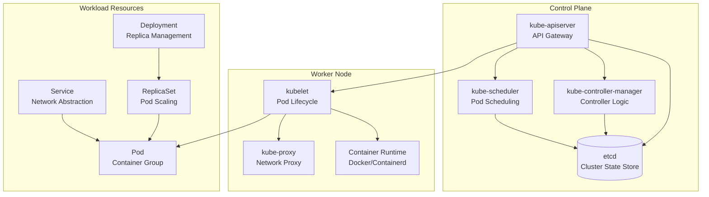

# Kubernetes Components

Kubernetes is composed of several key components that work together to manage containerized applications. These components can be categorized into control plane components (responsible for cluster management) and worker node components (responsible for running applications). Additionally, there are workload resources that define how applications run.

## Core Concepts Overview

Before diving into specific components, let's understand the fundamental building blocks:

- **Pods**: The smallest deployable units in Kubernetes, containing one or more containers
- **Services**: Abstractions that define a logical set of pods and enable network access
- **Deployments**: Controllers that manage pod replicas and provide declarative updates
- **Namespaces**: Virtual clusters within a physical cluster for resource isolation

## Control Plane Components

Control plane components are responsible for managing the cluster as a whole. They include:

*   **kube-apiserver:** The API server is the central point of contact for all communication with the cluster.
*   **kube-controller-manager:** The controller manager is responsible for ensuring that the desired state of the cluster is maintained.
*   **kube-scheduler:** The scheduler is responsible for scheduling pods to worker nodes.
*   **etcd:** etcd is a distributed key-value store that is used to store the state of the cluster.

## Worker Node Components

Worker node components are responsible for running the applications. They include:

*   **kubelet:** The kubelet is responsible for communicating with the master node and managing the pods on the worker node.
*   **kube-proxy:** The kube-proxy is responsible for networking between pods.
*   **Container runtime:** The container runtime is responsible for running the containers.

## Other Components

In addition to the control plane and worker node components, there are a number of other components that are used in Kubernetes. These components include:

*   **Pods:** A pod is the smallest and simplest unit in the Kubernetes object model. It represents a single instance of a running process in a cluster.
*   **Services:** A service is an abstraction that defines a logical set of pods and a policy by which to access them.
*   **Deployments:** A deployment is a controller that provides declarative updates for pods and replica sets.
*   **ReplicaSets:** A replica set is a controller that ensures that a specified number of pod replicas are running at any given time.
*   **Namespaces:** A namespace is a way to divide cluster resources between multiple users.

## Component Relationships Diagram



## Detailed Component Explanations

### Pods: The Atomic Unit

A Pod is the smallest and most basic deployable object in Kubernetes. It represents a single instance of a running process in your cluster and can contain one or more containers that share storage, network, and specifications about how to run them.

**Key Characteristics:**
- **Ephemeral**: Pods are not designed to be long-lived
- **Shared Context**: Containers in a pod share the same network namespace, IPC namespace, and can share volumes
- **Atomic Scheduling**: All containers in a pod are scheduled together on the same node

**Pod Lifecycle:**
1. **Pending**: Pod accepted by Kubernetes but containers not yet created
2. **Running**: All containers in the pod are running
3. **Succeeded**: All containers terminated successfully
4. **Failed**: At least one container terminated with failure
5. **Unknown**: State cannot be determined

### Services: Network Abstraction

A Service is an abstraction that defines a logical set of pods and a policy by which to access them. Services enable loose coupling between dependent pods and provide a stable endpoint for accessing applications.

**Service Types:**
- **ClusterIP**: Default type, exposes service on internal cluster IP
- **NodePort**: Exposes service on each node's IP at a static port
- **LoadBalancer**: Creates an external load balancer (requires cloud provider)
- **ExternalName**: Maps service to external DNS name

### Deployments: Declarative Updates

A Deployment provides declarative updates for Pods and ReplicaSets. It describes a desired state and the Deployment controller changes the actual state to the desired state at a controlled rate.

**Key Features:**
- **Rolling Updates**: Update pods without downtime
- **Rollback**: Revert to previous versions
- **Scaling**: Change number of replicas
- **Pause/Resume**: Control update process

**Understanding `kubectl get deployments` Output:**

When you run `kubectl get deployments`, you'll see output like this:

```
NAME               READY   UP-TO-DATE   AVAILABLE   AGE
nginx-deployment   3/3     3            3           2m
```

**Column Explanations:**
- **NAME**: The name of the deployment
- **READY**: Shows `current/desired` replicas (e.g., 3/3 means 3 out of 3 desired pods are ready)
- **UP-TO-DATE**: Number of replicas that have been updated to the latest pod spec
- **AVAILABLE**: Number of replicas available to users (ready and able to serve traffic)
- **AGE**: How long ago the deployment was created

**Example Scenarios:**
- `3/3  3  3  2m`: Perfect state - all desired pods are ready, up-to-date, and available
- `2/3  3  2  2m`: Rolling update in progress - 3 pods updated but only 2 are ready yet
- `3/3  0  3  2m`: Deployment created but pods not updated (paused deployment)
- `1/3  1  1  2m`: Only 1 pod ready, likely due to resource constraints or failures

**Deployment Status Details:**

For more detailed information, use `kubectl describe deployment <name>`:

```bash
kubectl describe deployment nginx-deployment
```

This shows:
- **Replicas**: Desired, current, ready, available, and unavailable counts
- **Strategy**: Rolling update configuration (max unavailable, max surge)
- **Conditions**: Status conditions like Available, Progressing, ReplicaFailure
- **Events**: Timeline of deployment events and status changes
- **Pod Template**: The pod specification being deployed

### ConfigMaps and Secrets: Configuration Management

**ConfigMaps** store non-confidential configuration data in key-value pairs that can be consumed by pods.

**Secrets** store sensitive information like passwords, tokens, and keys, encoded in base64.

### Persistent Volumes: Storage Abstraction

Persistent Volumes (PV) provide API for users and administrators to abstract details of how storage is provided from how it is consumed.

**Key Concepts:**
- **PersistentVolume (PV)**: Storage resource in the cluster
- **PersistentVolumeClaim (PVC)**: Request for storage by a user
- **StorageClass**: Defines different classes of storage

## Hands-on Exercises

### Exercise 1: Working with Pods

1. **Create a simple pod:**

```yaml
apiVersion: v1
kind: Pod
metadata:
  name: nginx-pod
  labels:
    app: nginx
spec:
  containers:
  - name: nginx
    image: nginx:1.21
    ports:
    - containerPort: 80
```

```bash
kubectl apply -f pod.yaml
kubectl get pods
kubectl describe pod nginx-pod
```

2. **Access the pod:**

```bash
kubectl port-forward pod/nginx-pod 8080:80
# Access http://localhost:8080
```

### Exercise 2: Creating Services

1. **Create a deployment and service:**

```yaml
apiVersion: apps/v1
kind: Deployment
metadata:
  name: nginx-deployment
spec:
  replicas: 3
  selector:
    matchLabels:
      app: nginx
  template:
    metadata:
      labels:
        app: nginx
    spec:
      containers:
      - name: nginx
        image: nginx:1.21
        ports:
        - containerPort: 80
---
apiVersion: v1
kind: Service
metadata:
  name: nginx-service
spec:
  selector:
    app: nginx
  ports:
  - port: 80
    targetPort: 80
  type: ClusterIP
```

```bash
kubectl apply -f deployment-service.yaml
kubectl get services
kubectl get endpoints nginx-service
```

### Exercise 3: Using ConfigMaps

1. **Create a ConfigMap:**

```yaml
apiVersion: v1
kind: ConfigMap
metadata:
  name: app-config
data:
  APP_ENV: "production"
  LOG_LEVEL: "info"
  DATABASE_URL: "postgres://db:5432/myapp"
```

2. **Use ConfigMap in a pod:**

```yaml
apiVersion: v1
kind: Pod
metadata:
  name: config-pod
spec:
  containers:
  - name: app
    image: busybox
    command: ["env"]
    envFrom:
    - configMapRef:
        name: app-config
```

```bash
kubectl apply -f configmap.yaml
kubectl apply -f config-pod.yaml
kubectl logs config-pod
```

### Exercise 4: Working with Secrets

1. **Create a Secret:**

```bash
kubectl create secret generic db-secret \
  --from-literal=username=admin \
  --from-literal=password=mypassword
```

2. **Use Secret in a pod:**

```yaml
apiVersion: v1
kind: Pod
metadata:
  name: secret-pod
spec:
  containers:
  - name: app
    image: busybox
    command: ["sh", "-c", "echo Username: $DB_USER && echo Password: $DB_PASS"]
    env:
    - name: DB_USER
      valueFrom:
        secretKeyRef:
          name: db-secret
          key: username
    - name: DB_PASS
      valueFrom:
        secretKeyRef:
          name: db-secret
          key: password
```

### Exercise 5: Persistent Storage

1. **Create a PersistentVolumeClaim:**

```yaml
apiVersion: v1
kind: PersistentVolumeClaim
metadata:
  name: app-storage
spec:
  accessModes:
    - ReadWriteOnce
  resources:
    requests:
      storage: 1Gi
```

2. **Use PVC in a pod:**

```yaml
apiVersion: v1
kind: Pod
metadata:
  name: storage-pod
spec:
  containers:
  - name: app
    image: busybox
    command: ["sh", "-c", "echo 'Hello World' > /data/hello.txt && sleep 3600"]
    volumeMounts:
    - name: storage
      mountPath: /data
  volumes:
  - name: storage
    persistentVolumeClaim:
      claimName: app-storage
```

```bash
kubectl apply -f pvc.yaml
kubectl apply -f storage-pod.yaml
kubectl exec storage-pod -- cat /data/hello.txt
kubectl delete pod storage-pod
# Data persists!
kubectl apply -f storage-pod.yaml
kubectl exec storage-pod -- cat /data/hello.txt
```

## Advanced Topics

### Custom Resource Definitions (CRDs)

CRDs allow you to extend Kubernetes API with your own resource types.

### Operators

Operators are software extensions that use CRDs to manage applications and their components.

### Network Policies

Network policies specify how groups of pods are allowed to communicate with each other and other network endpoints.

## Troubleshooting Common Issues

- **Pod Pending**: Check resource availability and node capacity
- **Pod CrashLoopBackOff**: Examine container logs and exit codes
- **Service Not Accessible**: Verify selectors and endpoint creation
- **PVC Pending**: Check storage class and available PVs
- **Image Pull Errors**: Verify image names and registry access

## Best Practices

1. **Resource Limits**: Always set CPU and memory limits
2. **Health Checks**: Implement readiness and liveness probes
3. **Labels and Selectors**: Use consistent labeling strategy
4. **Security Context**: Run containers with appropriate security contexts
5. **Rolling Updates**: Use deployments for zero-downtime updates
6. **Monitoring**: Implement proper logging and metrics collection