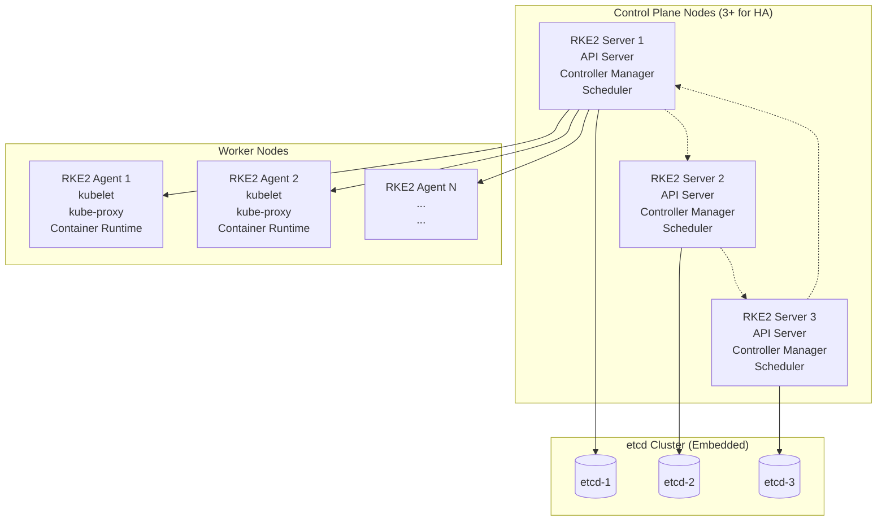

# High-Availability K8s Cluster with RKE2

RKE2 (Rancher Kubernetes Engine 2) is Rancher's next-generation Kubernetes distribution designed specifically for production workloads requiring high availability, security, and compliance. It provides a hardened, secure, and easy-to-maintain Kubernetes cluster with built-in etcd high availability, automated certificate management, and integrated security features.

## Why RKE2 for Production?

- **Security First**: CIS benchmark compliant with security hardening by default
- **High Availability**: Built-in etcd clustering and control plane redundancy
- **Automated Operations**: Self-healing, auto-scaling, and automated certificate rotation
- **Compliance Ready**: FIPS 140-2 compliant binaries available
- **Easy Upgrades**: Rolling upgrades with minimal downtime
- **Multi-OS Support**: Runs on various Linux distributions and Windows

## System Requirements

*   **Operating System:** Ubuntu 20.04 or CentOS 8
*   **RAM:** 4GB
*   **CPU:** 2 cores

## Installation

1.  **Install RKE2:** To install RKE2, run the following command on all of your nodes:

    ```bash
    curl -sfL https://get.rke2.io | sh -
    ```

2.  **Configure the first master node:** On the first master node, create a file named `/etc/rancher/rke2/config.yaml` with the following content:

    ```yaml
    token: <my-shared-secret>
    ```

    Replace `<my-shared-secret>` with a secret token that will be used to join the other nodes to the cluster.

3.  **Start RKE2 on the first master node:** To start RKE2 on the first master node, run the following command:

    ```bash
    systemctl enable rke2-server
    systemctl start rke2-server
    ```

4.  **Configure the other master nodes:** On the other master nodes, create a file named `/etc/rancher/rke2/config.yaml` with the following content:

    ```yaml
    server: https://<ip-of-first-master>:9345
    token: <my-shared-secret>
    ```

    Replace `<ip-of-first-master>` with the IP address of the first master node and `<my-shared-secret>` with the same secret token that you used on the first master node.

5.  **Start RKE2 on the other master nodes:** To start RKE2 on the other master nodes, run the following command:

    ```bash
    systemctl enable rke2-server
    systemctl start rke2-server
    ```

6.  **Configure the worker nodes:** On the worker nodes, create a file named `/etc/rancher/rke2/config.yaml` with the following content:

    ```yaml
    server: https://<ip-of-first-master>:9345
    token: <my-shared-secret>
    ```

    Replace `<ip-of-first-master>` with the IP address of the first master node and `<my-shared-secret>` with the same secret token that you used on the first master node.

7.  **Start RKE2 on the worker nodes:** To start RKE2 on the worker nodes, run the following command:

    ```bash
    systemctl enable rke2-agent
    systemctl start rke2-agent
    ```

## Exercise: Deploy a High-Availability Application

1.  **Create a deployment:** Create a file named `deployment.yaml` with the following content:

    ```yaml
    apiVersion: apps/v1
    kind: Deployment
    metadata:
      name: nginx-deployment
    spec:
      replicas: 3
      selector:
        matchLabels:
          app: nginx
      template:
        metadata:
          labels:
            app: nginx
        spec:
          containers:
          - name: nginx
            image: nginx:1.14.2
            ports:
            - containerPort: 80
    ```

2.  **Apply the deployment:** Run the following command to apply the deployment:

    ```bash
    kubectl apply -f deployment.yaml
    ```

3.  **Check the deployment:** To check the status of your deployment, run the following command:

    ```bash
    kubectl get deployments
    ```

4.  **Expose the deployment:** To expose the deployment, run the following command:

    ```bash
    kubectl expose deployment nginx-deployment --port=80 --type=LoadBalancer
    ```

5.  **Access the application:** To access the application, you will need to get the external IP address of the load balancer. Run the following command to get the external IP address:

    ```bash
    kubectl get services
    ```

    You can then access the application by opening a web browser and navigating to the external IP address.

## RKE2 Architecture and Components



## Advanced RKE2 Configuration

### Custom Configuration File

Create `/etc/rancher/rke2/config.yaml` with advanced options:

```yaml
# Cluster configuration
cluster-cidr: "10.42.0.0/16"
service-cidr: "10.43.0.0/16"
cluster-dns: "10.43.0.10"

# Security settings
profile: "cis-1.23"
secrets-encryption: true

# Networking
cni: "calico"
disable-kube-proxy: false

# etcd configuration
etcd-expose-metrics: true
etcd-snapshot-schedule-cron: "0 */6 * * *"
etcd-snapshot-retention: 7

# Node settings
node-label:
  - "environment=production"
  - "team=platform"
node-taint:
  - "CriticalAddonsOnly=true:NoExecute"

# Registry configuration
mirrors:
  docker.io:
    endpoint:
      - "https://registry.example.com"
```

### Integrating with Rancher

After setting up RKE2, integrate it with Rancher for management:

1. **Install Rancher** (if not already installed)
2. **Import RKE2 Cluster**: In Rancher UI, go to Cluster Management → Import Existing Cluster
3. **Run Import Command**: Execute the provided kubectl command on your RKE2 cluster
4. **Verify Integration**: Check that the cluster appears in Rancher dashboard

### Backup and Recovery

Implement automated backups for disaster recovery:

```bash
# Create backup
rke2 etcd-snapshot save --name emergency-backup

# List snapshots
rke2 etcd-snapshot list

# Restore from backup
rke2 server --cluster-reset --etcd-snapshot-name emergency-backup
```

### Monitoring RKE2 Clusters

Deploy comprehensive monitoring:

```bash
# Install Rancher Monitoring (if using Rancher)
kubectl apply -f https://raw.githubusercontent.com/rancherfederal/rke2-monitoring/main/deploy.yaml

# Or install Prometheus manually
helm repo add prometheus-community https://prometheus-community.github.io/helm-charts
helm install prometheus prometheus-community/kube-prometheus-stack
```

## Troubleshooting High Availability

- **etcd Issues**: Check cluster health with `rke2 etcd-snapshot list`
- **Control Plane Failures**: Verify load balancer configuration
- **Certificate Expiry**: RKE2 auto-renews, but monitor with `rke2 certificate check`
- **Network Problems**: Ensure firewall rules allow cluster communication
- **Resource Constraints**: Monitor node resources and scale appropriately

## Best Practices for Production

1. **Use External Load Balancer**: Place control plane nodes behind a load balancer
2. **Regular Backups**: Implement automated etcd snapshots
3. **Security Hardening**: Enable CIS profiles and secrets encryption
4. **Resource Planning**: Allocate sufficient CPU/memory for control plane components
5. **Network Security**: Implement network policies and service mesh
6. **Monitoring**: Set up comprehensive observability from day one
7. **Updates**: Plan regular maintenance windows for RKE2 upgrades