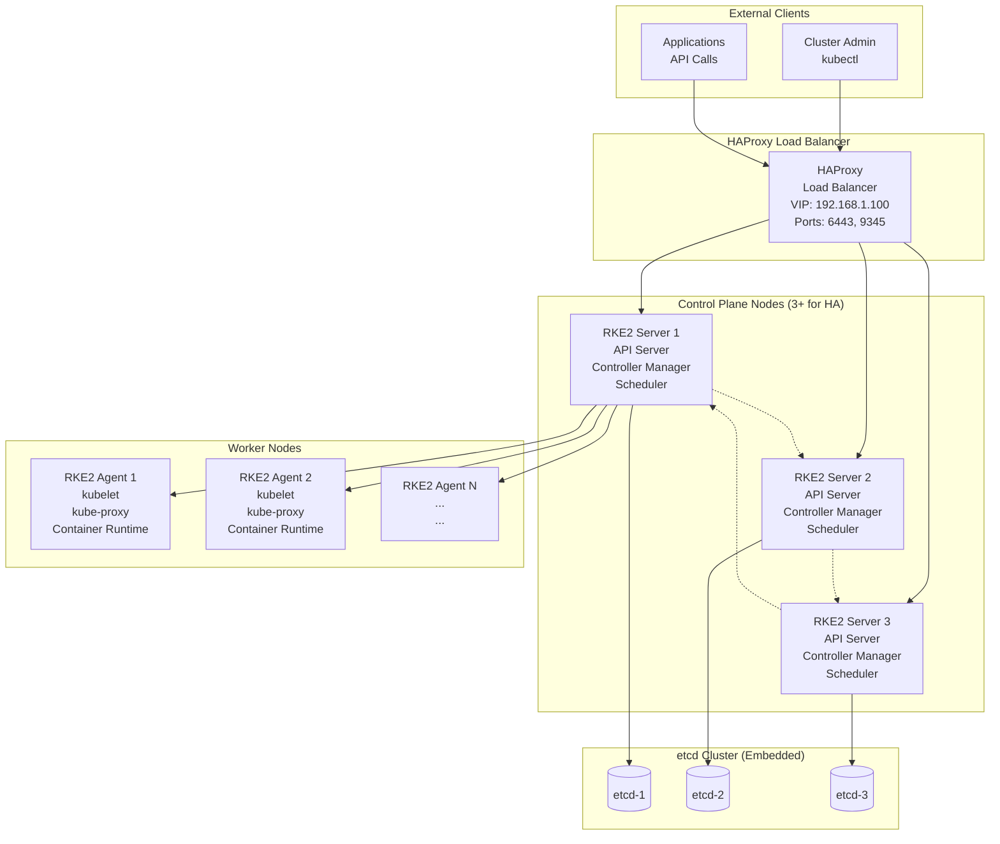

# High-Availability K8s Cluster with RKE2

RKE2 (Rancher Kubernetes Engine 2) is Rancher's next-generation Kubernetes distribution designed specifically for production workloads requiring high availability, security, and compliance. It provides a hardened, secure, and easy-to-maintain Kubernetes cluster with built-in etcd high availability, automated certificate management, and integrated security features.

## Why RKE2 for Production?

- **Security First**: CIS benchmark compliant with security hardening by default
- **High Availability**: Built-in etcd clustering and control plane redundancy
- **Automated Operations**: Self-healing, auto-scaling, and automated certificate rotation
- **Compliance Ready**: FIPS 140-2 compliant binaries available
- **Easy Upgrades**: Rolling upgrades with minimal downtime
- **Multi-OS Support**: Runs on various Linux distributions and Windows

## System Requirements

*   **Operating System:** Ubuntu 20.04 or CentOS 8
*   **RAM:** 4GB
*   **CPU:** 2 cores

## HAProxy Load Balancer for Control Plane HA

To achieve true high availability for the Kubernetes control plane, deploy HAProxy as a load balancer in front of the RKE2 master nodes. This ensures that API server requests are distributed across all masters and provides failover capabilities.

### Why HAProxy?

- **Load Balancing**: Distributes API server traffic across multiple master nodes
- **Health Checks**: Automatically removes unhealthy masters from the pool
- **Failover**: Seamless failover when a master node goes down
- **Simple Configuration**: Lightweight and easy to deploy on bare-metal

### HAProxy Installation and Configuration

1. **Install HAProxy on a dedicated node or VM:**

    ```bash
    # On Ubuntu/Debian
    sudo apt update
    sudo apt install haproxy

    # On CentOS/RHEL
    sudo yum install haproxy
    ```

2. **Configure HAProxy:** Create `/etc/haproxy/haproxy.cfg` with the following configuration:

    ```haproxy
    global
        log /dev/log local0
        log /dev/log local1 notice
        chroot /var/lib/haproxy
        stats socket /run/haproxy/admin.sock mode 660 level admin expose-fd listeners
        stats timeout 30s
        user haproxy
        group haproxy
        daemon

    defaults
        log global
        mode tcp
        option tcplog
        option dontlognull
        timeout connect 5000
        timeout client 50000
        timeout server 50000

    frontend kubernetes-api
        bind *:9345  # RKE2 supervisor port
        default_backend kubernetes-masters

    backend kubernetes-masters
        balance roundrobin
        option tcp-check
        server master1 <master1-ip>:9345 check
        server master2 <master2-ip>:9345 check
        server master3 <master3-ip>:9345 check

    frontend kubernetes-api-6443
        bind *:6443  # Kubernetes API server port
        default_backend kubernetes-api-servers

    backend kubernetes-api-servers
        balance roundrobin
        option tcp-check
        server master1 <master1-ip>:6443 check
        server master2 <master2-ip>:6443 check
        server master3 <master3-ip>:6443 check

    listen stats
        bind *:9000
        stats enable
        stats uri /stats
        stats refresh 30s
    ```

    Replace `<master1-ip>`, `<master2-ip>`, `<master3-ip>` with the actual IP addresses of your master nodes.

3. **Enable and start HAProxy:**

    ```bash
    sudo systemctl enable haproxy
    sudo systemctl start haproxy
    ```

4. **Verify HAProxy status:**

    ```bash
    sudo systemctl status haproxy
    curl http://<haproxy-ip>:9000/stats  # Access HAProxy stats page
    ```

### HAProxy Best Practices

- **Dedicated Node**: Run HAProxy on a separate node/VM for better isolation
- **Keepalived Integration**: For HAProxy HA, integrate with Keepalived for VIP failover
- **SSL Termination**: Consider SSL termination at HAProxy for encrypted traffic
- **Monitoring**: Monitor HAProxy metrics and logs for troubleshooting

---

## RKE2 Installation

1.  **Install RKE2:** To install RKE2, run the following command on all of your nodes:

    ```bash
    curl -sfL https://get.rke2.io | INSTALL_RKE2_TYPE=server sudo sh -
    ```

2.  **Configure the first master node:** 
   Configure RKE2 for HA:
   - sudo mkdir -p /etc/rancher/rke2
   - sudo nano /etc/rancher/rke2/config.yaml
   - Edit `/etc/rancher/rke2/config.yaml` on **master nodes**:
     On the first master node add you own security token, but if you want system generete token then go to step 3.
     ```yaml
     token: "<my-shared-secret>"
     tls-san:
      - ha-proxy-ip
      - server-mastername
      - server-masterip
     ```

3.  **Start RKE2 on the first master node:** To start RKE2 on the first master node, run the following command:

    ```bash
    systemctl enable rke2-server
    systemctl start rke2-server
    ```
    If you are not generate token by yourself, a token that can be used to register other server or agent nodes will be created at /var/lib/rancher/rke2/server/node-token

    Go to step 2, after get a token from a master one node.

    For kubectl working with Cluster, you need to copy rke2.yaml into .kube folder

    ```bash
    mkdir .kube
    cp /etc/rancher/rke2/rke2.yaml .kube/config
    ```

4.  **Configure the other master nodes:** On the other master nodes, create a file named `/etc/rancher/rke2/config.yaml` with the following content:

    ```yaml
    server: https://<haproxy-ip>:9345
    token: <my-shared-secret>
    tls-san:
      - server-mastername
      - server-masterip
    ```

    Replace `<haproxy-ip>` with the IP address of the HAProxy load balancer and `<my-shared-secret>` with the same secret token that you used on the first master node.

5.  **Start RKE2 on the other master nodes:** To start RKE2 on the other master nodes, run the following command:

    ```bash
    systemctl enable rke2-server
    systemctl start rke2-server
    ```

6.  **Configure the worker nodes:** On the worker nodes, create a file named `/etc/rancher/rke2/config.yaml` with the following content:

    ```bash
    curl -sfL https://get.rke2.io | INSTALL_RKE2_TYPE=agent sudo sh -
    ```

    ```yaml
    server: https://<haproxy-ip>:9345
    token: <my-shared-secret>
    ```

    Replace `<haproxy-ip>` with the IP address of the HAProxy load balancer and `<my-shared-secret>` with the same secret token that you used on the first master node.

7.  **Start RKE2 on the worker nodes:** To start RKE2 on the worker nodes, run the following command:

    ```bash
    systemctl enable rke2-agent
    systemctl start rke2-agent
    ```
8.  **List Cluster Nodes:** After success install node, you can list all nodes using the following command below:

    ```bash
    kubectl get nodes
    ```

9.  **Update Role Label:** In Kubernetes, **node “roles” are not actual rename-able objects** — they are just *labels* applied to nodes.
So to “rename” a role, you simply remove the old role label and add a new one.


### ✅ Check current labels

```bash
kubectl get nodes --show-labels
```

You should see labels like:

```bash
node-role.kubernetes.io/control-plane=""
node-role.kubernetes.io/worker=""
```

---

### ✅ Remove old role label

Example: remove `worker` role from node `node01`:

```sh
kubectl label node node01 node-role.kubernetes.io/worker-
```

> Note the `-` at the end — that deletes the label.

---

### ✅ Add new role label

Example: assign a new role `database`:

```sh
kubectl label node node01 node-role.kubernetes.io/database=""
```

---

### Optional: Taints (if needed)

Control-plane nodes are usually tainted.
If you're modifying master roles and want to allow workloads to run there, remove taint:

```sh
kubectl taint nodes node01 node-role.kubernetes.io/control-plane-
```

---

### Summary

| Action                  | Command                                                               |
| ----------------------- | --------------------------------------------------------------------- |
| View labels             | `kubectl get nodes --show-labels`                                     |
| Remove role             | `kubectl label node <node_name> node-role.kubernetes.io/<oldrole>-`   |
| Add new role            | `kubectl label node <node_name> node-role.kubernetes.io/<newrole>=""` |
| Remove taint (optional) | `kubectl taint nodes <node_name> node-role.kubernetes.io/<role>-`     |

---

Here’s the command to add the **worker** role label on a specific node (example: node name = `node01`):

```sh
kubectl label node node01 node-role.kubernetes.io/worker=""
```

✅ Done — now that node has the `worker` role label.

If you need to remove any existing role before adding worker, do this first:

```sh
kubectl label node node01 node-role.kubernetes.io/<oldrole>-
```

Replace `<oldrole>` with whatever label you want to remove (e.g., `control-plane`).


---

## Exercise: Deploy a High-Availability Application

1.  **Create a deployment:** Create a file named `deployment.yaml` with the following content:

    ```yaml
    apiVersion: apps/v1
    kind: Deployment
    metadata:
      name: nginx-deployment
    spec:
      replicas: 3
      selector:
        matchLabels:
          app: nginx
      template:
        metadata:
          labels:
            app: nginx
        spec:
          containers:
          - name: nginx
            image: nginx:1.14.2
            ports:
            - containerPort: 80
    ```

2.  **Apply the deployment:** Run the following command to apply the deployment:

    ```bash
    kubectl apply -f deployment.yaml
    ```

3.  **Check the deployment:** To check the status of your deployment, run the following command:

    ```bash
    kubectl get deployments
    ```

4.  **Expose the deployment:** To expose the deployment, run the following command:

    ```bash
    kubectl expose deployment nginx-deployment --port=80 --type=LoadBalancer
    ```

5.  **Access the application:** To access the application, you will need to get the external IP address of the load balancer. Run the following command to get the external IP address:

    ```bash
    kubectl get services
    ```

    You can then access the application by opening a web browser and navigating to the external IP address.

## RKE2 Architecture and Components



## Advanced RKE2 Configuration

### Custom Configuration File

Create `/etc/rancher/rke2/config.yaml` with advanced options:

```yaml
# Cluster configuration
cluster-cidr: "10.42.0.0/16"
service-cidr: "10.43.0.0/16
cluster-dns: "10.43.0.10"

# Security settings
profile: "cis-1.23"
secrets-encryption: true

# Networking
cni: "calico"
disable-kube-proxy: false

# etcd configuration
etcd-expose-metrics: true
etcd-snapshot-schedule-cron: "0 */6 * * *"
etcd-snapshot-retention: 7

# Node settings
node-label:
  - "environment=production"
  - "team=platform"
node-taint:
  - "CriticalAddonsOnly=true:NoExecute"

# Registry configuration
mirrors:
  docker.io:
    endpoint:
      - "https://registry.example.com"
```

### Integrating with Rancher

After setting up RKE2, integrate it with Rancher for management:

1. **Install Rancher** (if not already installed)
2. **Import RKE2 Cluster**: In Rancher UI, go to Cluster Management → Import Existing Cluster
3. **Run Import Command**: Execute the provided kubectl command on your RKE2 cluster
4. **Verify Integration**: Check that the cluster appears in Rancher dashboard

### Backup and Recovery

Implement automated backups for disaster recovery:

```bash
# Create backup
rke2 etcd-snapshot save --name emergency-backup

# List snapshots
rke2 etcd-snapshot list

# Restore from backup
rke2 server --cluster-reset --etcd-snapshot-name emergency-backup
```

### Monitoring RKE2 Clusters

Deploy comprehensive monitoring:

```bash
# Install Rancher Monitoring (if using Rancher)
kubectl apply -f https://raw.githubusercontent.com/rancherfederal/rke2-monitoring/main/deploy.yaml

# Or install Prometheus manually
helm repo add prometheus-community https://prometheus-community.github.io/helm-charts
helm install prometheus prometheus-community/kube-prometheus-stack
```

## Troubleshooting High Availability

- **etcd Issues**: Check cluster health with `rke2 etcd-snapshot list`
- **Control Plane Failures**: Verify load balancer configuration
- **Certificate Expiry**: RKE2 auto-renews, but monitor with `rke2 certificate check`
- **Network Problems**: Ensure firewall rules allow cluster communication
- **Resource Constraints**: Monitor node resources and scale appropriately

## Best Practices for Production

1. **Use HAProxy Load Balancer**: Deploy HAProxy in front of control plane nodes for true HA and load distribution
2. **Regular Backups**: Implement automated etcd snapshots
3. **Security Hardening**: Enable CIS profiles and secrets encryption
4. **Resource Planning**: Allocate sufficient CPU/memory for control plane components
5. **Network Security**: Implement network policies and service mesh
6. **Monitoring**: Set up comprehensive observability from day one
7. **Updates**: Plan regular maintenance windows for RKE2 upgrades