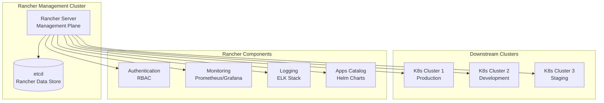

# Using Rancher for Cluster Management

Rancher is a comprehensive Kubernetes management platform that simplifies cluster operations across multiple environments. It provides a unified interface for managing Kubernetes clusters, whether they're running locally (like KIND clusters) or in cloud environments. Rancher adds enterprise-grade features like authentication, RBAC, monitoring, and centralized logging.

## Key Benefits of Rancher

- **Multi-Cluster Management**: Manage multiple Kubernetes clusters from a single dashboard
- **Unified Authentication**: Integrate with LDAP, SAML, and other identity providers
- **Built-in Monitoring**: Prometheus and Grafana integration out of the box
- **Application Catalog**: Deploy applications using Helm charts through the Rancher Apps & Marketplace
- **Security Policies**: Implement and enforce security best practices across clusters
- **Backup & Restore**: Automated backup solutions for cluster state and applications

## Installing Helm
```sh
curl https://raw.githubusercontent.com/helm/helm/main/scripts/get-helm-3 | bash
```

## Installing Rancher

Rancher can be installed in multiple ways depending on your environment and requirements. Here are the main installation options:

### Option 1: Docker Installation (Standalone)

1.  **Install Docker:** If you don't already have Docker installed, follow the instructions for your operating system: [https://docs.docker.com/get-docker/](https://docs.docker.com/get-docker/)

2.  **Install Rancher:** To install Rancher, run the following command:

    ```bash
    docker run -d --restart=unless-stopped -p 80:80 -p 443:443 --privileged rancher/rancher:latest
    ```

    This will start the Rancher server in a Docker container.

3.  **Access Rancher:** To access the Rancher UI, open a web browser and navigate to `https://localhost`. You will be prompted to set a password for the `admin` user.

### Option 2: Helm Installation (Inside Kubernetes Cluster)

For production deployments, install Rancher inside a Kubernetes cluster using Helm:

1. **Add Rancher Helm repository:**

```bash
helm repo add rancher-stable https://releases.rancher.com/server-charts/stable
helm repo update
```

2. **Create namespace:**

```bash
kubectl create namespace cattle-system
```

3. **Install cert-manager (required for Rancher):**

```bash
kubectl apply -f https://github.com/cert-manager/cert-manager/releases/download/v1.13.3/cert-manager.crds.yaml

helm repo add jetstack https://charts.jetstack.io
helm repo update

helm install cert-manager jetstack/cert-manager \
  --namespace cert-manager \
  --create-namespace \
  --version v1.13.3
```

4. **Install Rancher:**

```bash
helm install rancher rancher-stable/rancher \
  --namespace cattle-system \
  --set hostname=rancher.mycompany.com \
  --set bootstrapPassword=admin \
  --set ingress.tls.source=letsEncrypt \
  --set letsEncrypt.email=admin@mycompany.com
```

**Alternative: Using self-signed certificates:**

```bash
helm install rancher rancher-stable/rancher \
  --namespace cattle-system \
  --set hostname=rancher.mycompany.com \
  --set bootstrapPassword=admin \
  --set ingress.tls.source=rancher
```

5. **Verify installation:**

```bash
kubectl -n cattle-system rollout status deploy/rancher
kubectl -n cattle-system get ingress
```

6. **Access Rancher:** Use the hostname you configured (e.g., `https://rancher.mycompany.com`)

### Option 3: RKE2 with Rancher (Integrated Installation)

If you're using RKE2, you can install Rancher as part of the cluster bootstrap:

1. **Configure RKE2 with Rancher:**

```yaml
# /etc/rancher/rke2/config.yaml
token: "your-cluster-token"
server: "https://<first-server>:9345"
system-default-registry: "docker.io"

# Rancher-specific configuration
rancher-install:
  enabled: true
  bootstrap-password: "your-bootstrap-password"
  hostname: "rancher.yourdomain.com"
```

2. **Start RKE2:**

```bash
systemctl enable rke2-server
systemctl start rke2-server
```

### Option 4: Air-Gapped Installation

For environments without internet access:

1. **Download required images:**

```bash
docker pull rancher/rancher:latest
docker pull rancher/rancher-agent:latest
# Download additional system images...
```

2. **Save and transfer images:**

```bash
docker save rancher/rancher:latest > rancher.tar
# Transfer to air-gapped environment
docker load < rancher.tar
```

3. **Install using local registry:**

```bash
helm install rancher ./rancher-chart \
  --namespace cattle-system \
  --set rancherImage=rancher/rancher \
  --set systemDefaultRegistry=your-registry.com
```

### Option 5: High Availability Installation

For production HA setup:

```bash
# Install on multiple nodes with external load balancer
helm install rancher rancher-stable/rancher \
  --namespace cattle-system \
  --set hostname=rancher.mycompany.com \
  --set replicas=3 \
  --set ingress.ingressClassName=nginx \
  --set bootstrapPassword=secure-password
```

**Post-Installation Configuration:**

After installation, complete the setup:

1. **Access Rancher UI** using the configured hostname
2. **Set admin password** (if not set during installation)
3. **Configure authentication** (local, LDAP, SAML, etc.)
4. **Add cluster repositories** for applications
5. **Configure monitoring and logging** if desired

## Importing a Cluster

1.  **Log in to Rancher:** Log in to the Rancher UI using the password you set in the previous step.

2.  **Click "Add Cluster":** Click the "Add Cluster" button in the top right corner of the screen.

3.  **Select "Import":** Select the "Import" option.

4.  **Enter a cluster name:** Enter a name for your cluster and click "Create".

5.  **Run the kubectl command:** Rancher will generate a `kubectl` command that you need to run on your cluster. This command will install the Rancher agent on your cluster and connect it to the Rancher server.

6.  **Wait for the cluster to be imported:** It may take a few minutes for the cluster to be imported. Once the cluster is imported, you will be able to see it in the Rancher UI.

## Exercise: Deploy an Application with Rancher

1.  **Log in to Rancher:** Log in to the Rancher UI.

2.  **Select your cluster:** Select the cluster that you imported in the previous step.

3.  **Click "Deploy":** Click the "Deploy" button in the top right corner of the screen.

4.  **Enter the following information:**

    *   **Name:** `nginx`
    *   **Docker Image:** `nginx:1.14.2`
    *   **Port Mapping:** `80:80`

5.  **Click "Launch":** Click the "Launch" button to deploy the application.

6.  **Access the application:** To access the application, open a web browser and navigate to the IP address of your cluster.

## Rancher Architecture Overview



## Advanced Rancher Features

### Fleet for GitOps

Rancher Fleet enables GitOps workflows for managing multiple clusters:

```bash
# Install Fleet
helm repo add rancher-fleet https://rancherfederal.github.io/fleet/charts
helm install fleet rancher-fleet/fleet -n fleet-system --create-namespace

# Create a GitRepo resource
kubectl apply -f - <<EOF
apiVersion: fleet.cattle.io/v1alpha1
kind: GitRepo
metadata:
  name: my-app
  namespace: fleet-default
spec:
  repo: https://github.com/myorg/my-app
  branch: main
  paths:
  - manifests/
EOF
```

### Monitoring with Rancher

Enable monitoring stack for observability:

```bash
# Install Rancher Monitoring
helm repo add rancher-stable https://releases.rancher.com/server-charts/stable
helm install rancher-monitoring rancher-stable/rancher-monitoring --namespace cattle-monitoring-system --create-namespace
```

### Security Best Practices

1. **Enable Pod Security Standards**:
   - Navigate to Cluster → Policies → Pod Security
   - Set appropriate security levels (privileged/restricted/baseline)

2. **Configure Network Policies**:
   - Use Rancher's built-in network policy editor
   - Implement zero-trust networking between namespaces

3. **Regular Updates**:
   - Keep Rancher and downstream clusters updated
   - Use Rancher's upgrade features for seamless updates

## Troubleshooting Rancher

- **Cluster Import Issues**: Ensure kubeconfig has correct permissions
- **Performance Problems**: Monitor resource usage in Rancher dashboard
- **Authentication Failures**: Check identity provider configuration
- **Backup Failures**: Verify storage class and permissions for backup targets