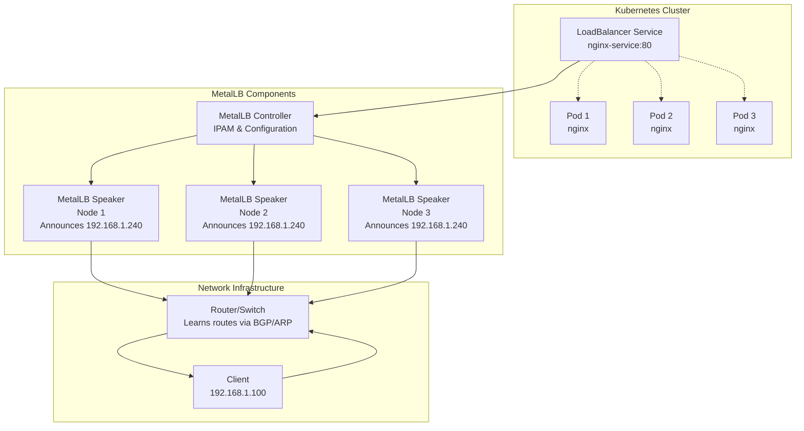

# Load Balancing with MetalLB

MetalLB is a load balancer implementation for bare-metal Kubernetes clusters that provides network load balancing without requiring cloud provider integrations. It allows you to expose Kubernetes services externally using standard networking protocols like ARP, NDP, or BGP, making it ideal for on-premises deployments.

## Why MetalLB?

- **Bare-Metal Ready**: Works without cloud provider load balancers
- **Layer 2 & BGP Support**: Flexible networking options for different environments
- **Standard Protocols**: Uses ARP/NDP for simple setups, BGP for advanced routing
- **Easy Configuration**: Simple YAML configuration with IP address pools
- **High Performance**: Direct routing without proxy overhead
- **Production Ready**: Supports health checks, failover, and load distribution

## Installation

1.  **Apply the MetalLB manifest:**

    ```bash
    kubectl apply -f https://raw.githubusercontent.com/metallb/metallb/v0.13.7/config/manifests/metallb-native.yaml
    ```

2.  **Create a configuration file:** Create a file named `metallb-config.yaml` with the following content:

    ```yaml
    apiVersion: metallb.io/v1beta1
    kind: IPAddressPool
    metadata:
      name: first-pool
      namespace: metallb-system
    spec:
      addresses:
      - 192.168.1.240-192.168.1.250
    ---
    apiVersion: metallb.io/v1beta1
    kind: L2Advertisement
    metadata:
      name: example
      namespace: metallb-system
    spec:
      ipAddressPools:
      - first-pool
    ```

    **Note:** You will need to replace the IP address range in the `addresses` field with a range of IP addresses that are available on your network.

3.  **Apply the configuration:**

    ```bash
    kubectl apply -f metallb-config.yaml
    ```

## Exercise: Deploy a Service with a Load Balancer

1.  **Create a deployment:** Create a file named `deployment.yaml` with the following content:

    ```yaml
    apiVersion: apps/v1
    kind: Deployment
    metadata:
      name: nginx-deployment
    spec:
      replicas: 3
      selector:
        matchLabels:
          app: nginx
      template:
        metadata:
          labels:
            app: nginx
        spec:
          containers:
          - name: nginx
            image: nginx:1.14.2
            ports:
            - containerPort: 80
    ```

2.  **Apply the deployment:**

    ```bash
    kubectl apply -f deployment.yaml
    ```

3.  **Create a service:** Create a file named `service.yaml` with the following content:

    ```yaml
    apiVersion: v1
    kind: Service
    metadata:
      name: nginx-service
    spec:
      selector:
        app: nginx
      ports:
        - protocol: TCP
          port: 80
          targetPort: 80
      type: LoadBalancer
    ```

4.  **Apply the service:**

    ```bash
    kubectl apply -f service.yaml
    ```

5.  **Get the external IP address:**

    ```bash
    kubectl get services
    ```

    You should see an external IP address assigned to the `nginx-service`. You can use this IP address to access the NGINX application.

## MetalLB Architecture



## Advanced MetalLB Configuration

### BGP Configuration for Production

For production environments with proper routing infrastructure:

```yaml
apiVersion: metallb.io/v1beta1
kind: IPAddressPool
metadata:
  name: production-pool
  namespace: metallb-system
spec:
  addresses:
  - 203.0.113.0/24
  autoAssign: true
---
apiVersion: metallb.io/v1beta1
kind: BGPAdvertisement
metadata:
  name: bgp-advertisement
  namespace: metallb-system
spec:
  ipAddressPools:
  - production-pool
  communities:
  - "65000:100"  # Custom BGP community
  localPref: 100
  peers:
  - router1.example.com
  - router2.example.com
---
apiVersion: metallb.io/v1beta1
kind: BGPPeer
metadata:
  name: router1
  namespace: metallb-system
spec:
  myASN: 65001
  peerASN: 65000
  peerAddress: 192.168.1.1
  routerID: 192.168.1.10
  holdTime: 30s
  keepaliveTime: 10s
```

### Layer 2 Configuration for Simple Networks

For home labs or simple networks without BGP:

```yaml
apiVersion: metallb.io/v1beta1
kind: IPAddressPool
metadata:
  name: layer2-pool
  namespace: metallb-system
spec:
  addresses:
  - 192.168.1.240-192.168.1.250
---
apiVersion: metallb.io/v1beta1
kind: L2Advertisement
metadata:
  name: layer2-advertisement
  namespace: metallb-system
spec:
  ipAddressPools:
  - layer2-pool
  interfaces:
  - eth0  # Specify network interface
```

### Load Balancing Algorithms

MetalLB supports different load distribution methods:

1. **Layer 2 Mode**: Uses ARP/NDP announcements
   - Simple failover (active-passive)
   - Fast convergence
   - Limited to single node active at a time

2. **BGP Mode**: Uses BGP routing
   - True load balancing (active-active)
   - ECMP support
   - Better integration with network infrastructure

### Health Checks and Failover

MetalLB integrates with Kubernetes service health checks:

```yaml
apiVersion: v1
kind: Service
metadata:
  name: nginx-service
  annotations:
    metallb.universe.tf/healthCheckNodePort: "8080"
spec:
  selector:
    app: nginx
  ports:
  - port: 80
    targetPort: 80
    nodePort: 30080
    protocol: TCP
    name: http
  - port: 443
    targetPort: 443
    nodePort: 30443
    protocol: TCP
    name: https
  type: LoadBalancer
  healthCheckNodePort: 8080
```

### Troubleshooting MetalLB

Common issues and solutions:

- **IP not assigned**: Check IPAddressPool configuration and available IPs
- **Traffic not reaching pods**: Verify speaker pods are running and network policies
- **BGP not working**: Check BGP peer configuration and router logs
- **ARP conflicts**: Ensure IP ranges don't conflict with existing network devices

### Integration with Ingress Controllers

MetalLB works well with ingress controllers like NGINX Ingress:

```yaml
apiVersion: networking.k8s.io/v1
kind: Ingress
metadata:
  name: nginx-ingress
spec:
  ingressClassName: nginx
  rules:
  - host: app.example.com
    http:
      paths:
      - path: /
        pathType: Prefix
        backend:
          service:
            name: nginx-service
            port:
              number: 80
---
apiVersion: v1
kind: Service
metadata:
  name: nginx-ingress
  namespace: ingress-nginx
spec:
  type: LoadBalancer
  ports:
  - port: 80
    targetPort: 80
    protocol: TCP
    name: http
  - port: 443
    targetPort: 443
    protocol: TCP
    name: https
  selector:
    app.kubernetes.io/name: ingress-nginx
```

### Monitoring MetalLB

Monitor MetalLB performance and health:

```bash
# Check MetalLB pods
kubectl get pods -n metallb-system

# View MetalLB logs
kubectl logs -n metallb-system deployment/controller

# Check service status
kubectl get svc -o wide

# Monitor BGP sessions (if using BGP)
kubectl get bgppeers -n metallb-system