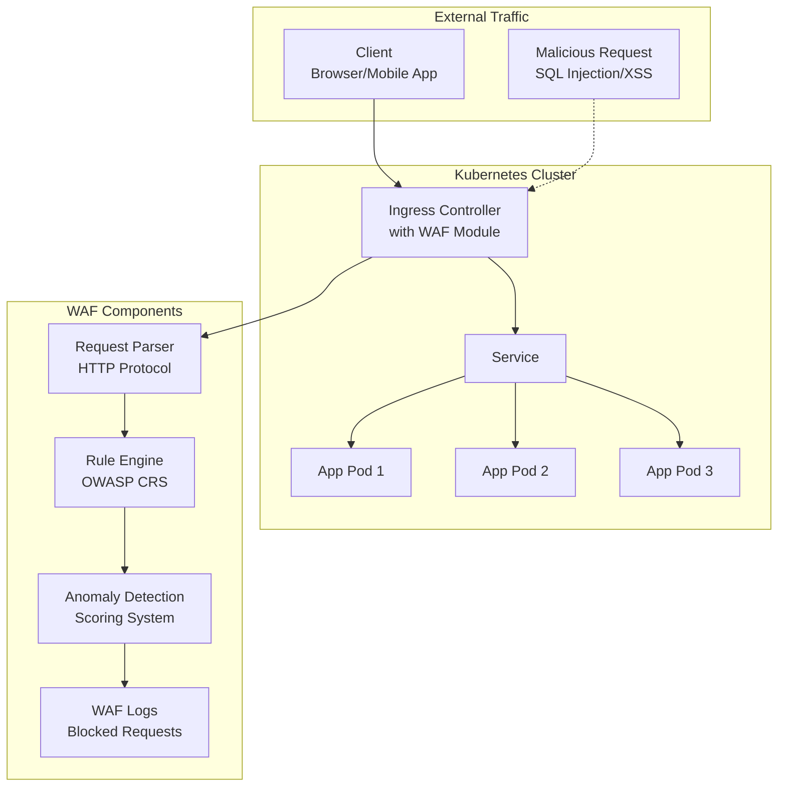

# Securing Applications with a WAF

A Web Application Firewall (WAF) is a specialized security solution designed to protect web applications from common attacks such as SQL injection, cross-site scripting (XSS), and cross-site request forgery (CSRF). In Kubernetes environments, WAFs can be deployed as ingress controllers or sidecar proxies to provide application-layer protection.

## Why WAF in Kubernetes?

- **Application Layer Protection**: Defends against OWASP Top 10 vulnerabilities
- **API Security**: Protects REST APIs and microservices
- **Compliance**: Helps meet security standards (PCI-DSS, HIPAA, etc.)
- **Zero-Day Protection**: Can detect and block unknown attack patterns
- **Traffic Inspection**: Deep packet inspection of HTTP/HTTPS traffic
- **Rate Limiting**: Prevents DDoS and brute force attacks

## WAF Architecture in Kubernetes



## Implementing ModSecurity with NGINX Ingress

### Step 1: Install NGINX Ingress Controller with ModSecurity

```bash
# Add Helm repository
helm repo add ingress-nginx https://kubernetes.github.io/ingress-nginx
helm repo update

# Install NGINX Ingress with ModSecurity enabled
helm install nginx-ingress ingress-nginx/ingress-nginx \
  --set controller.allowSnippetAnnotations=true \
  --set controller.config.enable-modsecurity=true \
  --set controller.config.enable-owasp-modsecurity-crs=true \
  --set controller.config.modsecurity-snippet='
    SecRuleEngine On
    SecAuditEngine RelevantOnly
    SecAuditLog /var/log/modsec_audit.log
    SecAuditLogFormat JSON
    SecAuditLogType Serial
    SecAuditLogParts ABIJDEFHZ
    SecDebugLog /var/log/modsec_debug.log
    SecDebugLogLevel 3
  ' \
  --namespace ingress-nginx --create-namespace
```

### Step 2: Configure WAF Rules

Create a ConfigMap with custom WAF rules:

```yaml
apiVersion: v1
kind: ConfigMap
metadata:
  name: modsecurity-config
  namespace: ingress-nginx
data:
  # Custom rules for your application
  custom-rules.conf: |
    # Allow specific headers
    SecRule REQUEST_HEADERS:Content-Type "!@contains application/json" \
      "id:1001,phase:1,t:lowercase,deny,status:403,msg:'Invalid Content-Type'"

    # Block common attack patterns
    SecRule ARGS "@contains <script>" \
      "id:1002,phase:2,t:lowercase,deny,status:403,msg:'XSS Attack Detected'"

    # Rate limiting for API endpoints
    SecRule REQUEST_URI "@beginsWith /api/" \
      "id:1003,phase:1,nolog,pass,initcol:ip=%{REMOTE_ADDR},setvar:ip.count=+1"

    SecRule IP:COUNT "@gt 10" \
      "id:1004,phase:1,deny,status:429,msg:'Rate limit exceeded'"
```

### Step 3: Create Ingress with WAF Protection

```yaml
apiVersion: networking.k8s.io/v1
kind: Ingress
metadata:
  name: secure-app-ingress
  namespace: default
  annotations:
    nginx.ingress.kubernetes.io/enable-modsecurity: "true"
    nginx.ingress.kubernetes.io/modsecurity-snippet: |
      SecRuleEngine On
      SecRule REQUEST_URI "@contains /admin" \
        "id:2001,phase:1,deny,status:403,msg:'Admin access blocked'"
spec:
  ingressClassName: nginx
  rules:
  - host: myapp.example.com
    http:
      paths:
      - path: /
        pathType: Prefix
        backend:
          service:
            name: myapp-service
            port:
              number: 80
  tls:
  - hosts:
    - myapp.example.com
    secretName: myapp-tls
```

## Alternative WAF Solutions

### 1. Traefik with WAF Plugin

```yaml
# docker-compose.yml for testing
version: '3.8'
services:
  traefik:
    image: traefik:v2.5
    command:
      - "--providers.docker=true"
      - "--providers.docker.exposedbydefault=false"
      - "--entrypoints.web.address=:80"
      - "--experimental.plugins.waf.modulename=github.com/acouvreur/traefik-modsecurity-plugin"
      - "--experimental.plugins.waf.version=v1.3.0"
    ports:
      - "80:80"
    volumes:
      - /var/run/docker.sock:/var/run/docker.sock
```

### 2. Envoy Proxy with WAF

```yaml
apiVersion: v1
kind: ConfigMap
metadata:
  name: envoy-config
  namespace: default
data:
  envoy.yaml: |
    static_resources:
      listeners:
      - name: listener_0
        address:
          socket_address:
            address: 0.0.0.0
            port_value: 80
        filter_chains:
        - filters:
          - name: envoy.filters.network.http_connection_manager
            typed_config:
              "@type": type.googleapis.com/envoy.extensions.filters.network.http_connection_manager.v3.HttpConnectionManager
              codec_type: auto
              stat_prefix: ingress_http
              route_config:
                name: local_route
                virtual_hosts:
                - name: backend
                  domains: ["*"]
                  routes:
                  - match:
                      prefix: "/"
                    route:
                      cluster: service_backend
              http_filters:
              - name: envoy.filters.http.modsecurity
                typed_config:
                  "@type": type.googleapis.com/envoy.extensions.filters.http.modsecurity.v3.ModSecurity
                  config:
                    rules: |
                      SecRuleEngine On
                      SecRule ARGS "@contains <script>" "id:1,phase:2,deny,status:403"
              - name: envoy.filters.http.router
                typed_config:
                  "@type": type.googleapis.com/envoy.extensions.filters.http.router.v3.Router
      clusters:
      - name: service_backend
        type: STRICT_DNS
        lb_policy: ROUND_ROBIN
        load_assignment:
          cluster_name: service_backend
          endpoints:
          - lb_endpoints:
            - endpoint:
                address:
                  socket_address:
                    address: myapp-service
                    port_value: 80
```

## Testing WAF Protection

### 1. Basic WAF Testing

```bash
# Test SQL injection
curl "http://myapp.example.com/search?q=' OR '1'='1"

# Test XSS
curl "http://myapp.example.com/comment" \
  -d "message=<script>alert('XSS')</script>"

# Test path traversal
curl "http://myapp.example.com/files/../../../etc/passwd"

# Test command injection
curl "http://myapp.example.com/execute?cmd=ls%20-la"
```

### 2. Automated Testing with OWASP ZAP

```bash
# Install OWASP ZAP
docker run -u zap -p 8080:8080 -i owasp/zap2docker-stable zap.sh -daemon

# Run automated scan
docker run -u zap -v $(pwd):/zap/results -i owasp/zap2docker-stable zap.sh \
  -cmd -quickurl http://myapp.example.com -quickout /zap/results/report.html
```

## Monitoring and Logging

### WAF Metrics Collection

```yaml
apiVersion: v1
kind: ConfigMap
metadata:
  name: prometheus-rules
  namespace: monitoring
data:
  waf.rules: |
    groups:
    - name: waf
      rules:
      - alert: HighWAFBlocks
        expr: rate(modsecurity_blocked_requests_total[5m]) > 10
        for: 5m
        labels:
          severity: warning
        annotations:
          summary: "High number of blocked requests"
          description: "WAF is blocking more than 10 requests per minute"
```

### Log Analysis

```bash
# View WAF logs
kubectl logs -n ingress-nginx deployment/nginx-ingress-controller

# Search for blocked requests
kubectl logs -n ingress-nginx deployment/nginx-ingress-controller | grep "ModSecurity"

# Analyze logs with jq (if JSON format)
kubectl logs -n ingress-nginx deployment/nginx-ingress-controller | \
  jq 'select(.transaction.messages != null) | .transaction.messages[]'
```

## Best Practices

1. **Rule Tuning**: Start with minimal rules and gradually increase protection
2. **False Positive Management**: Monitor logs and whitelist legitimate traffic
3. **Regular Updates**: Keep WAF rules and signatures updated
4. **SSL/TLS Inspection**: Ensure WAF can inspect encrypted traffic
5. **Performance Monitoring**: Monitor WAF impact on response times
6. **Incident Response**: Set up alerts for security events
7. **Compliance**: Document WAF configurations for audits

## Troubleshooting Common Issues

- **False Positives**: Adjust rule sensitivity or create exceptions
- **Performance Impact**: Use caching and optimize rule sets
- **SSL Issues**: Configure proper certificate handling
- **Log Volume**: Implement log rotation and filtering
- **Rule Conflicts**: Test rules in staging before production deployment