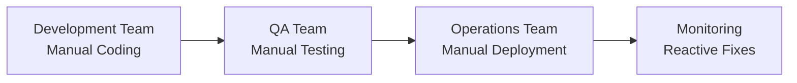
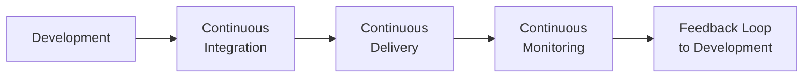
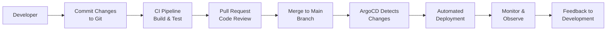
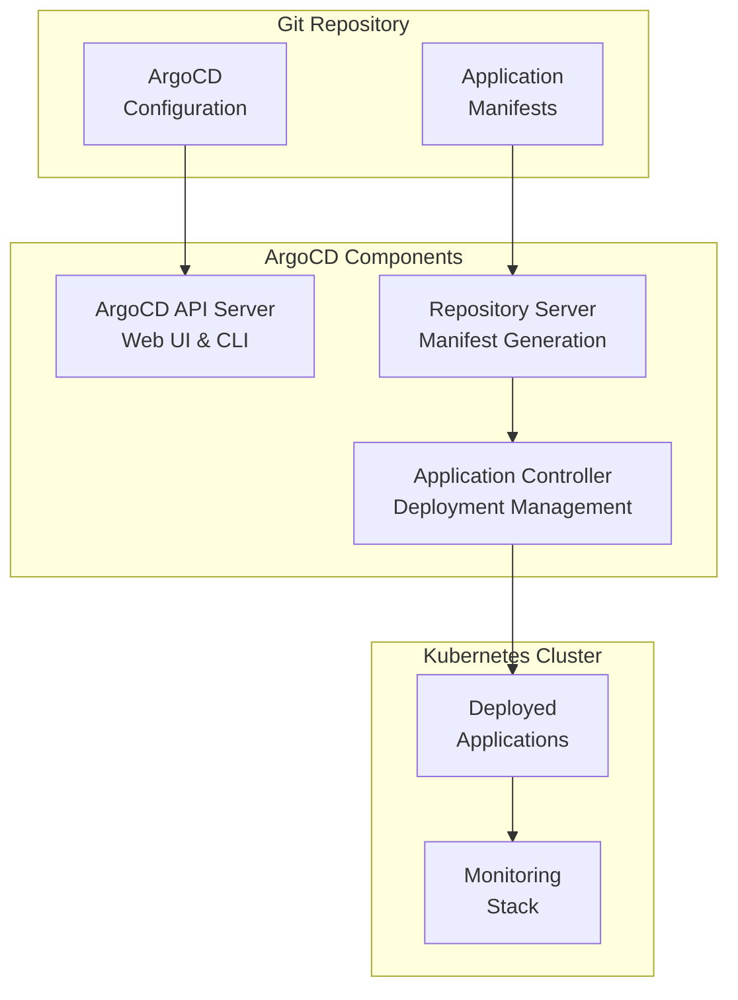

# DevOps with Kubernetes and ArgoCD

This guide explores the DevOps methodology, its relationship with Kubernetes, and how GitOps tools like ArgoCD enable continuous deployment and infrastructure management. Learn how to implement modern DevOps practices using Kubernetes as the deployment platform and ArgoCD for automated application delivery.

## What is DevOps?

DevOps is a cultural and technical movement that emphasizes collaboration, automation, and integration between software development (Dev) and IT operations (Ops) teams. It aims to shorten the software development lifecycle and provide continuous delivery of high-quality software.

### DevOps Core Principles

1. **Collaboration:** Breaking down silos between development and operations
2. **Automation:** Automating repetitive tasks and processes
3. **Continuous Integration:** Frequent code integration and testing
4. **Continuous Delivery:** Automated deployment pipelines
5. **Monitoring:** Proactive monitoring and feedback loops
6. **Infrastructure as Code:** Treating infrastructure like software

### Traditional vs. DevOps Workflow

**Traditional Approach:**


**DevOps Approach:**


## Advantages of DevOps

### 1. Faster Time-to-Market
- **Reduced Deployment Time:** From weeks to minutes
- **Frequent Releases:** Multiple deployments per day
- **Automated Pipelines:** Consistent and reliable releases

### 2. Improved Quality
- **Automated Testing:** Comprehensive test coverage
- **Early Bug Detection:** Issues caught in development
- **Rollback Capabilities:** Quick recovery from failures

### 3. Enhanced Collaboration
- **Cross-functional Teams:** Shared responsibility
- **Knowledge Sharing:** Operations insights inform development
- **Blame-free Culture:** Focus on problem-solving

### 4. Cost Efficiency
- **Reduced Manual Work:** Automation decreases operational costs
- **Resource Optimization:** Better infrastructure utilization
- **Fewer Production Issues:** Proactive monitoring prevents outages

### 5. Scalability and Reliability
- **Infrastructure as Code:** Reproducible environments
- **Automated Scaling:** Handle traffic spikes automatically
- **High Availability:** Built-in redundancy and failover

## How Kubernetes Enables DevOps

Kubernetes provides the perfect platform for implementing DevOps practices by offering:

### 1. Declarative Configuration
```yaml
# Infrastructure defined as code
apiVersion: apps/v1
kind: Deployment
metadata:
  name: my-app
spec:
  replicas: 3
  template:
    spec:
      containers:
      - name: app
        image: myapp:v1.2.3
```

### 2. Immutable Deployments
- **Container Images:** Consistent, versioned deployments
- **Rolling Updates:** Zero-downtime application updates
- **Rollback Capability:** Instant reversion to previous versions

### 3. Service Discovery and Load Balancing
- **Automatic Service Discovery:** No manual configuration
- **Load Balancing:** Built-in traffic distribution
- **Health Checks:** Automatic failure detection

### 4. Resource Management
- **Horizontal Pod Autoscaling:** Automatic scaling based on metrics
- **Resource Quotas:** Prevent resource exhaustion
- **Namespace Isolation:** Multi-tenant environments

### 5. Observability
- **Built-in Monitoring:** Integration with Prometheus and Grafana
- **Logging:** Centralized log aggregation
- **Tracing:** Distributed tracing capabilities

## GitOps: DevOps Evolution

GitOps is a DevOps evolution that uses Git as the single source of truth for infrastructure and application deployments.

### GitOps Principles

1. **Declarative Configuration:** All infrastructure defined in Git
2. **Version Control:** Git history provides audit trail
3. **Automated Deployment:** Changes in Git trigger deployments
4. **Observability:** Deployment status visible in Git
5. **Immutability:** No manual changes to production

### GitOps Workflow



## ArgoCD: GitOps for Kubernetes

ArgoCD is a declarative, GitOps continuous delivery tool for Kubernetes that follows the GitOps pattern of using Git repositories as the source of truth for defining the desired application state.

### ArgoCD Architecture



### Key ArgoCD Features

1. **Automated Sync:** Automatically syncs applications to desired state
2. **Multi-cluster Support:** Manage multiple Kubernetes clusters
3. **Web UI:** Intuitive interface for application management
4. **CLI Tools:** Command-line interface for automation
5. **RBAC:** Role-based access control
6. **SSO Integration:** Single sign-on support
7. **Health Assessment:** Application health monitoring

## Implementing DevOps with ArgoCD and Kubernetes

### Step 1: Set Up ArgoCD

1. **Install ArgoCD:**
```bash
kubectl create namespace argocd
kubectl apply -n argocd -f https://raw.githubusercontent.com/argoproj/argo-cd/stable/manifests/install.yaml
```

2. **Access ArgoCD UI:**
```bash
# Get initial admin password
kubectl -n argocd get secret argocd-initial-admin-secret -o jsonpath="{.data.password}" | base64 -d

# Port forward to access UI
kubectl port-forward svc/argocd-server -n argocd 8080:443
# Access: https://localhost:8080
```

## Option: SSL Termination at Ingress Controller¶
An alternative approach is to perform the SSL termination at the Ingress. Since an ingress-nginx Ingress supports only a single protocol per Ingress object, two Ingress objects need to be defined using the nginx.ingress.kubernetes.io/backend-protocol annotation, one for HTTP/HTTPS and the other for gRPC.

Each ingress will be for a different domain (argocd.example.com and grpc.argocd.example.com). This requires that the Ingress resources use different TLS secretNames to avoid unexpected behavior.

```bash
apiVersion: networking.k8s.io/v1
kind: Ingress
metadata:
  name: argocd-server-http-ingress
  namespace: argocd
  annotations:
    nginx.ingress.kubernetes.io/force-ssl-redirect: "true"
    nginx.ingress.kubernetes.io/backend-protocol: "HTTPS"
spec:
  ingressClassName: nginx
  rules:
  - http:
      paths:
      - path: /
        pathType: Prefix
        backend:
          service:
            name: argocd-server
            port:
              name: http
    host: argocd.example.com
  tls:
  - hosts:
    - argocd.example.com
    secretName: argocd-ingress-http
```

gRPC ingress:

```bash
apiVersion: networking.k8s.io/v1
kind: Ingress
metadata:
  name: argocd-server-grpc-ingress
  namespace: argocd
  annotations:
    nginx.ingress.kubernetes.io/backend-protocol: "GRPC"
spec:
  ingressClassName: nginx
  rules:
  - http:
      paths:
      - path: /
        pathType: Prefix
        backend:
          service:
            name: argocd-server
            port:
              name: https
    host: grpc.argocd.example.com
  tls:
  - hosts:
    - grpc.argocd.example.com
    secretName: argocd-ingress-grpc
```


3. **Login and Change Password:**
- Username: admin
- Password: (from above command)

### Step 2: Create GitHub Repository Structure

```
my-app/
├── k8s/
│   ├── base/
│   │   ├── deployment.yaml
│   │   ├── service.yaml
│   │   └── configmap.yaml
│   ├── overlays/
│   │   ├── development/
│   │   │   ├── deployment.yaml
│   │   │   └── kustomization.yaml
│   │   └── production/
│   │       ├── deployment.yaml
│   │       └── kustomization.yaml
│   └── kustomization.yaml
├── src/
│   └── ... (application code)
├── Dockerfile
├── .github/
│   └── workflows/
│       └── ci-cd.yaml
└── argocd/
    └── application.yaml
```

### Step 3: Configure CI/CD Pipeline

Create `.github/workflows/ci-cd.yaml`:

```yaml
name: CI/CD Pipeline

on:
  push:
    branches: [ main, develop ]
  pull_request:
    branches: [ main ]

jobs:
  build-and-test:
    runs-on: ubuntu-latest

    steps:
    - uses: actions/checkout@v3

    - name: Set up Docker Buildx
      uses: docker/setup-buildx-action@v2

    - name: Login to Docker Hub
      uses: docker/login-action@v2
      with:
        username: ${{ secrets.DOCKER_USERNAME }}
        password: ${{ secrets.DOCKER_PASSWORD }}

    - name: Build and push Docker image
      uses: docker/build-push-action@v4
      with:
        context: .
        push: true
        tags: myapp:${{ github.sha }}, myapp:latest

    - name: Update deployment image
      if: github.ref == 'refs/heads/main'
      run: |
        sed -i 's|image: myapp:.*|image: myapp:${{ github.sha }}|g' k8s/overlays/production/deployment.yaml
        git config --global user.name 'GitHub Actions'
        git config --global user.email 'actions@github.com'
        git add k8s/overlays/production/deployment.yaml
        git commit -m "Update production image to ${{ github.sha }}"
        git push
```

### Step 4: Set Up ArgoCD Application

Create `argocd/application.yaml`:

```yaml
apiVersion: argoproj.io/v1alpha1
kind: Application
metadata:
  name: my-app-production
  namespace: argocd
spec:
  project: default
  source:
    repoURL: https://github.com/your-org/my-app
    targetRevision: HEAD
    path: k8s/overlays/production
  destination:
    server: https://kubernetes.default.svc
    namespace: production
  syncPolicy:
    automated:
      prune: true
      selfHeal: true
    syncOptions:
    - CreateNamespace=true
    - PrunePropagationPolicy=foreground
    - PruneLast=true
```

### Step 5: Deploy Application via ArgoCD

1. **Apply ArgoCD Application:**
```bash
kubectl apply -f argocd/application.yaml
```

2. **Sync Application:**
```bash
argocd app sync my-app-production
```

3. **Monitor Deployment:**
```bash
argocd app get my-app-production
argocd app logs my-app-production
```

## Advanced DevOps Patterns

### 1. Blue-Green Deployments

```yaml
# Blue deployment (current)
apiVersion: argoproj.io/v1alpha1
kind: Application
metadata:
  name: my-app-blue
spec:
  source:
    path: k8s/overlays/blue

---
# Green deployment (new version)
apiVersion: argoproj.io/v1alpha1
kind: Application
metadata:
  name: my-app-green
spec:
  source:
    path: k8s/overlays/green
```

### 2. Canary Deployments

```yaml
apiVersion: argoproj.io/v1alpha1
kind: Application
metadata:
  name: my-app-canary
spec:
  source:
    path: k8s/overlays/canary
  syncPolicy:
    automated:
      prune: false  # Don't remove old version yet
```

### 3. Progressive Delivery

```yaml
apiVersion: argoproj.io/v1alpha1
kind: Application
metadata:
  name: my-app-progressive
spec:
  source:
    path: k8s/overlays/production
  syncPolicy:
    automated:
      prune: true
      selfHeal: true
  analysis:
    successCondition: result[0] >= 0.95
    provider:
      job:
        spec:
          template:
            spec:
              containers:
              - name: smoketest
                image: smoketest:latest
                command: [sh, -c, "curl -f http://my-app/health"]
```

## Monitoring and Observability

### ArgoCD Monitoring

```bash
# Check application health
argocd app get my-app-production

# View sync status
argocd app list

# Monitor ArgoCD metrics
kubectl port-forward svc/argocd-metrics -n argocd 8082:8082
# Access metrics at http://localhost:8082/metrics
```

### Application Monitoring

```yaml
# Prometheus service monitor
apiVersion: monitoring.coreos.com/v1
kind: ServiceMonitor
metadata:
  name: my-app-monitor
  namespace: monitoring
spec:
  selector:
    matchLabels:
      app: my-app
  endpoints:
  - port: metrics
    path: /metrics
    interval: 30s
```

## Security in DevOps

### 1. Pipeline Security
- **Secret Management:** Use GitHub Secrets or external vaults
- **Code Signing:** Sign commits and container images
- **Vulnerability Scanning:** Scan dependencies and containers

### 2. Kubernetes Security
- **RBAC:** Implement least-privilege access
- **Network Policies:** Control pod-to-pod communication
- **Pod Security Standards:** Enforce security contexts

### 3. ArgoCD Security
- **RBAC:** Configure ArgoCD roles and permissions
- **SSO Integration:** Use enterprise identity providers
- **Audit Logging:** Track all ArgoCD operations

## Troubleshooting DevOps Pipelines

### Common ArgoCD Issues

1. **Application Out of Sync:**
```bash
# Check sync status
argocd app get my-app-production

# Force sync
argocd app sync my-app-production --force
```

2. **Manifest Errors:**
```bash
# Validate manifests
kubectl apply --dry-run=client -f k8s/

# Check ArgoCD logs
kubectl logs -n argocd deployment/argocd-application-controller
```

3. **Git Repository Issues:**
```bash
# Test repository access
argocd repo list

# Re-add repository if needed
argocd repo add https://github.com/your-org/my-app --username $GIT_USERNAME --password $GIT_TOKEN
```

### CI/CD Pipeline Issues

1. **Build Failures:**
```bash
# Check GitHub Actions logs
# Navigate to Actions tab in repository

# Debug locally
docker build -t test-image .
docker run test-image npm test
```

2. **Deployment Failures:**
```bash
# Check pod status
kubectl get pods -n production

# View pod logs
kubectl logs -n production deployment/my-app
```

## Best Practices

### 1. Repository Organization
- **Monorepo vs. Polyrepo:** Choose based on team size and complexity
- **Branching Strategy:** Use GitFlow or trunk-based development
- **Tagging:** Use semantic versioning for releases

### 2. Pipeline Optimization
- **Parallel Jobs:** Run independent tasks concurrently
- **Caching:** Cache dependencies to speed up builds
- **Artifact Management:** Store and version build artifacts

### 3. Deployment Strategies
- **Rolling Updates:** Default for most applications
- **Blue-Green:** For zero-downtime critical updates
- **Canary:** For gradual rollout with monitoring

### 4. Monitoring and Alerting
- **Metrics Collection:** Monitor both application and infrastructure
- **Alert Configuration:** Set up alerts for deployment failures
- **Dashboard Creation:** Build comprehensive monitoring dashboards

## Real-World DevOps Success Stories

### Netflix: Chaos Engineering
- **Microservices at Scale:** 100+ microservices deployed daily
- **Automated Testing:** Chaos Monkey for resilience testing
- **Result:** 99.99% uptime with frequent deployments

### Etsy: Continuous Deployment
- **Deployment Frequency:** 50+ deployments per day
- **Feature Flags:** Gradual feature rollout
- **Culture Change:** "You build it, you run it" philosophy

### Google: Site Reliability Engineering
- **SRE Practices:** Error budgets and blameless postmortems
- **Automation Focus:** 70% of changes automated
- **Reliability:** Five nines availability (99.999%)

## Getting Started with DevOps

### Learning Path

1. **Understand Basics:** Learn Git, Docker, and Kubernetes fundamentals
2. **Set Up CI/CD:** Start with GitHub Actions for simple pipelines
3. **Implement GitOps:** Use ArgoCD for declarative deployments
4. **Add Monitoring:** Implement observability from day one
5. **Scale Practices:** Apply DevOps to larger, more complex systems

### Essential Tools

- **Version Control:** Git and GitHub
- **CI/CD:** GitHub Actions, Jenkins, GitLab CI
- **Containerization:** Docker
- **Orchestration:** Kubernetes
- **GitOps:** ArgoCD, Flux
- **Monitoring:** Prometheus, Grafana
- **Security:** Trivy, Falco, OPA

## Summary

DevOps with Kubernetes and ArgoCD represents the modern approach to software delivery. By combining container orchestration with GitOps principles, organizations can achieve:

- **Rapid Deployment:** Automated pipelines reduce time-to-market
- **High Reliability:** Infrastructure as code ensures consistency
- **Scalability:** Kubernetes handles dynamic scaling needs
- **Observability:** Comprehensive monitoring and feedback loops
- **Security:** Automated security scanning and compliance

The integration of Kubernetes and ArgoCD provides a robust foundation for implementing DevOps practices that scale from small teams to large enterprises. Start small, automate gradually, and continuously improve your processes for maximum benefit.