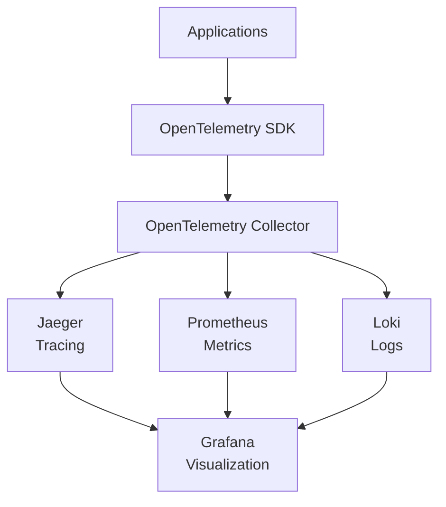

# Monitoring, Tracing, and Logging with OpenTelemetry in RKE2 Clusters

## Overview

Observability is crucial for maintaining healthy Kubernetes clusters and applications. This guide covers implementing comprehensive monitoring, tracing, and logging using OpenTelemetry in RKE2 (Rancher Kubernetes Engine 2) clusters. You'll learn how to collect, process, and visualize telemetry data to gain insights into your applications' performance and behavior.

## Why OpenTelemetry?

OpenTelemetry is an open-source observability framework that provides a unified approach to collecting and exporting telemetry data (metrics, traces, and logs). Key benefits include:

- **Vendor-neutral**: Works with multiple backends (Jaeger, Prometheus, Loki, etc.)
- **Language-agnostic**: Supports applications written in various programming languages
- **Standardized**: Uses open standards for data collection and export
- **Extensible**: Allows custom instrumentation and processors

## Architecture Overview



The OpenTelemetry ecosystem consists of:

- **OpenTelemetry SDK**: Libraries for instrumenting applications
- **OpenTelemetry Collector**: Receives, processes, and exports telemetry data
- **Backends**: Jaeger (tracing), Prometheus (metrics), Loki (logs)
- **Visualization**: Grafana for dashboards and alerting

## Prerequisites

- RKE2 cluster running (see [High-Availability K8s Cluster with RKE2](docs/08-ha-cluster-rke2.md))
- kubectl configured to access your cluster
- Helm 3 installed
- Basic knowledge of Kubernetes resources

## Step-by-Step Setup

### Step 1: Install OpenTelemetry Collector

The OpenTelemetry Collector acts as a central hub for receiving and processing telemetry data.

```bash
# Add OpenTelemetry Helm repository
helm repo add open-telemetry https://open-telemetry.github.io/opentelemetry-helm-charts
helm repo update

# Create namespace for observability components
kubectl create namespace observability

# Install OpenTelemetry Collector
helm install otel-collector open-telemetry/opentelemetry-collector \
  --namespace observability \
  --values - <<EOF
mode: deployment
config:
  receivers:
    otlp:
      protocols:
        grpc:
          endpoint: 0.0.0.0:4317
        http:
          endpoint: 0.0.0.0:4318
    jaeger:
      protocols:
        grpc:
          endpoint: 0.0.0.0:14250
        thrift_http:
          endpoint: 0.0.0.0:14268
  processors:
    batch:
  exporters:
    jaeger:
      endpoint: jaeger-collector.observability.svc.cluster.local:14250
      tls:
        insecure: true
    prometheus:
      endpoint: "0.0.0.0:8889"
    loki:
      endpoint: "http://loki-gateway.observability.svc.cluster.local:80/loki/api/v1/push"
  service:
    pipelines:
      traces:
        receivers: [otlp, jaeger]
        processors: [batch]
        exporters: [jaeger]
      metrics:
        receivers: [otlp]
        processors: [batch]
        exporters: [prometheus]
      logs:
        receivers: [otlp]
        processors: [batch]
        exporters: [loki]
EOF
```

### Step 2: Install Jaeger for Distributed Tracing

Jaeger provides distributed tracing capabilities to track requests across microservices.

```bash
# Add Jaeger Helm repository
helm repo add jaegertracing https://jaegertracing.github.io/helm-charts
helm repo update

# Install Jaeger
helm install jaeger jaegertracing/jaeger \
  --namespace observability \
  --set collector.otlp.enabled=true \
  --set storage.type=memory \
  --set agent.enabled=false \
  --set query.service.type=ClusterIP
```

### Step 3: Install Prometheus for Metrics Collection

Prometheus collects and stores metrics from applications and infrastructure.

```bash
# Add Prometheus Helm repository
helm repo add prometheus-community https://prometheus-community.github.io/helm-charts
helm repo update

# Install Prometheus
helm install prometheus prometheus-community/prometheus \
  --namespace observability \
  --set server.service.type=ClusterIP \
  --set alertmanager.enabled=false \
  --set pushgateway.enabled=false
```

### Step 4: Install Loki for Log Aggregation

Loki aggregates and indexes logs from applications and Kubernetes components.

```bash
# Add Loki Helm repository
helm repo add grafana https://grafana.github.io/helm-charts
helm repo update

# Install Loki
helm install loki grafana/loki \
  --namespace observability \
  --set loki.auth_enabled=false \
  --set loki.commonConfig.replication_factor=1 \
  --set singleBinary.replicas=1
```

### Step 5: Install Grafana for Visualization

Grafana provides dashboards for visualizing telemetry data.

```bash
# Install Grafana
helm install grafana grafana/grafana \
  --namespace observability \
  --set adminPassword='admin' \
  --set service.type=ClusterIP \
  --set datasources."datasources\.yaml".apiVersion=1 \
  --set datasources."datasources\.yaml".datasources[0].name=Jaeger \
  --set datasources."datasources\.yaml".datasources[0].type=jaeger \
  --set datasources."datasources\.yaml".datasources[0].url=http://jaeger-query.observability.svc.cluster.local:16686 \
  --set datasources."datasources\.yaml".datasources[0].access=proxy \
  --set datasources."datasources\.yaml".datasources[1].name=Prometheus \
  --set datasources."datasources\.yaml".datasources[1].type=prometheus \
  --set datasources."datasources\.yaml".datasources[1].url=http://prometheus-server.observability.svc.cluster.local \
  --set datasources."datasources\.yaml".datasources[1].access=proxy \
  --set datasources."datasources\.yaml".datasources[2].name=Loki \
  --set datasources."datasources\.yaml".datasources[2].type=loki \
  --set datasources."datasources\.yaml".datasources[2].url=http://loki.observability.svc.cluster.local:3100 \
  --set datasources."datasources\.yaml".datasources[2].access=proxy
```

### Step 6: Configure Ingress for External Access

Create ingress resources to access the observability tools externally.

```yaml
# Save as ingress-observability.yaml
apiVersion: networking.k8s.io/v1
kind: Ingress
metadata:
  name: observability-ingress
  namespace: observability
  annotations:
    nginx.ingress.kubernetes.io/rewrite-target: /
spec:
  rules:
  - host: jaeger.yourdomain.com
    http:
      paths:
      - path: /
        pathType: Prefix
        backend:
          service:
            name: jaeger-query
            port:
              number: 16686
  - host: grafana.yourdomain.com
    http:
      paths:
      - path: /
        pathType: Prefix
        backend:
          service:
            name: grafana
            port:
              number: 80
  - host: prometheus.yourdomain.com
    http:
      paths:
      - path: /
        pathType: Prefix
        backend:
          service:
            name: prometheus-server
            port:
              number: 80
---
apiVersion: networking.k8s.io/v1
kind: Ingress
metadata:
  name: otel-collector-ingress
  namespace: observability
spec:
  rules:
  - host: otel-collector.yourdomain.com
    http:
      paths:
      - path: /
        pathType: Prefix
        backend:
          service:
            name: otel-collector
            port:
              number: 4318
```

Apply the ingress:

```bash
kubectl apply -f ingress-observability.yaml
```

## Instrumenting Applications

### Auto-Instrumentation for .NET Applications

For .NET applications, use the OpenTelemetry .NET SDK.

```xml
<!-- Add to your .csproj file -->
<PackageReference Include="OpenTelemetry" Version="1.7.0" />
<PackageReference Include="OpenTelemetry.Exporter.OpenTelemetryProtocol" Version="1.7.0" />
<PackageReference Include="OpenTelemetry.Instrumentation.AspNetCore" Version="1.6.0" />
<PackageReference Include="OpenTelemetry.Instrumentation.Http" Version="1.6.0" />
```

```csharp
// Add to Program.cs
using OpenTelemetry;
using OpenTelemetry.Trace;
using OpenTelemetry.Metrics;
using OpenTelemetry.Logs;

var builder = WebApplication.CreateBuilder(args);

// Configure OpenTelemetry
builder.Services.AddOpenTelemetry()
    .WithTracing(tracerProviderBuilder =>
        tracerProviderBuilder
            .AddAspNetCoreInstrumentation()
            .AddHttpClientInstrumentation()
            .AddOtlpExporter(opts => {
                opts.Endpoint = new Uri("http://otel-collector.observability.svc.cluster.local:4318");
            }))
    .WithMetrics(metricsProviderBuilder =>
        metricsProviderBuilder
            .AddAspNetCoreInstrumentation()
            .AddOtlpExporter(opts => {
                opts.Endpoint = new Uri("http://otel-collector.observability.svc.cluster.local:4318");
            }))
    .WithLogging(loggingBuilder =>
        loggingBuilder.AddOtlpExporter(opts => {
            opts.Endpoint = new Uri("http://otel-collector.observability.svc.cluster.local:4318");
        }));

var app = builder.Build();
```

### Manual Instrumentation Example

```csharp
// Add custom spans
using var activity = ActivitySource.StartActivity("CustomOperation");
activity?.SetTag("operation.name", "data-processing");
activity?.SetTag("operation.duration", 150);

// Add custom metrics
var meter = new Meter("MyApp");
var counter = meter.CreateCounter<long>("requests_total", description: "Total requests");
counter.Add(1, new KeyValuePair<string, object?>("method", "GET"));
```

## Hands-On Exercises

### Exercise 1: Deploy a Sample Application with Instrumentation

1. Create a simple .NET API application with OpenTelemetry instrumentation
2. Deploy it to your RKE2 cluster
3. Generate some traffic and observe traces in Jaeger
4. View metrics in Prometheus and Grafana

### Exercise 2: Set Up Log Aggregation

1. Configure your application to send logs to Loki via OpenTelemetry
2. Create a Grafana dashboard for log visualization
3. Set up log-based alerts

### Exercise 3: Create Custom Dashboards

1. Access Grafana at `http://grafana.yourdomain.com`
2. Create a dashboard combining traces, metrics, and logs
3. Add panels for request latency, error rates, and log volumes

## Best Practices

### Resource Management
- **Configure resource limits**: Set appropriate CPU and memory limits for observability components to prevent resource starvation of application workloads
- **Use dedicated node pools**: For larger clusters, consider tainting nodes for monitoring workloads to isolate resource consumption
- **Optimize data collection**: Implement sampling strategies for tracing (e.g., 10-50% sampling rates) and configure appropriate scrape intervals for metrics
- **External monitoring alternatives**: For resource-constrained clusters, consider:
  - Managed cloud services (AWS CloudWatch, GCP Cloud Monitoring, Azure Monitor)
  - External monitoring clusters dedicated to observability
  - Lightweight alternatives like kube-prometheus-stack with reduced retention
- **Use persistent storage**: For production deployments, configure persistent volumes to prevent data loss during pod restarts
- **Implement data retention policies**: Configure appropriate retention periods to balance observability needs with storage costs

### Security Considerations
- Secure access to Grafana and other UIs
- Use TLS for data transmission
- Implement authentication and authorization

### Performance Optimization
- Use sampling for high-volume tracing
- Configure appropriate scrape intervals for metrics
- Implement log filtering to reduce noise

## Troubleshooting

### Common Issues

**OpenTelemetry Collector not receiving data:**
- Check service endpoints and ports
- Verify network policies allow communication
- Review collector logs: `kubectl logs -n observability deployment/otel-collector`

**Jaeger not showing traces:**
- Ensure applications are properly instrumented
- Check OTLP exporter configuration
- Verify collector pipeline configuration

**Prometheus metrics not appearing:**
- Confirm scrape targets are configured
- Check service discovery
- Validate metric names and labels

## Conclusion

Implementing OpenTelemetry-based observability in your RKE2 cluster provides comprehensive insights into application performance and behavior. The combination of tracing, metrics, and logging enables proactive monitoring and faster troubleshooting. As you gain experience, consider integrating additional tools like service meshes (Istio) and advanced alerting systems for production-grade observability.

## Additional Resources

- [OpenTelemetry Documentation](https://opentelemetry.io/docs/)
- [Jaeger Documentation](https://www.jaegertracing.io/docs/)
- [Prometheus Documentation](https://prometheus.io/docs/)
- [Loki Documentation](https://grafana.com/docs/loki/)
- [Grafana Documentation](https://grafana.com/docs/)