# Exercise 1: Deploy ASP.NET Core API to Kubernetes

**Duration:** 30 minutes  
**Difficulty:** Beginner  
**Prerequisites:** .NET 8 SDK, Docker, kubectl, KIND cluster running

## Learning Objectives

By completing this exercise, you will:
- ✅ Containerize an ASP.NET Core Web API
- ✅ Build and tag Docker images
- ✅ Create Kubernetes Deployment and Service manifests
- ✅ Deploy application to local Kubernetes cluster
- ✅ Test API endpoints
- ✅ View logs and troubleshoot issues
- ✅ Scale the application

## Application Overview

You'll deploy a simple **Product Catalog API** that provides RESTful endpoints to manage products. This simulates a real-world microservice in an e-commerce platform.

**API Endpoints:**
- `GET /api/products` - List all products
- `GET /api/products/{id}` - Get product by ID
- `POST /api/products` - Create new product
- `PUT /api/products/{id}` - Update product
- `DELETE /api/products/{id}` - Delete product
- `GET /health` - Health check endpoint

## Architecture

```mermaid
graph LR
    USER[👤 User] --> SVC[Service<br/>ClusterIP]
    SVC --> POD1[Pod 1<br/>API Container]
    SVC --> POD2[Pod 2<br/>API Container]
    SVC --> POD3[Pod 3<br/>API Container]
    
    POD1 --> DATA[(In-Memory<br/>Data Store)]
    POD2 --> DATA
    POD3 --> DATA
    
    style SVC fill:#4CAF50,color:#fff
    style POD1 fill:#2196F3,color:#fff
    style POD2 fill:#2196F3,color:#fff
    style POD3 fill:#2196F3,color:#fff
```



## Step 1: Examine the Application (5 min)

Navigate to the source directory:
```bash
cd docs/workshop/aspnet-core/src
```

### Review the Code

**Program.cs** - Application entry point:
```csharp
var builder = WebApplication.CreateBuilder(args);

builder.Services.AddControllers();
builder.Services.AddEndpointsApiExplorer();
builder.Services.AddSwaggerGen();
builder.Services.AddSingleton<ProductService>();

var app = builder.Build();

app.UseSwagger();
app.UseSwaggerUI();
app.MapControllers();
app.MapGet("/health", () => Results.Ok(new { status = "healthy", timestamp = DateTime.UtcNow }));

app.Run();
```

**ProductsController.cs** - API endpoints:
```csharp
[ApiController]
[Route("api/[controller]")]
public class ProductsController : ControllerBase
{
    private readonly ProductService _productService;
    private readonly ILogger<ProductsController> _logger;

    public ProductsController(ProductService productService, ILogger<ProductsController> logger)
    {
        _productService = productService;
        _logger = logger;
    }

    [HttpGet]
    public IActionResult GetAll()
    {
        _logger.LogInformation("Fetching all products");
        return Ok(_productService.GetAll());
    }

    [HttpGet("{id}")]
    public IActionResult GetById(int id)
    {
        var product = _productService.GetById(id);
        if (product == null)
        {
            _logger.LogWarning("Product {ProductId} not found", id);
            return NotFound();
        }
        return Ok(product);
    }

    [HttpPost]
    public IActionResult Create([FromBody] Product product)
    {
        _logger.LogInformation("Creating new product: {ProductName}", product.Name);
        var created = _productService.Create(product);
        return CreatedAtAction(nameof(GetById), new { id = created.Id }, created);
    }
}
```

### Test Locally (Optional)
```bash
# Run locally to verify it works
dotnet run

# In another terminal:
curl http://localhost:5000/health
curl http://localhost:5000/api/products
```

## Step 2: Create Dockerfile (5 min)

Create `Dockerfile` in the `src/` directory:

```dockerfile
# Stage 1: Build
FROM mcr.microsoft.com/dotnet/sdk:8.0 AS build
WORKDIR /src

# Copy csproj and restore dependencies
COPY ["ProductApi.csproj", "./"]
RUN dotnet restore

# Copy source code and build
COPY . .
RUN dotnet publish -c Release -o /app/publish

# Stage 2: Runtime
FROM mcr.microsoft.com/dotnet/aspnet:8.0 AS runtime
WORKDIR /app

# Copy published app from build stage
COPY --from=build /app/publish .

# Expose port
EXPOSE 8080

# Set environment
ENV ASPNETCORE_URLS=http://+:8080
ENV ASPNETCORE_ENVIRONMENT=Production

# Health check
HEALTHCHECK --interval=30s --timeout=3s --start-period=5s --retries=3 \
    CMD curl --fail http://localhost:8080/health || exit 1

# Run the application
ENTRYPOINT ["dotnet", "ProductApi.dll"]
```

### Dockerfile Best Practices Explained:

1. **Multi-stage build**: Reduces final image size (SDK ~700MB → Runtime ~200MB)
2. **Layer caching**: Copy project file first, then restore (caches dependencies)
3. **Non-root user**: Runtime image runs as non-root for security
4. **Health check**: Kubernetes can monitor application health
5. **Environment variables**: Configure app for Kubernetes

## Step 3: Build and Test Docker Image (5 min)

```bash
# Build the image
docker build -t product-api:v1.0 .

# Expected output:
# [+] Building 45.2s (15/15) FINISHED
# Successfully tagged product-api:v1.0

# Verify image was created
docker images | grep product-api

# Test the container locally
docker run -d -p 8080:8080 --name product-api-test product-api:v1.0

# Wait a few seconds, then test
curl http://localhost:8080/health
# Expected: {"status":"healthy","timestamp":"..."}

curl http://localhost:8080/api/products
# Expected: Array of products

# View logs
docker logs product-api-test

# Stop and remove test container
docker stop product-api-test
docker rm product-api-test
```

### Troubleshooting:
- **Port already in use**: Change to different port: `-p 8081:8080`
- **Build fails**: Check .NET SDK version: `dotnet --version` (need 8.0+)
- **Health check fails**: Check logs: `docker logs product-api-test`

## Step 4: Load Image to KIND Cluster (3 min)

KIND clusters don't have access to your local Docker images by default. We need to load the image:

```bash
# Load image into KIND cluster
kind load docker-image product-api:v1.0 --name workshop

# Expected output:
# Image: "product-api:v1.0" with ID "sha256:..." not yet present on node "workshop-control-plane", loading...

# Verify in cluster
docker exec workshop-control-plane crictl images | grep product-api
```

**Why this step?** KIND creates its own container registry inside the cluster. Loading the image makes it available to Kubernetes.

## Step 5: Create Kubernetes Manifests (7 min)

Navigate to k8s directory:
```bash
cd ../k8s
```

### Create Deployment Manifest

Create `deployment.yaml`:

```yaml
apiVersion: apps/v1
kind: Deployment
metadata:
  name: product-api
  labels:
    app: product-api
    version: v1.0
spec:
  replicas: 3  # Start with 3 replicas for high availability
  selector:
    matchLabels:
      app: product-api
  strategy:
    type: RollingUpdate
    rollingUpdate:
      maxUnavailable: 1  # Only 1 pod down during updates
      maxSurge: 1        # Only 1 extra pod during updates
  template:
    metadata:
      labels:
        app: product-api
        version: v1.0
    spec:
      containers:
      - name: api
        image: product-api:v1.0
        imagePullPolicy: IfNotPresent  # Use local image
        ports:
        - containerPort: 8080
          name: http
          protocol: TCP
        env:
        - name: ASPNETCORE_ENVIRONMENT
          value: "Production"
        - name: Logging__LogLevel__Default
          value: "Information"
        resources:
          requests:
            cpu: 100m      # Request 0.1 CPU core
            memory: 128Mi  # Request 128 MB memory
          limits:
            cpu: 500m      # Limit to 0.5 CPU core
            memory: 512Mi  # Limit to 512 MB memory
        livenessProbe:
          httpGet:
            path: /health
            port: 8080
          initialDelaySeconds: 10
          periodSeconds: 10
          timeoutSeconds: 3
          failureThreshold: 3
        readinessProbe:
          httpGet:
            path: /health
            port: 8080
          initialDelaySeconds: 5
          periodSeconds: 5
          timeoutSeconds: 2
          failureThreshold: 3
```

### Create Service Manifest

Create `service.yaml`:

```yaml
apiVersion: v1
kind: Service
metadata:
  name: product-api
  labels:
    app: product-api
spec:
  type: NodePort  # Accessible from outside cluster
  selector:
    app: product-api
  ports:
  - name: http
    port: 80        # Service port
    targetPort: 8080  # Container port
    nodePort: 30080   # External access port
    protocol: TCP
```

### Understanding the Manifests:

**Deployment:**
- `replicas: 3` - Runs 3 copies for high availability
- `resources` - Guarantees minimum resources and prevents overconsumption
- `livenessProbe` - Kubernetes restarts pod if health check fails
- `readinessProbe` - Traffic only sent to ready pods
- `RollingUpdate` - Zero-downtime deployments

**Service:**
- `type: NodePort` - Exposes on each node's IP
- `selector` - Routes traffic to pods with matching labels
- `port: 80` - Service accessible at port 80
- `targetPort: 8080` - Forwards to container port 8080
- `nodePort: 30080` - External access port (30000-32767 range)

## Step 6: Deploy to Kubernetes (5 min)

```bash
# Apply the manifests
kubectl apply -f deployment.yaml
kubectl apply -f service.yaml

# Or apply all at once:
kubectl apply -f .

# Expected output:
# deployment.apps/product-api created
# service/product-api created

# Verify deployment
kubectl get deployments
# NAME          READY   UP-TO-DATE   AVAILABLE   AGE
# product-api   3/3     3            3           30s

# Check pods
kubectl get pods
# NAME                          READY   STATUS    RESTARTS   AGE
# product-api-xxxxxxxxx-xxxxx   1/1     Running   0          30s
# product-api-xxxxxxxxx-xxxxx   1/1     Running   0          30s
# product-api-xxxxxxxxx-xxxxx   1/1     Running   0          30s

# Check service
kubectl get services
# NAME          TYPE       CLUSTER-IP      EXTERNAL-IP   PORT(S)        AGE
# product-api   NodePort   10.96.xxx.xxx   <none>        80:30080/TCP   30s

# View detailed information
kubectl describe deployment product-api
kubectl describe service product-api
```

### Troubleshooting Pod Issues:

**Pods not starting?**
```bash
# Get pod details
kubectl get pods -o wide

# Describe pod to see events
kubectl describe pod <pod-name>

# Check logs
kubectl logs <pod-name>

# Common issues:
# - ImagePullBackOff: Image not loaded to cluster
#   Solution: kind load docker-image product-api:v1.0 --name workshop
# - CrashLoopBackOff: Application error
#   Solution: Check logs: kubectl logs <pod-name>
# - Pending: Insufficient resources
#   Solution: Reduce resource requests or add nodes
```

## Step 7: Test the API (5 min)

### Access via Port Forward:
```bash
# Port forward to access service locally
kubectl port-forward service/product-api 8080:80

# In another terminal, test endpoints:

# Health check
curl http://localhost:8080/health
# Expected: {"status":"healthy","timestamp":"2024-..."}

# Get all products
curl http://localhost:8080/api/products
# Expected: JSON array of products

# Get specific product
curl http://localhost:8080/api/products/1

# Create new product
curl -X POST http://localhost:8080/api/products \
  -H "Content-Type: application/json" \
  -d '{"name":"Laptop","price":999.99,"category":"Electronics"}'

# Update product
curl -X PUT http://localhost:8080/api/products/1 \
  -H "Content-Type: application/json" \
  -d '{"id":1,"name":"Gaming Laptop","price":1299.99,"category":"Electronics"}'

# Delete product
curl -X DELETE http://localhost:8080/api/products/1
```

### Access via NodePort (Alternative):
```bash
# Get cluster node IP
kubectl get nodes -o wide
# Note the INTERNAL-IP

# Or use localhost with KIND
curl http://localhost:30080/health
curl http://localhost:30080/api/products
```

### View Application Logs:
```bash
# View logs from all pods
kubectl logs -l app=product-api

# Follow logs in real-time
kubectl logs -l app=product-api -f

# View logs from specific pod
kubectl logs <pod-name>

# View previous pod logs (if crashed)
kubectl logs <pod-name> --previous
```

## Step 8: Scale the Application (3 min)

```bash
# Scale to 5 replicas
kubectl scale deployment product-api --replicas=5

# Watch pods being created
kubectl get pods -w

# Verify scaling
kubectl get deployment product-api
# NAME          READY   UP-TO-DATE   AVAILABLE   AGE
# product-api   5/5     5            5           5m

# Scale down to 2
kubectl scale deployment product-api --replicas=2

# Test load balancing
# Make multiple requests and check which pod handles them
for i in {1..10}; do
  curl http://localhost:8080/api/products
  echo ""
done

# View pod logs to see which pods received requests
kubectl logs -l app=product-api --tail=5
```

## Step 9: Update the Application (Bonus)

Simulate a version update with zero downtime:

```bash
# Edit deployment to change image tag
kubectl set image deployment/product-api api=product-api:v1.1

# Watch the rolling update
kubectl rollout status deployment/product-api

# Check rollout history
kubectl rollout history deployment/product-api

# Rollback if needed
kubectl rollout undo deployment/product-api

# Rollback to specific revision
kubectl rollout undo deployment/product-api --to-revision=1
```

## Step 10: Explore and Experiment (Remaining Time)

```bash
# Execute commands inside a pod
kubectl exec -it <pod-name> -- /bin/bash
# Or for Alpine-based images:
kubectl exec -it <pod-name> -- /bin/sh

# Inside pod, you can:
# - Check environment variables: env
# - Test localhost: curl localhost:8080/health
# - View files: ls -la
# - Exit: exit

# View pod resource usage
kubectl top pods

# View events (useful for debugging)
kubectl get events --sort-by='.lastTimestamp'

# Edit deployment live (not recommended for prod!)
kubectl edit deployment product-api

# Get deployment YAML
kubectl get deployment product-api -o yaml

# Delete specific pod (will be recreated automatically!)
kubectl delete pod <pod-name>
# Watch new pod being created
kubectl get pods -w
```

## Key Takeaways

✅ **Containerization**: Multi-stage Docker builds optimize image size  
✅ **Declarative**: Kubernetes manifests describe desired state  
✅ **Self-Healing**: Pods automatically restart on failure  
✅ **Scaling**: Easily scale with a single command  
✅ **Load Balancing**: Services automatically distribute traffic  
✅ **Zero Downtime**: Rolling updates ensure availability  
✅ **Observability**: Built-in logging and monitoring

## Common Issues & Solutions

| Issue | Symptom | Solution |
|-------|---------|----------|
| Image not found | `ErrImagePull` | Run `kind load docker-image product-api:v1.0 --name workshop` |
| Port already in use | `bind: address already in use` | Use different port or stop conflicting process |
| Pods pending | `Status: Pending` | Check resources with `kubectl describe pod <name>` |
| Can't access service | Connection refused | Verify port-forward is running, check service endpoints |
| Application crash | `CrashLoopBackOff` | Check logs: `kubectl logs <pod-name>` |

## Cleanup

When finished with this exercise:

```bash
# Delete resources
kubectl delete -f k8s/

# Or delete individually
kubectl delete deployment product-api
kubectl delete service product-api

# Verify deletion
kubectl get all
```

## Next Steps

Congratulations! 🎉 You've successfully deployed your first application to Kubernetes!

**Continue to:** [Exercise 2: Node.js Web Application](../nodejs/)

## Additional Challenges (Optional)

Try these on your own:

1. **Add Horizontal Pod Autoscaler:**
   ```bash
   kubectl autoscale deployment product-api --min=2 --max=10 --cpu-percent=70
   ```

2. **Implement ConfigMap for configuration:**
   - Extract API settings to ConfigMap
   - Mount as environment variables

3. **Add Persistent Storage:**
   - Create PersistentVolumeClaim
   - Store product data to volume

4. **Implement Ingress:**
   - Install ingress controller
   - Create Ingress resource for HTTP routing

5. **Add Monitoring:**
   - Expose metrics endpoint
   - Configure Prometheus scraping

---

**Workshop Progress:** ✅ Exercise 1 Complete → [Exercise 2: Node.js](../nodejs/)

Need help? Raise your hand or ask the instructor! 👋