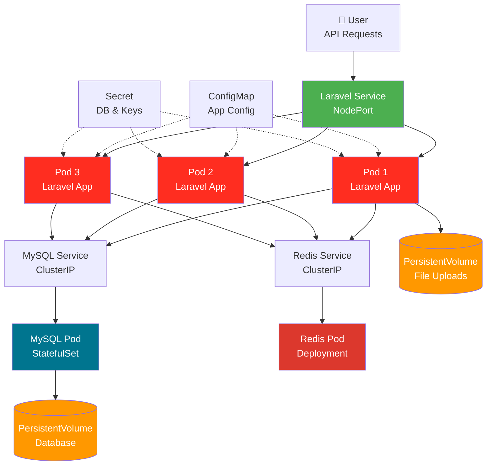

# Exercise 3: Deploy Laravel Application to Kubernetes

**Duration:** 30 minutes  
**Difficulty:** Intermediate  
**Prerequisites:** PHP 8.2+, Composer, Docker, kubectl, KIND cluster running

## Learning Objectives

By completing this exercise, you will:
- ✅ Containerize a Laravel application
- ✅ Deploy MySQL database as StatefulSet
- ✅ Configure Laravel with environment variables
- ✅ Use ConfigMaps for application configuration
- ✅ Use Secrets for database credentials
- ✅ Implement database migrations in Kubernetes
- ✅ Set up Redis for caching and sessions
- ✅ Configure persistent storage for uploads

## Application Overview

You'll deploy a **Blog API** built with Laravel that provides RESTful endpoints for managing blog posts and comments. This simulates a real-world content management system.

**API Endpoints:**
- `GET /api/posts` - List all blog posts
- `GET /api/posts/{id}` - Get specific post
- `POST /api/posts` - Create new post
- `PUT /api/posts/{id}` - Update post
- `DELETE /api/posts/{id}` - Delete post
- `GET /api/posts/{id}/comments` - Get post comments
- `POST /api/posts/{id}/comments` - Add comment
- `GET /health` - Health check endpoint

## Architecture



## Step 1: Examine the Application (5 min)

Navigate to the source directory:
```bash
cd docs/workshop/laravel/src
```

### Review the Code

**routes/api.php** - API routes:
```php
Route::get('/health', [HealthController::class, 'check']);

Route::prefix('posts')->group(function () {
    Route::get('/', [PostController::class, 'index']);
    Route::post('/', [PostController::class, 'store']);
    Route::get('/{id}', [PostController::class, 'show']);
    Route::put('/{id}', [PostController::class, 'update']);
    Route::delete('/{id}', [PostController::class, 'destroy']);
    
    Route::get('/{id}/comments', [CommentController::class, 'index']);
    Route::post('/{id}/comments', [CommentController::class, 'store']);
});
```

**Post Model** - Eloquent model:
```php
class Post extends Model
{
    protected $fillable = ['title', 'content', 'author', 'published'];
    
    public function comments()
    {
        return $this->hasMany(Comment::class);
    }
}
```

### Test Locally (Optional)
```bash
# Install dependencies
composer install

# Copy environment file
cp .env.example .env

# Generate application key
php artisan key:generate

# Start local MySQL (if Docker installed)
docker run -d -p 3306:3306 \
  -e MYSQL_ROOT_PASSWORD=root \
  -e MYSQL_DATABASE=laravel \
  --name mysql-local \
  mysql:8.0

# Run migrations
php artisan migrate --seed

# Start development server
php artisan serve

# Test API
curl http://localhost:8000/health
curl http://localhost:8000/api/posts
```

## Step 2: Create Dockerfile (5 min)

Create `Dockerfile` in the `src/` directory:

```dockerfile
# Stage 1: Composer dependencies
FROM composer:2 AS composer
WORKDIR /app
COPY composer.json composer.lock ./
RUN composer install --no-dev --no-scripts --no-autoloader --prefer-dist

# Stage 2: Build
FROM php:8.2-fpm-alpine AS build
WORKDIR /app

# Install system dependencies
RUN apk add --no-cache \
    libpng-dev \
    libjpeg-turbo-dev \
    freetype-dev \
    zip \
    unzip \
    git \
    curl \
    mysql-client \
    oniguruma-dev

# Install PHP extensions
RUN docker-php-ext-configure gd --with-freetype --with-jpeg && \
    docker-php-ext-install -j$(nproc) \
    pdo \
    pdo_mysql \
    mbstring \
    exif \
    pcntl \
    bcmath \
    gd \
    opcache

# Install Redis extension
RUN pecl install redis && docker-php-ext-enable redis

# Copy composer dependencies
COPY --from=composer /app/vendor ./vendor

# Copy application code
COPY . .

# Generate optimized autoloader
RUN composer dump-autoload --optimize

# Set permissions
RUN chown -R www-data:www-data /app/storage /app/bootstrap/cache

# Stage 3: Production with Nginx
FROM php:8.2-fpm-alpine AS production
WORKDIR /var/www/html

# Install runtime dependencies
RUN apk add --no-cache \
    nginx \
    supervisor \
    libpng \
    libjpeg-turbo \
    freetype \
    mysql-client \
    oniguruma \
    curl

# Install PHP extensions
RUN docker-php-ext-install -j$(nproc) \
    pdo pdo_mysql mbstring exif pcntl bcmath gd opcache && \
    pecl install redis && docker-php-ext-enable redis

# Copy application from build stage
COPY --from=build --chown=www-data:www-data /app .

# Copy configuration files
COPY docker/nginx.conf /etc/nginx/nginx.conf
COPY docker/php.ini /usr/local/etc/php/conf.d/custom.ini
COPY docker/supervisord.conf /etc/supervisor/conf.d/supervisord.conf

# Create required directories
RUN mkdir -p /var/log/supervisor /run/nginx && \
    chown -R www-data:www-data /var/log/supervisor /run/nginx

# Expose port
EXPOSE 8080

# Health check
HEALTHCHECK --interval=30s --timeout=3s --start-period=10s --retries=3 \
    CMD curl -f http://localhost:8080/health || exit 1

# Start supervisor
CMD ["/usr/bin/supervisord", "-c", "/etc/supervisor/conf.d/supervisord.conf"]
```

### Why This Dockerfile?

1. **Multi-stage build**: Separates dependencies from runtime (reduces size by ~60%)
2. **Nginx + PHP-FPM**: Production-ready web server setup
3. **Supervisor**: Manages multiple processes in single container
4. **Optimized**: OPcache and autoloader optimization for performance
5. **Security**: Runs as www-data user, not root

## Step 3: Create Configuration Files (5 min)

### Nginx configuration

Create `docker/nginx.conf`:
```nginx
user www-data;
worker_processes auto;
pid /run/nginx.pid;

events {
    worker_connections 1024;
}

http {
    include /etc/nginx/mime.types;
    default_type application/octet-stream;

    access_log /var/log/nginx/access.log;
    error_log /var/log/nginx/error.log;

    sendfile on;
    tcp_nopush on;
    tcp_nodelay on;
    keepalive_timeout 65;
    types_hash_max_size 2048;

    gzip on;
    gzip_vary on;
    gzip_types text/plain text/css application/json application/javascript text/xml application/xml;

    server {
        listen 8080;
        server_name _;
        root /var/www/html/public;
        index index.php;

        location / {
            try_files $uri $uri/ /index.php?$query_string;
        }

        location ~ \.php$ {
            fastcgi_pass 127.0.0.1:9000;
            fastcgi_index index.php;
            fastcgi_param SCRIPT_FILENAME $document_root$fastcgi_script_name;
            include fastcgi_params;
        }

        location ~ /\.ht {
            deny all;
        }
    }
}
```

### Supervisor configuration

Create `docker/supervisord.conf`:
```ini
[supervisord]
nodaemon=true
user=root
logfile=/var/log/supervisor/supervisord.log
pidfile=/var/run/supervisord.pid

[program:php-fpm]
command=php-fpm
autostart=true
autorestart=true
stderr_logfile=/var/log/supervisor/php-fpm.err.log
stdout_logfile=/var/log/supervisor/php-fpm.out.log

[program:nginx]
command=nginx -g 'daemon off;'
autostart=true
autorestart=true
stderr_logfile=/var/log/supervisor/nginx.err.log
stdout_logfile=/var/log/supervisor/nginx.out.log
```

### PHP configuration

Create `docker/php.ini`:
```ini
[PHP]
post_max_size = 100M
upload_max_filesize = 100M
variables_order = EGPCS

[opcache]
opcache.enable=1
opcache.memory_consumption=128
opcache.interned_strings_buffer=8
opcache.max_accelerated_files=4000
opcache.revalidate_freq=60
opcache.fast_shutdown=1
```

## Step 4: Build and Test Docker Image (5 min)

```bash
# Build the image
docker build -t blog-api:v1.0 .

# Expected output:
# [+] Building 125.3s (28/28) FINISHED
# Successfully tagged blog-api:v1.0

# Verify image
docker images | grep blog-api

# Test locally with MySQL
docker network create app-network

docker run -d \
  --name mysql-test \
  --network app-network \
  -e MYSQL_ROOT_PASSWORD=root \
  -e MYSQL_DATABASE=laravel \
  mysql:8.0

# Wait for MySQL to be ready
sleep 15

docker run -d \
  -p 8080:8080 \
  --name blog-api-test \
  --network app-network \
  -e DB_HOST=mysql-test \
  -e DB_DATABASE=laravel \
  -e DB_USERNAME=root \
  -e DB_PASSWORD=root \
  -e APP_KEY=base64:$(openssl rand -base64 32) \
  blog-api:v1.0

# Wait for app to start
sleep 10

# Test health endpoint
curl http://localhost:8080/health

# Test API
curl http://localhost:8080/api/posts

# View logs
docker logs blog-api-test

# Cleanup
docker stop blog-api-test mysql-test
docker rm blog-api-test mysql-test
docker network rm app-network
```

## Step 5: Load Image to KIND Cluster (3 min)

```bash
# Load images into KIND cluster
kind load docker-image blog-api:v1.0 --name workshop

# Load MySQL and Redis images
docker pull mysql:8.0
docker pull redis:7-alpine
kind load docker-image mysql:8.0 --name workshop
kind load docker-image redis:7-alpine --name workshop

# Verify in cluster
docker exec workshop-control-plane crictl images | grep -E "blog-api|mysql|redis"
```

## Step 6: Create ConfigMap and Secret (5 min)

Navigate to k8s directory:
```bash
cd ../k8s
```

### Create ConfigMap

Create `configmap.yaml`:
```yaml
apiVersion: v1
kind: ConfigMap
metadata:
  name: blog-api-config
  labels:
    app: blog-api
data:
  # Application configuration
  APP_NAME: "Blog API"
  APP_ENV: "production"
  APP_DEBUG: "false"
  LOG_CHANNEL: "stderr"
  LOG_LEVEL: "info"
  
  # Database configuration (non-sensitive)
  DB_CONNECTION: "mysql"
  DB_HOST: "mysql-service"
  DB_PORT: "3306"
  DB_DATABASE: "laravel"
  
  # Cache and Session
  CACHE_DRIVER: "redis"
  SESSION_DRIVER: "redis"
  QUEUE_CONNECTION: "redis"
  REDIS_HOST: "redis-service"
  REDIS_PORT: "6379"
  
  # Application settings
  APP_TIMEZONE: "Asia/Singapore"
  APP_LOCALE: "en"
```

### Create Secret

Create `secret.yaml`:
```yaml
apiVersion: v1
kind: Secret
metadata:
  name: blog-api-secret
  labels:
    app: blog-api
type: Opaque
stringData:
  # Laravel application key (generate with: php artisan key:generate --show)
  APP_KEY: "base64:VGhpc0lzQURlbW9LZXlGb3JLdWJlcm5ldGVz"
  
  # Database credentials
  DB_USERNAME: "laravel"
  DB_PASSWORD: "laravel123"
  DB_ROOT_PASSWORD: "root123"
  
  # Redis password (optional)
  REDIS_PASSWORD: ""
```

**Important**: In production, never commit secrets to Git! Use tools like:
- Sealed Secrets
- External Secrets Operator
- HashiCorp Vault
- Cloud provider secret managers (AWS Secrets Manager, Azure Key Vault, GCP Secret Manager)

## Step 7: Deploy MySQL StatefulSet (7 min)

Create `mysql-statefulset.yaml`:
```yaml
apiVersion: v1
kind: Service
metadata:
  name: mysql-service
  labels:
    app: mysql
spec:
  ports:
  - port: 3306
    targetPort: 3306
  clusterIP: None
  selector:
    app: mysql
---
apiVersion: apps/v1
kind: StatefulSet
metadata:
  name: mysql
  labels:
    app: mysql
spec:
  serviceName: mysql-service
  replicas: 1
  selector:
    matchLabels:
      app: mysql
  template:
    metadata:
      labels:
        app: mysql
    spec:
      containers:
      - name: mysql
        image: mysql:8.0
        ports:
        - containerPort: 3306
          name: mysql
        env:
        - name: MYSQL_ROOT_PASSWORD
          valueFrom:
            secretKeyRef:
              name: blog-api-secret
              key: DB_ROOT_PASSWORD
        - name: MYSQL_DATABASE
          valueFrom:
            configMapKeyRef:
              name: blog-api-config
              key: DB_DATABASE
        - name: MYSQL_USER
          valueFrom:
            secretKeyRef:
              name: blog-api-secret
              key: DB_USERNAME
        - name: MYSQL_PASSWORD
          valueFrom:
            secretKeyRef:
              name: blog-api-secret
              key: DB_PASSWORD
        volumeMounts:
        - name: mysql-data
          mountPath: /var/lib/mysql
        resources:
          requests:
            cpu: 250m
            memory: 512Mi
          limits:
            cpu: 1000m
            memory: 1Gi
        livenessProbe:
          exec:
            command:
            - mysqladmin
            - ping
            - -h
            - localhost
          initialDelaySeconds: 30
          periodSeconds: 10
          timeoutSeconds: 5
        readinessProbe:
          exec:
            command:
            - mysql
            - -h
            - localhost
            - -u
            - root
            - -p$MYSQL_ROOT_PASSWORD
            - -e
            - SELECT 1
          initialDelaySeconds: 10
          periodSeconds: 5
          timeoutSeconds: 3
  volumeClaimTemplates:
  - metadata:
      name: mysql-data
    spec:
      accessModes: ["ReadWriteOnce"]
      resources:
        requests:
          storage: 2Gi
```

### Deploy MySQL and Redis:

```bash
# Apply ConfigMap and Secret
kubectl apply -f configmap.yaml
kubectl apply -f secret.yaml

# Deploy MySQL
kubectl apply -f mysql-statefulset.yaml

# Deploy Redis
kubectl apply -f redis-deployment.yaml

# Watch pods start
kubectl get pods -w

# Verify MySQL is running
kubectl get statefulsets
kubectl get pods -l app=mysql

# Check MySQL logs
kubectl logs mysql-0

# Verify PersistentVolume was created
kubectl get pvc
kubectl get pv
```

## Step 8: Deploy Laravel Application (5 min)

Create `deployment.yaml`:
```yaml
apiVersion: apps/v1
kind: Deployment
metadata:
  name: blog-api
  labels:
    app: blog-api
    version: v1.0
spec:
  replicas: 3
  selector:
    matchLabels:
      app: blog-api
  strategy:
    type: RollingUpdate
    rollingUpdate:
      maxUnavailable: 1
      maxSurge: 1
  template:
    metadata:
      labels:
        app: blog-api
        version: v1.0
    spec:
      initContainers:
      - name: wait-for-mysql
        image: busybox:latest
        command:
        - sh
        - -c
        - |
          until nc -z mysql-service 3306; do
            echo "Waiting for MySQL..."
            sleep 2
          done
          echo "MySQL is ready!"
      - name: run-migrations
        image: blog-api:v1.0
        command:
        - sh
        - -c
        - |
          php artisan migrate --force
          php artisan db:seed --force
        envFrom:
        - configMapRef:
            name: blog-api-config
        - secretRef:
            name: blog-api-secret
      containers:
      - name: app
        image: blog-api:v1.0
        imagePullPolicy: IfNotPresent
        ports:
        - containerPort: 8080
          name: http
        envFrom:
        - configMapRef:
            name: blog-api-config
        - secretRef:
            name: blog-api-secret
        volumeMounts:
        - name: storage
          mountPath: /var/www/html/storage/app/public
        resources:
          requests:
            cpu: 100m
            memory: 256Mi
          limits:
            cpu: 500m
            memory: 512Mi
        livenessProbe:
          httpGet:
            path: /health
            port: 8080
          initialDelaySeconds: 20
          periodSeconds: 10
          timeoutSeconds: 3
          failureThreshold: 3
        readinessProbe:
          httpGet:
            path: /health
            port: 8080
          initialDelaySeconds: 10
          periodSeconds: 5
          timeoutSeconds: 2
          failureThreshold: 3
      volumes:
      - name: storage
        persistentVolumeClaim:
          claimName: blog-storage-pvc
```

Create `service.yaml`:
```yaml
apiVersion: v1
kind: Service
metadata:
  name: blog-api
  labels:
    app: blog-api
spec:
  type: NodePort
  selector:
    app: blog-api
  ports:
  - name: http
    port: 80
    targetPort: 8080
    nodePort: 30082
    protocol: TCP
```

### Deploy Application:

```bash
# Create PVC for storage
kubectl apply -f storage-pvc.yaml

# Deploy application
kubectl apply -f deployment.yaml
kubectl apply -f service.yaml

# Watch pods start
kubectl get pods -w

# Check deployment
kubectl get deployments
kubectl get pods -l app=blog-api

# View logs
kubectl logs -l app=blog-api --tail=50

# Check migrations ran
kubectl logs -l app=blog-api -c run-migrations
```

## Step 9: Test the API (5 min)

### Access via Port Forward:
```bash
# Port forward to service
kubectl port-forward service/blog-api 8080:80

# In another terminal, test endpoints:

# Health check
curl http://localhost:8080/health

# Get all posts
curl http://localhost:8080/api/posts

# Create a post
curl -X POST http://localhost:8080/api/posts \
  -H "Content-Type: application/json" \
  -d '{
    "title": "Getting Started with Kubernetes",
    "content": "Kubernetes is an amazing container orchestration platform...",
    "author": "DevOps Engineer",
    "published": true
  }'

# Get specific post
curl http://localhost:8080/api/posts/1

# Add comment
curl -X POST http://localhost:8080/api/posts/1/comments \
  -H "Content-Type: application/json" \
  -d '{
    "author": "Reader",
    "content": "Great article! Very helpful."
  }'

# Get post with comments
curl http://localhost:8080/api/posts/1/comments

# Update post
curl -X PUT http://localhost:8080/api/posts/1 \
  -H "Content-Type: application/json" \
  -d '{
    "title": "Advanced Kubernetes Topics",
    "content": "Updated content...",
    "published": true
  }'

# Delete post
curl -X DELETE http://localhost:8080/api/posts/1
```

### Access via NodePort:
```bash
curl http://localhost:30082/health
curl http://localhost:30082/api/posts
```

## Step 10: Advanced Features (Remaining Time)

### Check Redis Caching:
```bash
# Exec into Redis pod
kubectl exec -it <redis-pod-name> -- redis-cli

# Inside Redis
KEYS *
GET laravel_cache:*
EXIT
```

### View Application Logs:
```bash
# All logs
kubectl logs -l app=blog-api --all-containers

# Follow logs
kubectl logs -l app=blog-api -f

# Specific container
kubectl logs <pod-name> -c app

# Init container logs
kubectl logs <pod-name> -c run-migrations
```

### Scale Application:
```bash
# Scale up
kubectl scale deployment blog-api --replicas=5

# Watch scaling
kubectl get pods -w

# Test load distribution
for i in {1..20}; do
  curl http://localhost:8080/api/posts
  sleep 1
done
```

## Key Takeaways

✅ **Init Containers**: Run migrations before app starts  
✅ **Multi-Container Pods**: Nginx + PHP-FPM in single pod  
✅ **Database Migrations**: Automated schema management  
✅ **Redis Caching**: Improved performance  
✅ **Persistent Storage**: File uploads survive pod restarts  
✅ **Health Checks**: Proper liveness and readiness probes  
✅ **Environment Configuration**: ConfigMaps and Secrets separation

## Common Issues & Solutions

| Issue | Symptom | Solution |
|-------|---------|----------|
| Migrations fail | Init container errors | Check MySQL is ready, verify credentials |
| 502 Bad Gateway | Nginx can't reach PHP-FPM | Check supervisor logs, verify PHP-FPM running |
| Database connection fails | SQLSTATE errors | Verify service name, check MySQL pod status |
| Storage permission denied | Can't write files | Check volume permissions, PVC status |
| Redis connection timeout | Cache errors | Verify Redis service, check network policies |

## Cleanup

```bash
# Delete all resources
kubectl delete -f k8s/

# Verify deletion
kubectl get all
kubectl get pvc
kubectl get pv
```

## Next Steps

Congratulations! 🎉 You've deployed a production-ready Laravel application!

**Optional Challenges:**
1. **Add Queue Workers**: Deploy separate pods for Laravel queue workers
2. **Implement Horizontal Pod Autoscaling**: Auto-scale based on CPU/memory
3. **Add Ingress**: Use Ingress controller for domain-based routing
4. **Implement CI/CD**: Automate builds and deployments with GitHub Actions
5. **Add Monitoring**: Deploy Prometheus and Grafana for metrics

---

**Workshop Complete!** 

You've now deployed applications in:
- ✅ ASP.NET Core (.NET ecosystem)
- ✅ Node.js (JavaScript ecosystem)  
- ✅ Laravel (PHP ecosystem)

**Next:** Explore [DevOps with ArgoCD](../../11-devops-kubernetes-argocd.md) for GitOps workflows!

Need help? Raise your hand or ask the instructor! 👋