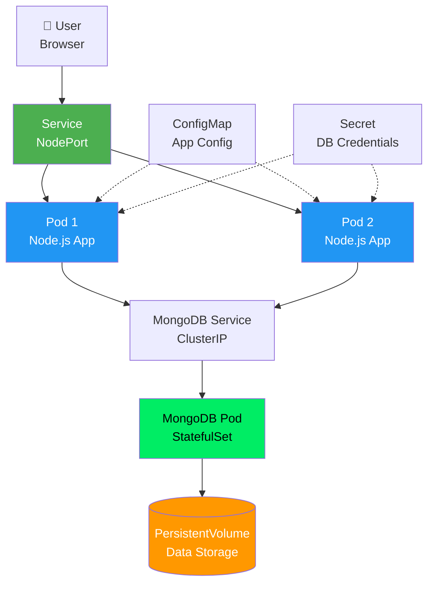

# Exercise 2: Deploy Node.js Web Application to Kubernetes

**Duration:** 30 minutes  
**Difficulty:** Beginner  
**Prerequisites:** Node.js 18+, Docker, kubectl, KIND cluster running

## Learning Objectives

By completing this exercise, you will:
- ✅ Build a Node.js Express application
- ✅ Create multi-stage Dockerfile for optimization
- ✅ Deploy MongoDB as StatefulSet
- ✅ Configure service-to-service communication
- ✅ Use ConfigMaps for configuration
- ✅ Use Secrets for sensitive data
- ✅ Implement persistent storage with PersistentVolumes

## Application Overview

You'll deploy a **Task Manager Web Application** with:
- **Frontend**: HTML/JavaScript interface
- **Backend**: Express.js REST API
- **Database**: MongoDB for data persistence

**Features:**
- Create, read, update, delete tasks
- User authentication (simple)
- Task categorization
- Search functionality

## Architecture



## Step 1: Examine the Application (5 min)

Navigate to the source directory:
```bash
cd docs/workshop/nodejs/src
```

### Review the Code

**app.js** - Application entry point:
```javascript
const express = require('express');
const mongoose = require('mongoose');
const path = require('path');

const app = express();
const PORT = process.env.PORT || 3000;
const MONGO_URI = process.env.MONGO_URI || 'mongodb://localhost:27017/taskmanager';

// Connect to MongoDB
mongoose.connect(MONGO_URI, {
    useNewUrlParser: true,
    useUnifiedTopology: true
});

// Routes
app.use('/api/tasks', require('./routes/tasks'));
app.use(express.static('public'));

app.listen(PORT, () => {
    console.log(`Server running on port ${PORT}`);
});
```

### Test Locally (Optional)
```bash
# Install dependencies
npm install

# Start MongoDB locally (if Docker installed)
docker run -d -p 27017:27017 --name mongodb mongo:7

# Run application
npm start

# Test in browser: http://localhost:3000
```

## Step 2: Create Multi-Stage Dockerfile (5 min)

Create `Dockerfile` in the `src/` directory:

```dockerfile
# Stage 1: Dependencies
FROM node:18-alpine AS dependencies
WORKDIR /app

# Copy package files
COPY package*.json ./

# Install production dependencies only
RUN npm ci --only=production

# Stage 2: Build (if needed for build steps)
FROM node:18-alpine AS build
WORKDIR /app

# Copy package files and install all dependencies
COPY package*.json ./
RUN npm ci

# Copy source code
COPY . .

# Stage 3: Production
FROM node:18-alpine AS production
WORKDIR /app

# Copy production dependencies from first stage
COPY --from=dependencies /app/node_modules ./node_modules

# Copy application code
COPY . .

# Create non-root user
RUN addgroup -g 1001 -S nodejs && \
    adduser -S nodejs -u 1001 && \
    chown -R nodejs:nodejs /app

# Switch to non-root user
USER nodejs

# Expose port
EXPOSE 3000

# Health check
HEALTHCHECK --interval=30s --timeout=3s --start-period=10s --retries=3 \
    CMD node healthcheck.js || exit 1

# Start application
CMD ["node", "app.js"]
```

### Why Multi-Stage Build?

1. **Smaller Image**: Final image only contains production dependencies (~150MB vs ~300MB)
2. **Security**: Runs as non-root user
3. **Layer Caching**: Dependencies cached separately from code
4. **Clean Build**: Build artifacts don't end up in production image

## Step 3: Build and Test Docker Image (5 min)

```bash
# Build the image
docker build -t task-manager:v1.0 .

# Expected output:
# [+] Building 52.3s (18/18) FINISHED
# Successfully tagged task-manager:v1.0

# Verify image
docker images | grep task-manager

# Test locally with MongoDB
docker network create app-network

docker run -d \
  --name mongodb \
  --network app-network \
  mongo:7

docker run -d \
  -p 3000:3000 \
  --name task-manager-test \
  --network app-network \
  -e MONGO_URI=mongodb://mongodb:27017/taskmanager \
  task-manager:v1.0

# Wait a few seconds, then test
curl http://localhost:3000/health
curl http://localhost:3000/api/tasks

# View logs
docker logs task-manager-test

# Cleanup test containers
docker stop task-manager-test mongodb
docker rm task-manager-test mongodb
docker network rm app-network
```

## Step 4: Load Image to KIND Cluster (3 min)

```bash
# Load images into KIND cluster
kind load docker-image task-manager:v1.0 --name workshop

# Note: We'll use official MongoDB image from Docker Hub
# KIND will pull it automatically, but you can pre-load it:
docker pull mongo:7
kind load docker-image mongo:7 --name workshop

# Verify in cluster
docker exec workshop-control-plane crictl images | grep -E "task-manager|mongo"
```

## Step 5: Create ConfigMap and Secret (5 min)

Navigate to k8s directory:
```bash
cd ../k8s
```

### Create ConfigMap

Create `configmap.yaml`:

```yaml
apiVersion: v1
kind: ConfigMap
metadata:
  name: task-manager-config
  labels:
    app: task-manager
data:
  # Application configuration
  NODE_ENV: "production"
  LOG_LEVEL: "info"
  
  # MongoDB connection (non-sensitive)
  MONGO_DB_NAME: "taskmanager"
  MONGO_HOST: "mongodb-service"
  MONGO_PORT: "27017"
  
  # Application settings
  MAX_TASKS_PER_USER: "100"
  ENABLE_ANALYTICS: "true"
```

### Create Secret

Create `secret.yaml`:

```yaml
apiVersion: v1
kind: Secret
metadata:
  name: task-manager-secret
  labels:
    app: task-manager
type: Opaque
stringData:
  # MongoDB credentials (base64 encoded in real scenarios)
  MONGO_USERNAME: "taskuser"
  MONGO_PASSWORD: "taskpass123"
  
  # JWT secret for authentication
  JWT_SECRET: "your-super-secret-jwt-key-change-in-production"
  
  # API keys (example)
  API_KEY: "demo-api-key-12345"
```

**Note**: In production, never commit secrets to Git! Use secret management tools like:
- Kubernetes External Secrets
- HashiCorp Vault
- AWS Secrets Manager
- Azure Key Vault

## Step 6: Deploy MongoDB StatefulSet (7 min)

Create `mongodb-statefulset.yaml`:

```yaml
apiVersion: v1
kind: Service
metadata:
  name: mongodb-service
  labels:
    app: mongodb
spec:
  ports:
  - port: 27017
    targetPort: 27017
  clusterIP: None  # Headless service for StatefulSet
  selector:
    app: mongodb
---
apiVersion: apps/v1
kind: StatefulSet
metadata:
  name: mongodb
  labels:
    app: mongodb
spec:
  serviceName: mongodb-service
  replicas: 1
  selector:
    matchLabels:
      app: mongodb
  template:
    metadata:
      labels:
        app: mongodb
    spec:
      containers:
      - name: mongodb
        image: mongo:7
        ports:
        - containerPort: 27017
          name: mongodb
        env:
        - name: MONGO_INITDB_ROOT_USERNAME
          valueFrom:
            secretKeyRef:
              name: task-manager-secret
              key: MONGO_USERNAME
        - name: MONGO_INITDB_ROOT_PASSWORD
          valueFrom:
            secretKeyRef:
              name: task-manager-secret
              key: MONGO_PASSWORD
        volumeMounts:
        - name: mongodb-data
          mountPath: /data/db
        resources:
          requests:
            cpu: 250m
            memory: 512Mi
          limits:
            cpu: 500m
            memory: 1Gi
  volumeClaimTemplates:
  - metadata:
      name: mongodb-data
    spec:
      accessModes: ["ReadWriteOnce"]
      resources:
        requests:
          storage: 1Gi
```

### Understanding StatefulSet vs Deployment:

| Feature | Deployment | StatefulSet |
|---------|------------|-------------|
| **Pod Names** | Random hash | Predictable (mongodb-0, mongodb-1) |
| **Ordering** | Random | Sequential (mongodb-0 first, then mongodb-1) |
| **Storage** | Shared or ephemeral | Dedicated PersistentVolume per pod |
| **Network Identity** | Changes on restart | Stable (mongodb-0.service always same) |
| **Use Case** | Stateless apps | Databases, clusters |

### Deploy MongoDB:

```bash
# Apply ConfigMap and Secret
kubectl apply -f configmap.yaml
kubectl apply -f secret.yaml

# Deploy MongoDB
kubectl apply -f mongodb-statefulset.yaml

# Watch MongoDB pod start
kubectl get pods -w

# Verify MongoDB is running
kubectl get statefulsets
kubectl get pods -l app=mongodb

# Check logs
kubectl logs mongodb-0

# Verify PersistentVolume was created
kubectl get pvc
kubectl get pv

# Expected output:
# NAME                      STATUS   VOLUME      CAPACITY   ACCESS MODES
# mongodb-data-mongodb-0    Bound    pvc-xxxxx   1Gi        RWO
```

## Step 7: Deploy Node.js Application (5 min)

Create `deployment.yaml`:

```yaml
apiVersion: apps/v1
kind: Deployment
metadata:
  name: task-manager
  labels:
    app: task-manager
    version: v1.0
spec:
  replicas: 2
  selector:
    matchLabels:
      app: task-manager
  strategy:
    type: RollingUpdate
    rollingUpdate:
      maxUnavailable: 1
      maxSurge: 1
  template:
    metadata:
      labels:
        app: task-manager
        version: v1.0
    spec:
      containers:
      - name: app
        image: task-manager:v1.0
        imagePullPolicy: IfNotPresent
        ports:
        - containerPort: 3000
          name: http
        env:
        # Build MongoDB connection string from ConfigMap and Secret
        - name: MONGO_URI
          value: "mongodb://$(MONGO_USERNAME):$(MONGO_PASSWORD)@$(MONGO_HOST):$(MONGO_PORT)/$(MONGO_DB_NAME)?authSource=admin"
        - name: MONGO_USERNAME
          valueFrom:
            secretKeyRef:
              name: task-manager-secret
              key: MONGO_USERNAME
        - name: MONGO_PASSWORD
          valueFrom:
            secretKeyRef:
              name: task-manager-secret
              key: MONGO_PASSWORD
        - name: MONGO_HOST
          valueFrom:
            configMapKeyRef:
              name: task-manager-config
              key: MONGO_HOST
        - name: MONGO_PORT
          valueFrom:
            configMapKeyRef:
              name: task-manager-config
              key: MONGO_PORT
        - name: MONGO_DB_NAME
          valueFrom:
            configMapKeyRef:
              name: task-manager-config
              key: MONGO_DB_NAME
        - name: NODE_ENV
          valueFrom:
            configMapKeyRef:
              name: task-manager-config
              key: NODE_ENV
        - name: JWT_SECRET
          valueFrom:
            secretKeyRef:
              name: task-manager-secret
              key: JWT_SECRET
        resources:
          requests:
            cpu: 100m
            memory: 128Mi
          limits:
            cpu: 500m
            memory: 512Mi
        livenessProbe:
          httpGet:
            path: /health
            port: 3000
          initialDelaySeconds: 15
          periodSeconds: 10
          timeoutSeconds: 3
          failureThreshold: 3
        readinessProbe:
          httpGet:
            path: /health
            port: 3000
          initialDelaySeconds: 10
          periodSeconds: 5
          timeoutSeconds: 2
          failureThreshold: 3
```

Create `service.yaml`:

```yaml
apiVersion: v1
kind: Service
metadata:
  name: task-manager
  labels:
    app: task-manager
spec:
  type: NodePort
  selector:
    app: task-manager
  ports:
  - name: http
    port: 80
    targetPort: 3000
    nodePort: 30081
    protocol: TCP
```

### Deploy Application:

```bash
# Deploy application
kubectl apply -f deployment.yaml
kubectl apply -f service.yaml

# Watch pods start
kubectl get pods -w

# Verify deployment
kubectl get deployments
kubectl get pods -l app=task-manager
kubectl get services

# Check logs
kubectl logs -l app=task-manager

# Expected log output:
# "Connected to MongoDB"
# "Server running on port 3000"
```

## Step 8: Test the Application (5 min)

### Access via Port Forward:

```bash
# Port forward to service
kubectl port-forward service/task-manager 3000:80

# In another terminal, test endpoints:

# Health check
curl http://localhost:3000/health

# Get all tasks
curl http://localhost:3000/api/tasks

# Create a task
curl -X POST http://localhost:3000/api/tasks \
  -H "Content-Type: application/json" \
  -d '{
    "title": "Learn Kubernetes",
    "description": "Complete workshop exercises",
    "category": "Education",
    "priority": "high"
  }'

# Get specific task
curl http://localhost:3000/api/tasks/<task-id>

# Update task
curl -X PUT http://localhost:3000/api/tasks/<task-id> \
  -H "Content-Type: application/json" \
  -d '{
    "title": "Master Kubernetes",
    "completed": true
  }'

# Delete task
curl -X DELETE http://localhost:3000/api/tasks/<task-id>
```

### Access Web Interface:

```bash
# Open in browser
# With port-forward: http://localhost:3000
# Or with NodePort: http://localhost:30081
```

### Verify Service Communication:

```bash
# Exec into app pod
kubectl exec -it <task-manager-pod-name> -- sh

# Inside pod, test MongoDB connection
ping mongodb-service
# Should resolve to MongoDB pod IP

# Test database connectivity
node -e "const mongoose = require('mongoose'); mongoose.connect('mongodb://mongodb-service:27017/test').then(() => console.log('Connected!')).catch(err => console.log(err));"

# Exit
exit
```

## Step 9: Test Data Persistence (3 min)

```bash
# Create some tasks via API
curl -X POST http://localhost:3000/api/tasks \
  -H "Content-Type: application/json" \
  -d '{"title": "Test Persistence", "description": "This task should survive pod restarts"}'

# Verify tasks exist
curl http://localhost:3000/api/tasks

# Delete application pods (they will be recreated)
kubectl delete pod -l app=task-manager

# Wait for new pods
kubectl get pods -w

# Port-forward again
kubectl port-forward service/task-manager 3000:80

# Verify data still exists
curl http://localhost:3000/api/tasks
# Your task should still be there!

# Delete MongoDB pod (dangerous in production!)
kubectl delete pod mongodb-0

# Wait for StatefulSet to recreate it
kubectl get pods -w

# Verify data STILL exists (because of PersistentVolume)
curl http://localhost:3000/api/tasks
# Data persisted! 🎉
```

## Step 10: Scale and Monitor (Remaining Time)

```bash
# Scale application
kubectl scale deployment task-manager --replicas=4

# Watch scaling
kubectl get pods -w

# Check which pod handles requests
# Make multiple requests and check logs
for i in {1..10}; do
  curl http://localhost:3000/api/tasks
  sleep 1
done

# View logs from all pods
kubectl logs -l app=task-manager --tail=10

# Check resource usage
kubectl top pods

# View events
kubectl get events --sort-by='.lastTimestamp'

# Describe deployment
kubectl describe deployment task-manager

# Check ConfigMap
kubectl describe configmap task-manager-config

# View Secret (values are base64 encoded)
kubectl get secret task-manager-secret -o yaml
```

## Key Takeaways

✅ **StatefulSets**: Essential for stateful applications like databases  
✅ **Persistent Storage**: PersistentVolumes ensure data survives pod restarts  
✅ **ConfigMaps**: Externalize configuration from code  
✅ **Secrets**: Store sensitive data securely  
✅ **Service Discovery**: Pods communicate via service names  
✅ **Multi-Container Apps**: Frontend, backend, database work together  
✅ **Resource Management**: Proper limits prevent resource exhaustion

## Common Issues & Solutions

| Issue | Symptom | Solution |
|-------|---------|----------|
| App can't connect to MongoDB | Connection timeout | Check service name, verify MongoDB is running |
| PersistentVolume pending | PVC in Pending state | Check storage class, KIND provides default |
| App CrashLoopBackOff | Pod keeps restarting | Check logs, verify MongoDB is ready first |
| Can't access NodePort | Connection refused | Check service port mapping, firewall rules |
| ConfigMap changes not reflected | App uses old values | Restart pods: `kubectl rollout restart deployment/task-manager` |

## Cleanup

```bash
# Delete all resources
kubectl delete -f k8s/

# Or individually
kubectl delete deployment task-manager
kubectl delete service task-manager
kubectl delete statefulset mongodb
kubectl delete service mongodb-service
kubectl delete configmap task-manager-config
kubectl delete secret task-manager-secret
kubectl delete pvc --all

# Verify deletion
kubectl get all
kubectl get pvc
kubectl get pv
```

## Next Steps

Congratulations! 🎉 You've deployed a full-stack application with persistent storage!

**Continue to:** [Exercise 3: Scaling and Updates](../scaling-updates/)

## Additional Challenges (Optional)

1. **Add Redis Caching:**
   - Deploy Redis as StatefulSet
   - Modify app to cache frequently accessed tasks
   - Measure performance improvement

2. **Implement Init Containers:**
   - Add init container to wait for MongoDB
   - Seed initial data before app starts

3. **Add Horizontal Pod Autoscaler:**
   ```bash
   kubectl autoscale deployment task-manager --min=2 --max=10 --cpu-percent=70
   ```

4. **Implement Ingress:**
   - Install ingress controller
   - Create Ingress resource for path-based routing

5. **Add Monitoring:**
   - Deploy Prometheus and Grafana
   - Add custom metrics to application
   - Create dashboard for task statistics

---

**Workshop Progress:** ✅ Exercise 1 → ✅ Exercise 2 → [Exercise 3: Scaling](../scaling-updates/)

Need help? Raise your hand or ask the instructor! 👋